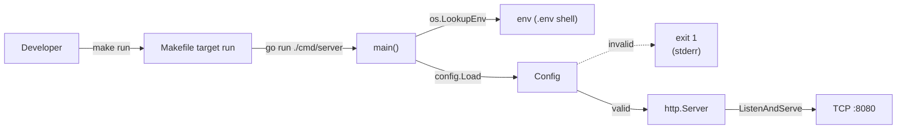
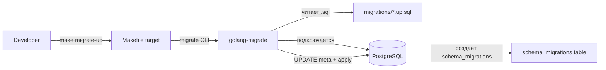
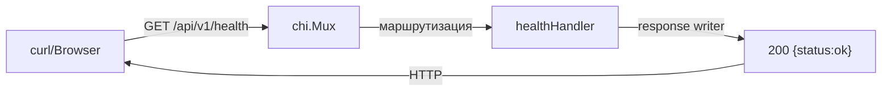
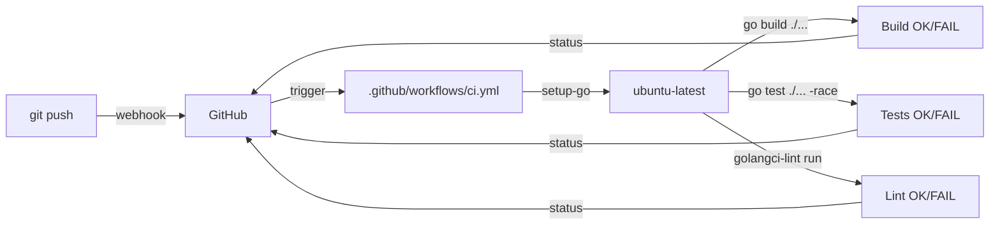
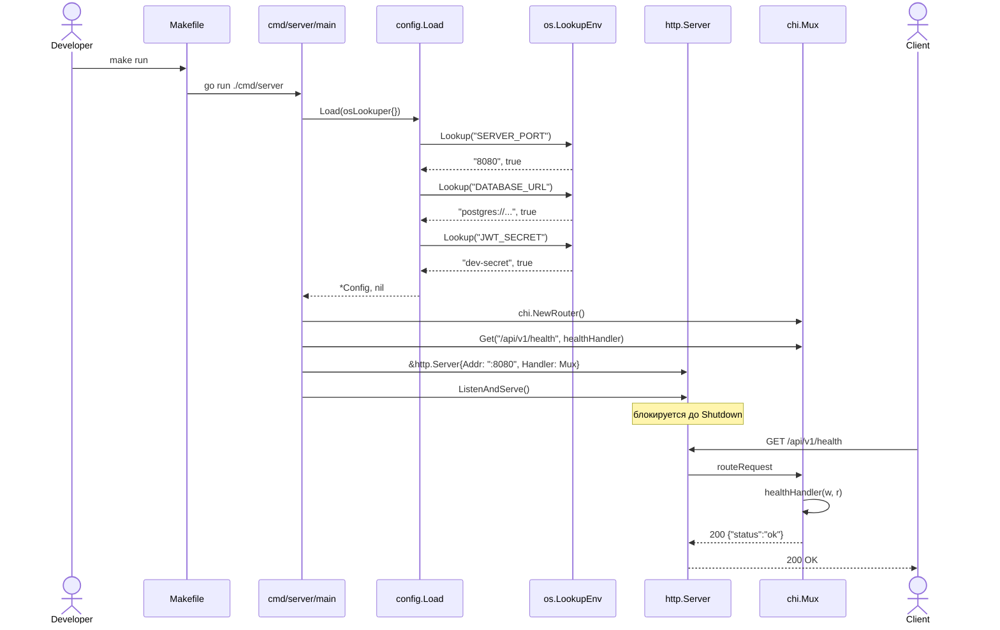
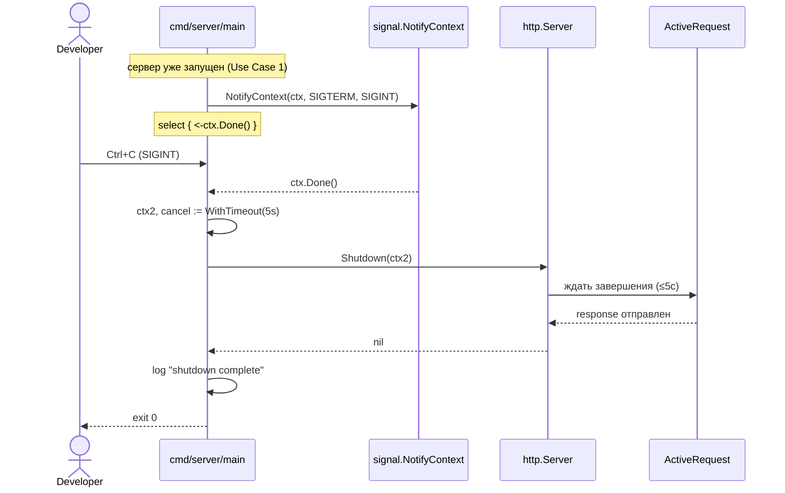
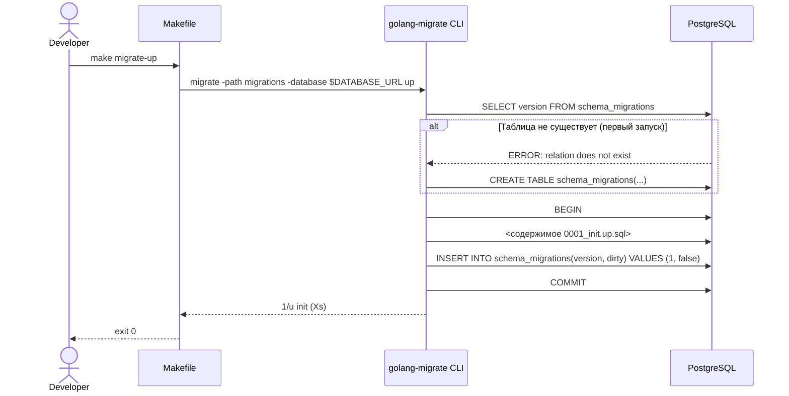
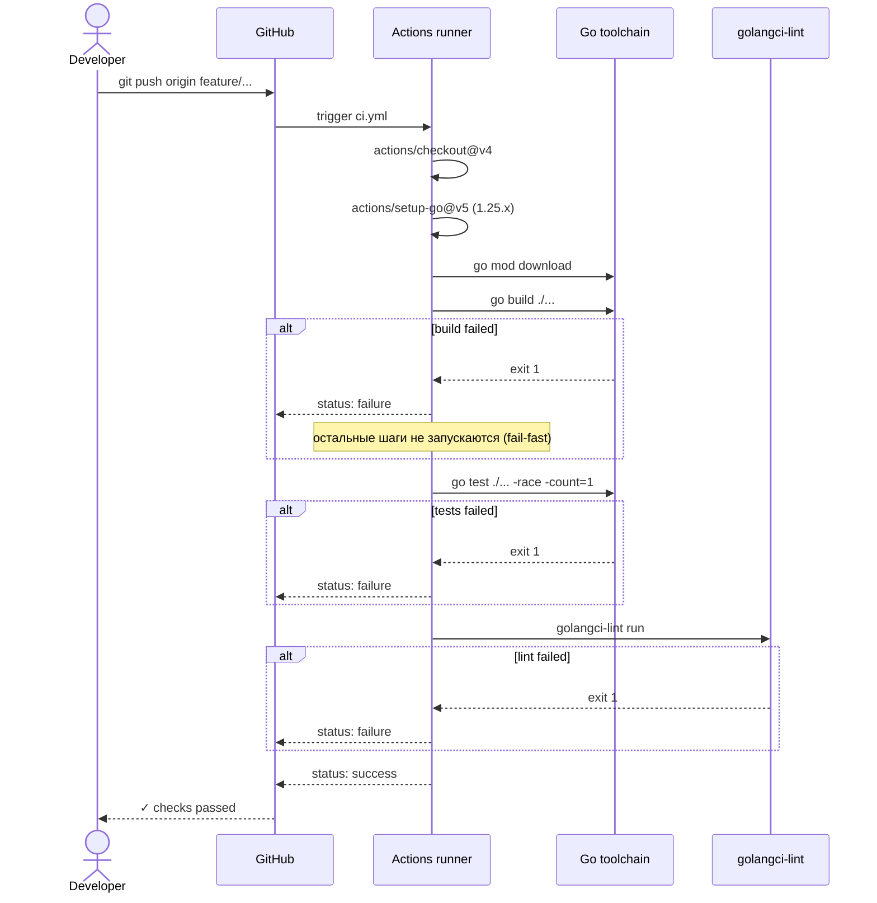

# 02 — Behavior (Process View)

## Data Flow Diagrams

### DFD-1: Запуск сервера (`make run`)

### DFD-2: Жизненный цикл миграций (`make migrate-up`)

### DFD-3: Health-check запрос

### DFD-4: CI Pipeline

## Sequence Diagrams

### Use Case 1: Запуск сервера и обработка `/api/v1/health`

Happy path:

**Error cases:**

| Условие | Тип | Код / Лог-маркер | HTTP Status | Поведение |
|---|---|---|---|---|
| `JWT_SECRET` не задан | Конфиг (типизированная ошибка) | CONFIG-001 | (не HTTP — exit 1 при старте) | `main()` пишет в stderr `config: JWT_SECRET is required`, exit 1 |
| `DATABASE_URL` не задан | Конфиг (типизированная ошибка) | CONFIG-002 | (не HTTP — exit 1) | `config: DATABASE_URL is required`, exit 1 |
| `SERVER_PORT` не парсится в int | Конфиг (типизированная ошибка) | CONFIG-003 | (не HTTP — exit 1) | `config: SERVER_PORT must be integer in 1..65535, got "abc"`, exit 1 |
| `SERVER_PORT` вне диапазона 1..65535 | Конфиг (типизированная ошибка) | CONFIG-003 | (не HTTP — exit 1) | то же сообщение |
| `ListenAndServe` упал (порт занят) | Runtime (лог в stderr, не API) | — | (не HTTP — exit 1) | `server: listen :8080: bind: address already in use`, exit 1 |
| Запрос на неизвестный путь | HTTP-статус | — | 404 | дефолт chi — `404 page not found` |

CONFIG-001/002/003 — это типизированные доменные ошибки конфигурации (`config.ValidationError`), они тестируются в `04-testing.md`. Runtime-сбои сервера (порт занят и т.п.) не получают error code — это лог-события и не часть API.

**Edge cases:**
- Race на старте: запрос приходит до `ListenAndServe` возвращения управления — невозможно, `ListenAndServe` блокирующий, а порт открывается до возврата.
- Сервер ловит `SIGPIPE` от убитого клиента — стандартная обработка `http.Server`, не требует кода.
- Запуск под root с привилегированным портом (<1024) — допустимо, но валидация в `Load` отвергнет такие порты только если они <1; ограничение 1..65535 не запрещает 80/443. Открытый вопрос — см. `03-decisions.md` Open Questions.

### Use Case 2: Graceful shutdown

**Error cases:**

| Условие | Тип | HTTP Status | Поведение |
|---|---|---|---|
| Активный запрос дольше 5с | Runtime (лог в stderr) | 503 для прерванного запроса (chi) | `Shutdown` возвращает `context.DeadlineExceeded`, `slog.Warn("shutdown timeout")`, exit 1 |
| `Shutdown` вернул error не deadline | Runtime (лог в stderr) | — | `slog.Error("shutdown failed", err=...)`, exit 1 |

Эти сбои — runtime-события, не API errors. Тестов на них в фазе 1.1 нет.

**Edge cases:**
- Двойной `SIGINT` — первый запускает graceful, второй принудительно завершает. Реализуется через `signal.NotifyContext` + явный `os.Exit(130)` на второй сигнал (`signal.Reset`). Open question: оставлять ли двойной-сигнал-выход или достаточно первого с таймаутом 5с (см. `03-decisions.md`).
- `SIGTERM` от `docker stop` — то же поведение, но без TTY.

### Use Case 3: Накатывание initial-миграции

**Error cases:**

| Условие | Код ошибки | HTTP Status | Поведение |
|---|---|---|---|
| `DATABASE_URL` пустой | — | — | `migrate` падает: `error: no database URL`, exit 1 |
| PostgreSQL недоступен | — | — | `dial tcp 127.0.0.1:5432: connect: connection refused`, exit 1 |
| `0001_init.up.sql` синтаксическая ошибка | — | — | `error: syntax error at or near ...`, миграция помечается dirty, exit 1 |
| Миграция уже применена | — | — | `no change`, exit 0 (идемпотентно) |

**Edge cases:**
- БД в `dirty`-состоянии после прерванной миграции: `make migrate-up` падает с `error: Dirty database version 1`. Открытый вопрос — добавлять ли `make migrate-force` или решать через CLI напрямую.

### Use Case 4: CI workflow на push

**Error cases:**

| Условие | Поведение |
|---|---|
| `go mod download` упал (сетевая проблема) | retry один раз через `actions/setup-go` cache miss, иначе exit 1 |
| Тест упал по race detector | стандартный вывод `WARNING: DATA RACE`, exit 1 |
| Lint выдал warning | `golangci-lint` выходит с кодом ≠ 0, CI красный |

**Edge cases:**
- Параллельные пуши — каждый workflow run изолирован. Cache по `go.sum` шарится через `actions/setup-go@v5`.
- Workflow на форке от внешнего PR — secrets не передаются, но для CI на pure Go-сборке секретов нет.

## Дополнительные сценарии

### Сценарий: первый клон репозитория разработчиком

Триггер: `git clone … && cd project-rupor`.

Поведение (точная последовательность из `README.MD` после внедрения скелета):

1. `cp .env.example .env`
2. `make dc-up` — поднимается контейнер `postgres:16-alpine`, healthcheck зелёный за 5–15с
3. `make migrate-up` — накатывается `0001_init.up.sql`
4. `make run` — стартует HTTP-сервер на `:8080`
5. `curl http://localhost:8080/api/v1/health` — возвращает `{"status":"ok"}`

Edge cases:
- На свежей машине нет `golang-migrate` CLI: `make migrate-up` падает с `migrate: command not found`. Решение — добавить в `README.MD` инструкцию `brew install golang-migrate` или `go install github.com/golang-migrate/migrate/v4/cmd/migrate@latest`. Open question: упаковывать ли `migrate` в Docker-образ и делать `make migrate-up` через `docker compose run`, или оставлять как dev-tool. См. `03-decisions.md`.
- Порт 8080 занят: `make run` падает на `ListenAndServe`. Разработчик меняет `SERVER_PORT` в `.env`.
- Порт 5432 занят (другой Postgres): `make dc-up` стартует, но контейнер падает или конфликтует. Решение — `docker-compose.yml` мапит `${POSTGRES_PORT:-5432}:5432`, разработчик переопределяет в `.env`.

### Сценарий: добавление нового домена (после Фазы 1.1)

Триггер: разработчик создаёт `internal/auth/domain/user.go`.

Поведение:
- Папки `internal/auth/{domain,usecase,transport/http,repository/postgres}/` уже существуют — никаких mkdir.
- При первой попытке наполнить `repository/postgres/queries/*.sql` — нужен блок в `sqlc.yaml`. Скелет `sqlc.yaml` содержит закомментированный шаблон блока, разработчик копирует и заполняет (см. `03-decisions.md` ADR-007).

Этот сценарий не реализуется в Фазе 1.1, но описан, чтобы подтвердить корректность раскладки папок.
