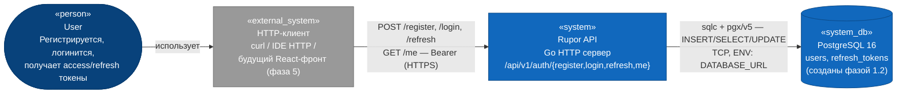
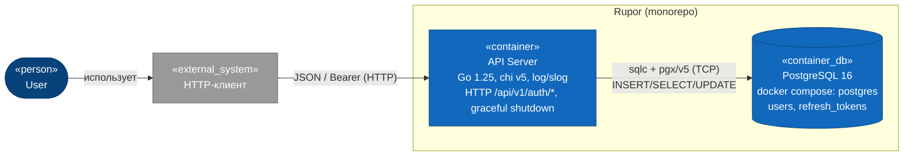
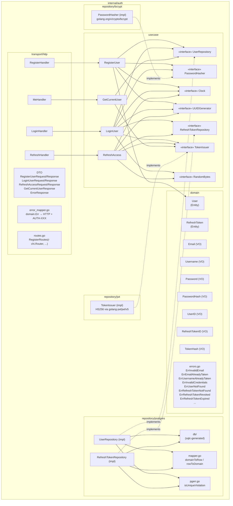
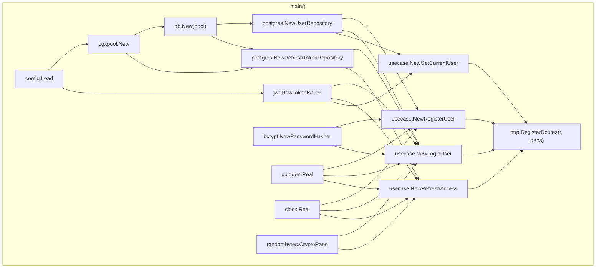
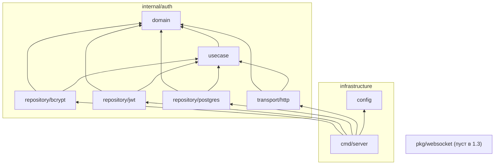

# 01 — Architecture (Logical View)

## C4 Level 1 — System Context

На уровне system context фича `1_3_auth_domen` не вводит новых внешних систем. Контекст показан таким, каким он будет к концу Фазы 1.3: пользователь обращается к Rupor API за регистрацией/логином/refresh, API хранит учётки и хеши refresh-токенов в локальном PostgreSQL, токены подписываются HS256-секретом из env-конфига.



Акторы:
- **User** — обычный пользователь Rupor.
- **HTTP-клиент** — пока `curl` или JetBrains HTTP Client; в фазе 5 место займёт React-приложение.

Внешние системы:
- **PostgreSQL 16** — поднимается через `docker compose` (`docker-compose.yml:2-19`), таблицы `users` (`migrations/0002_users.up.sql`) и `refresh_tokens` (`migrations/0003_refresh_tokens.up.sql`) уже существуют.

Что **не** входит в Level 1 этой фичи: STUN-сервер для WebRTC, фронтенд `web/`, продакшен-деплой, мониторинг, верификация e-mail.

## C4 Level 2 — Containers

Контейнеры в смысле C4 — те же два, что и в фазе 1.1: API-сервер и БД. Auth не вводит новых процессов — только новые компоненты внутри API-сервера.



Затрагиваемые контейнеры:
- **API Server (`cmd/server`, `internal/auth`, `config`)** — основной объём изменений: новый домен `auth/`, расширение `cmd/server/main.go` для composition root и регистрации `/api/v1/auth/*`.
- **PostgreSQL 16** — без изменений схемы. Используются существующие таблицы.

Новых контейнеров **нет** — Rupor планируется как монолит (`general_plan.md:69-79`).

## C4 Level 3 — Components (модуль `internal/auth/`)

Раскладка по слоям Clean Architecture. Все четыре стандартных слоя (`domain`, `usecase`, `transport/http`, `repository/postgres`) наполняются впервые в проекте; дополнительно появляются адаптеры `repository/jwt` и `repository/bcrypt` под зонтиком `repository/` (см. ADR-005 в `03-decisions.md`).



### Доменные сущности и VO

#### `domain.User`

Поля (приватные):
- `id UserID`
- `email Email`
- `username Username`
- `passwordHash PasswordHash`
- `createdAt time.Time`

Конструкторы:
- `NewUser(id UserID, email Email, username Username, passwordHash PasswordHash, createdAt time.Time) (*User, error)` — для создания новой сущности в `RegisterUser`. Проверяет: `id.IsZero()` → `ErrInvalidUserID`, `createdAt.IsZero()` → `ErrInvalidCreatedAt`.
- `ReconstructUser(id, email, username, passwordHash, createdAt)` — для восстановления из БД в репозитории. Те же проверки.

Геттеры: `ID() UserID`, `Email() Email`, `Username() Username`, `PasswordHash() PasswordHash`, `CreatedAt() time.Time`.

Бизнес-методы: **в scope 1.3 не предусмотрены** — у User нет жизненного цикла (нет `Activate`, `Ban`, `Deactivate`), потому что в схеме нет полей `status`/`deleted_at` (`docs/1_2_db_schema/users_table/03-decisions.md`, решения 8–9). Появятся в будущих фазах при необходимости.

#### `domain.RefreshToken`

Поля (приватные):
- `id RefreshTokenID`
- `userID UserID`
- `tokenHash TokenHash`
- `expiresAt time.Time`
- `createdAt time.Time`
- `revokedAt time.Time` — zero value = активный

Конструкторы:
- `NewRefreshToken(id, userID, tokenHash, expiresAt, createdAt) (*RefreshToken, error)` — выпускает активный токен. Проверки: `expiresAt.After(createdAt)` → `ErrInvalidRefreshTokenExpiration`, остальные ID/hash-инварианты делегируются конструкторам VO.
- `ReconstructRefreshToken(id, userID, tokenHash, expiresAt, createdAt, revokedAt time.Time)` — для репозитория.

Геттеры: `ID()`, `UserID()`, `TokenHash()`, `ExpiresAt()`, `CreatedAt()`, `RevokedAt()`.

Бизнес-методы:
- `Revoke(now time.Time) error` — устанавливает `revokedAt = now`. Если уже отозван → `ErrRefreshTokenAlreadyRevoked`, состояние не меняется.
- `IsActive(now time.Time) bool` — `revokedAt.IsZero() && now.Before(expiresAt)`.
- `IsRevoked() bool` — `!revokedAt.IsZero()`.
- `IsExpired(now time.Time) bool` — `!now.Before(expiresAt)`.

#### Value Objects

| VO | Базовый тип | Валидация в конструкторе |
|----|-------------|--------------------------|
| `UserID` | `uuid.UUID` | `IsZero()` запрещает нулевой UUID |
| `RefreshTokenID` | `uuid.UUID` | `IsZero()` запрещает нулевой UUID |
| `Email` | `string` (приватное `value`) | trim + `strings.ToLower`; не пустая; regex `^[^@\s]+@[^@\s]+\.[^@\s]+$`; длина ≤ 254 |
| `Username` | `string` | trim; длина 3..32 (совпадает с `users_username_length_check`); regex `^[a-zA-Z0-9_-]+$` (см. ADR-007) |
| `Password` | `string` | длина 8..72 (верх — лимит bcrypt-input); НЕ trim, чтобы пользователь мог использовать пробелы; не сериализуется наружу |
| `PasswordHash` | `string` | non-empty; формат — конкретный bcrypt-хеш `$2a$NN$...`, валидация делегируется bcrypt-адаптеру при `Verify` |
| `TokenHash` | `[32]byte` | конструктор `NewTokenHash(b []byte)` проверяет `len(b) == 32`, копирует в массив |

Каждый VO имеет:
- Приватные поля.
- Конструктор `NewXxx(raw) (Xxx, error)` или `NewXxx(typed) Xxx` (если zero-value не несёт смысла).
- Геттер `String()` (или `UUID()` для UserID/RefreshTokenID, `Bytes() [32]byte` для TokenHash).
- Сравнение по значению (`==`), кроме `TokenHash` — сравнение через явный метод `Equal(other TokenHash) bool` (массивы `[32]byte` сравнимы напрямую).

Доменные ошибки в `internal/auth/domain/errors.go`:
- Sentinel: `ErrInvalidEmail`, `ErrInvalidUsername`, `ErrInvalidPassword`, `ErrInvalidPasswordHash`, `ErrInvalidUserID`, `ErrInvalidRefreshTokenID`, `ErrInvalidTokenHash`, `ErrInvalidRefreshTokenExpiration`, `ErrEmailAlreadyTaken`, `ErrUsernameAlreadyTaken`, `ErrUserNotFound`, `ErrInvalidCredentials`, `ErrRefreshTokenNotFound`, `ErrRefreshTokenRevoked`, `ErrRefreshTokenExpired`, `ErrRefreshTokenAlreadyRevoked`, `ErrAccessTokenInvalid`, `ErrAccessTokenExpired`.

### Use Cases (`internal/auth/usecase/`)

| Use Case | Файл | Input | Output | Зависимости |
|----------|------|-------|--------|-------------|
| `RegisterUser` | `register_user.go` | `{Email, Username, Password string}` | `{UserID, Email, Username string; CreatedAt time.Time}` | `UserRepository`, `PasswordHasher`, `Clock`, `UUIDGenerator` |
| `LoginUser` | `login_user.go` | `{Email, Password string}` | `{AccessToken, RefreshToken string; AccessExpiresAt, RefreshExpiresAt time.Time}` | `UserRepository`, `RefreshTokenRepository`, `PasswordHasher`, `TokenIssuer`, `Clock`, `UUIDGenerator`, `RandomBytes` |
| `RefreshAccess` | `refresh_access.go` | `{RefreshToken string}` | то же, что `LoginUser` | `RefreshTokenRepository`, `TokenIssuer`, `Clock`, `UUIDGenerator`, `RandomBytes` |
| `GetCurrentUser` | `get_current_user.go` | `{UserID string}` (UUID-строка из access-claim) | `{UserID, Email, Username string; CreatedAt time.Time}` | `UserRepository` |

Все use case'ы — структуры с инжектированными зависимостями через конструктор `NewXxx(...)`. Каждая структура имеет один публичный метод `Execute(ctx, input) (output, error)` (`prompts/Architecture Layers.txt:39-43`).

### Интерфейсы зависимостей (порты)

Объявлены в `internal/auth/usecase/ports.go`:

```go
type UserRepository interface {
    Save(ctx context.Context, u *domain.User) error
    FindByID(ctx context.Context, id domain.UserID) (*domain.User, error)
    FindByEmail(ctx context.Context, email domain.Email) (*domain.User, error)
}

type RefreshTokenRepository interface {
    Save(ctx context.Context, t *domain.RefreshToken) error
    FindByHash(ctx context.Context, h domain.TokenHash) (*domain.RefreshToken, error)
    Rotate(ctx context.Context, oldHash domain.TokenHash, newToken *domain.RefreshToken, revokedAt time.Time) error
}

type PasswordHasher interface {
    Hash(p domain.Password) (domain.PasswordHash, error)
    Verify(h domain.PasswordHash, p domain.Password) error
}

type TokenIssuer interface {
    IssueAccess(userID domain.UserID, now time.Time) (token string, expiresAt time.Time, err error)
    VerifyAccess(token string, now time.Time) (domain.UserID, error)
}

type Clock interface { Now() time.Time }
type UUIDGenerator interface { New() uuid.UUID }
type RandomBytes interface { Read(n int) ([]byte, error) }
```

`Rotate` — единственный compound-метод; нужен для атомарности `revoke old + insert new` в одной `pgx.Tx` (см. ADR-006). Остальные методы — single-statement.

### Адаптеры (`internal/auth/repository/...`)

#### `repository/postgres/`
- `user_repository.go` — `UserRepository` impl. Конструктор `NewUserRepository(q *db.Queries)`.
- `refresh_token_repository.go` — `RefreshTokenRepository` impl. Конструктор `NewRefreshTokenRepository(pool *pgxpool.Pool, q *db.Queries)` (нужен `pool` для `BeginTx` в `Rotate`).
- `mapper.go` — `userRowToDomain`, `domainToInsertUserParams`, `refreshTokenRowToDomain`, `domainToInsertRefreshTokenParams` (паттерн из `prompts/RepoModel.txt:84-88`).
- `pgerr.go` — `isUniqueViolation(err error, constraintName string) bool` через `errors.As(*pgconn.PgError)` + `code == "23505"`.
- `queries/users.sql`, `queries/refresh_tokens.sql` — sqlc-исходники.
- `db/` — сгенерированный пакет (создаётся `make sqlc`, в git коммитится).

#### `repository/jwt/`
- `token_issuer.go` — `TokenIssuer` impl. Конструктор `NewTokenIssuer(secret []byte, accessTTL time.Duration)`. Использует `github.com/golang-jwt/jwt/v5`, метод подписи `jwt.SigningMethodHS256`. Claims: `sub` (UserID), `iat`, `exp`. `VerifyAccess` парсит, проверяет `exp` относительно переданного `now`, возвращает `domain.UserID` или `ErrAccessTokenInvalid` / `ErrAccessTokenExpired`.

#### `repository/bcrypt/`
- `password_hasher.go` — `PasswordHasher` impl. `bcrypt.DefaultCost = 10`. `Verify` обрабатывает `bcrypt.ErrMismatchedHashAndPassword` → `domain.ErrInvalidCredentials`.

### Транспорт (`internal/auth/transport/http/`)

- `dto.go` — все request/response/error структуры с json-тегами (`prompts/Architecture Layers.txt:54-58`).
- `register_handler.go`, `login_handler.go`, `refresh_handler.go`, `me_handler.go` — по одному файлу на эндпоинт. Каждый — структура с инжектированным use case, метод `ServeHTTP(w, r)`.
- `error_mapper.go` — `mapError(err error) (status int, code string, message string)` — единый switch по `errors.Is(err, domain.ErrXxx)`.
- `routes.go` — `RegisterRoutes(r chi.Router, deps Deps)` — собирает хендлеры, регистрирует `r.Post("/register", ...)`, `r.Post("/login", ...)`, `r.Post("/refresh", ...)`, `r.Get("/me", ...)`.
- `me_handler.go` дополнительно валидирует `Authorization: Bearer` → `TokenIssuer.VerifyAccess` → передаёт UserID в `GetCurrentUser` (см. ADR-009 — это временный inline-mode до фазы 1.4).

### State Machine — `RefreshToken`

```
[Active] --Revoke(now)--> [Revoked]
   │                          (terminal: новые операции — ошибка)
   │ now ≥ expiresAt
   ↓
[Expired]
   (terminal: переход не сохраняется в БД, вычисляется по now > expires_at AND revoked_at IS NULL)
```

`Active`: `revokedAt.IsZero() && now.Before(expiresAt)`.
`Revoked`: `!revokedAt.IsZero()` — пишется в БД через UPDATE в `Rotate`.
`Expired`: `revokedAt.IsZero() && !now.Before(expiresAt)` — состояние не пишется в БД, вычисляется при чтении.

Из `Revoked` и `Expired` нельзя выпустить новые токены — `RefreshAccess` возвращает `ErrRefreshTokenRevoked` / `ErrRefreshTokenExpired`.

### Composition root в `cmd/server/main.go`

Добавляется к существующему коду (`cmd/server/main.go:48-91`):



`Pool.Close()` добавляется в graceful shutdown после `srv.Shutdown(...)` (`cmd/server/main.go:82-87`).

## Граф зависимостей модулей

Правило из `prompts/Architecture Layers.txt:67-74`: импорт строго **внутрь**.



Запрещённые направления (`prompts/Architecture Layers.txt:73`):
- `domain` импортирует что-либо из `usecase/transport/repository/cmd` — **запрет**.
- `usecase` импортирует `transport`/`repository` — **запрет**. Использует ТОЛЬКО `domain` + stdlib + `github.com/google/uuid` (ADR-003).
- Адаптеры `repository/postgres`, `repository/jwt`, `repository/bcrypt` импортируют `usecase` (для интерфейсов) и `domain` (для типов и ошибок), но не друг друга.

Архитектурный smoke-тест (`docs/1_1_project-structure/04-testing.md:64-80`, помечен `t.Skip` в фазе 1.1) **активируется в этой фиче**: добавится whitelist для `domain`, `usecase` и pairwise проверка между `internal/auth/repository/{postgres,jwt,bcrypt}/`. Реализация — в `04-testing.md`.
