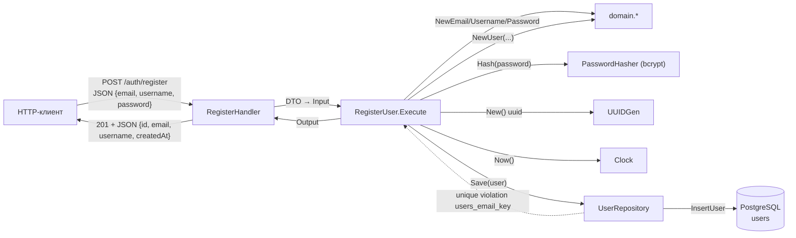
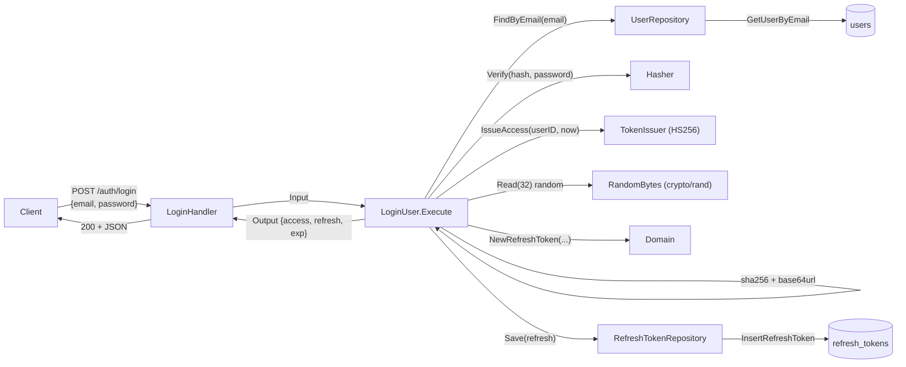
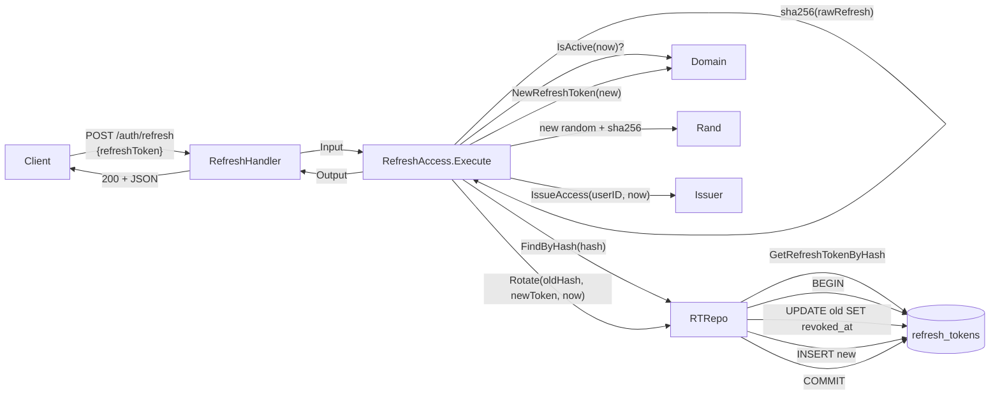
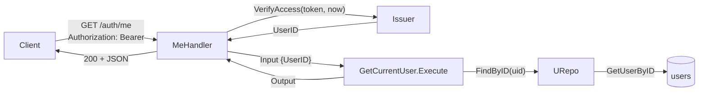
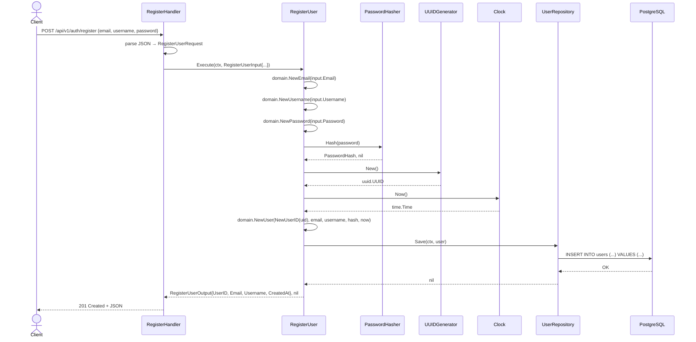
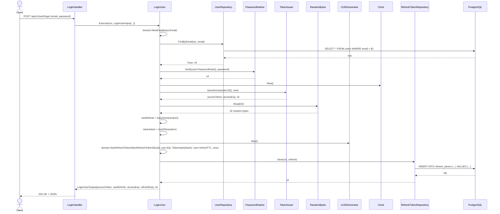
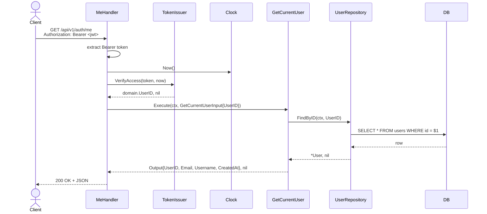

# 02 — Behavior (Process View)

## Data Flow Diagrams

### DFD-1: Register



### DFD-2: Login



### DFD-3: Refresh (с ротацией)



### DFD-4: GetCurrentUser (`/auth/me`)



## Sequence Diagrams

### Use Case 1: RegisterUser

Happy path:



**Error cases:**

| Условие | Тип ошибки | Code | HTTP | Поведение |
|---|---|---|---|---|
| Невалидный JSON в теле запроса | `transport` | AUTH-012 | 400 | Тело: `{"error":{"code":"AUTH-012","message":"malformed request body"}}` |
| `email` пустой / без `@` / >254 / содержит пробелы | `domain.ErrInvalidEmail` | AUTH-001 | 400 | `{"error":{"code":"AUTH-001","message":"invalid email"}}` |
| `username` <3 / >32 / содержит запрещённые символы | `domain.ErrInvalidUsername` | AUTH-002 | 400 | `{"error":{"code":"AUTH-002","message":"invalid username"}}` |
| `password` <8 или >72 байт | `domain.ErrInvalidPassword` | AUTH-003 | 400 | `{"error":{"code":"AUTH-003","message":"invalid password"}}` |
| `email` уже занят (unique violation `users_email_key`) | `domain.ErrEmailAlreadyTaken` | AUTH-004 | 409 | `{"error":{"code":"AUTH-004","message":"email already taken"}}` |
| `username` уже занят (unique violation `users_username_key`) | `domain.ErrUsernameAlreadyTaken` | AUTH-005 | 409 | `{"error":{"code":"AUTH-005","message":"username already taken"}}` |
| Сбой БД (connection lost, etc.) | wrapped error | — | 500 | `{"error":{"code":"INTERNAL","message":"internal"}}`; реальная ошибка в `slog.Error` |
| Сбой bcrypt | wrapped error | — | 500 | то же |

**Edge cases:**
- Race на email/username: два регистрационных запроса с одинаковым email одновременно. Один проходит, второй получает `unique_violation` от Postgres → маппится в `AUTH-004/005`. БД-уровневая защита.
- `password` ровно 72 байта (граница bcrypt) — валиден; 73 — `AUTH-003`.
- Email с верхним регистром → нормализуется в lower-case в `NewEmail`; уникальность держит `citext`.
- `username` с пробелами по краям — `trim` в `NewUsername`; внутренние пробелы запрещены regex.

### Use Case 2: LoginUser

Happy path:



**Error cases:**

| Условие | Тип ошибки | Code | HTTP | Поведение |
|---|---|---|---|---|
| Невалидный JSON | `transport` | AUTH-012 | 400 | `{"error":{"code":"AUTH-012",...}}` |
| Невалидный формат `email` (regex/длина) | `domain.ErrInvalidEmail` → mapped to | AUTH-006 | 401 | `{"error":{"code":"AUTH-006","message":"invalid credentials"}}` — **не палим**, что email сломан |
| `email` не найден в БД | `domain.ErrUserNotFound` → mapped to | AUTH-006 | 401 | то же сообщение `AUTH-006` |
| Пароль не совпал | `bcrypt.ErrMismatchedHashAndPassword` → `domain.ErrInvalidCredentials` | AUTH-006 | 401 | то же |
| Сбой БД при SELECT | wrapped error | — | 500 | `INTERNAL`, реальная ошибка в `slog.Error` |
| Сбой БД при INSERT refresh | wrapped error | — | 500 | то же; access не выдан, клиент повторяет |
| `crypto/rand` вернул ошибку | wrapped error | — | 500 | то же |

**Edge cases:**
- **Намеренно одинаковый ответ** `AUTH-006` для «email невалиден», «email не найден», «пароль неправильный» — защита от user-enumeration. Hasher вызывается даже при `ErrUserNotFound` через dummy-bcrypt-сравнение, чтобы выровнять время отклика (см. ADR-008).
- Транзакции на login нет: SELECT user → INSERT refresh. Если INSERT упал — клиент получает 500 и повторяет. Промежуточного inconsistent-state нет (user уже существовал, новых данных не сохранили).
- Длина `password` 73+ байт — пользователь не может войти, но это деталь bcrypt; в Login возвращаем `AUTH-006` (не `AUTH-003`), потому что валидация формата на login-флоу теряет смысл (валидный пользователь не мог зарегистрироваться с таким паролем).

### Use Case 3: RefreshAccess (с ротацией)

Happy path:

```mermaid
sequenceDiagram
    actor Client
    participant Handler as RefreshHandler
    participant UC as RefreshAccess
    participant RTRepo as RefreshTokenRepository
    participant Issuer as TokenIssuer
    participant Rand as RandomBytes
    participant UUIDGen as UUIDGenerator
    participant Clock
    participant DB as PostgreSQL

    Client->>Handler: POST /api/v1/auth/refresh {refreshToken}
    Handler->>UC: Execute(ctx, RefreshAccessInput{RefreshToken})
    UC->>UC: rawBytes = base64url.Decode(input.RefreshToken)
    UC->>UC: oldHash = sha256(rawBytes)
    UC->>RTRepo: FindByHash(ctx, oldHash)
    RTRepo->>DB: SELECT ... FROM refresh_tokens WHERE token_hash = $1
    DB-->>RTRepo: row
    RTRepo-->>UC: *RefreshToken, nil
    UC->>Clock: Now()
    UC->>UC: token.IsActive(now)? -> true
    UC->>Issuer: IssueAccess(token.UserID(), now)
    Issuer-->>UC: newAccess, accessExp, nil
    UC->>Rand: Read(32)
    Rand-->>UC: 32 bytes
    UC->>UC: newRaw = base64url; newHash = sha256
    UC->>UUIDGen: New()
    UC->>UC: domain.NewRefreshToken(newID, token.UserID(), newHash, now+refreshTTL, now)
    UC->>RTRepo: Rotate(ctx, oldHash, newRefresh, now)
    RTRepo->>DB: BEGIN
    RTRepo->>DB: UPDATE refresh_tokens SET revoked_at = $1 WHERE token_hash = $2 AND revoked_at IS NULL
    RTRepo->>DB: INSERT INTO refresh_tokens (...) VALUES (...)
    RTRepo->>DB: COMMIT
    RTRepo-->>UC: nil
    UC-->>Handler: RefreshAccessOutput{newAccess, newRaw, accessExp, refreshExp}, nil
    Handler-->>Client: 200 OK + JSON
```

**Error cases:**

| Условие | Тип ошибки | Code | HTTP | Поведение |
|---|---|---|---|---|
| Невалидный JSON | `transport` | AUTH-012 | 400 | стандарт |
| `refreshToken` не декодируется из base64url | `transport` | AUTH-007 | 401 | `{"error":{"code":"AUTH-007","message":"refresh token not found"}}` |
| `refreshToken` после декода ≠ 32 байт | `transport` | AUTH-007 | 401 | то же (одинаковый ответ для опс-фактов и not-found) |
| Хеш не найден в БД | `domain.ErrRefreshTokenNotFound` | AUTH-007 | 401 | то же |
| Токен отозван (`revoked_at IS NOT NULL`) | `domain.ErrRefreshTokenRevoked` | AUTH-008 | 401 | `{"error":{"code":"AUTH-008","message":"refresh token revoked"}}` |
| Токен истёк (`now ≥ expires_at`) | `domain.ErrRefreshTokenExpired` | AUTH-009 | 401 | `{"error":{"code":"AUTH-009","message":"refresh token expired"}}` |
| Сбой `Rotate` (БД упала между UPDATE и INSERT) | wrapped error | — | 500 | tx роллбэкается; старый токен остаётся активным; клиент повторит |
| Сбой `crypto/rand` | wrapped error | — | 500 | стандарт |

**Edge cases:**
- **Re-use detection (выявление переиспользования)**: если прилетел refresh, который уже отозван (`revoked_at != NULL`), это сильный сигнал, что токен утёк. В **scope MVP** мы лишь возвращаем `AUTH-008`; **более жёсткая реакция** (отозвать ВСЕ refresh-токены этого пользователя) — открытый вопрос (`03-decisions.md`, OQ-3).
- Race на двух параллельных refresh с одним и тем же токеном: благодаря транзакции в `Rotate`, второй UPDATE отработает с `affected_rows = 0` (потому что в WHERE `revoked_at IS NULL`), а sqlc-запрос `RotateRefreshTokenByHash` — это `:execrows`. Если 0 — возвращаем `domain.ErrRefreshTokenRevoked` (или `ErrRefreshTokenNotFound` — оба корректны). См. реализацию в `06-repo-model.md`.
- TTL refresh = 30 дней по умолчанию (`JWT_REFRESH_TTL=720h`). Клиент может использовать тот же refresh за 1 секунду до expiration — мы выпустим новые токены, expiration нового refresh — `now + 30d`.
- Истёкший токен можно теоретически использовать как detection signal (атакующий пробует), но в MVP логируем INFO и возвращаем 401.

### Use Case 4: GetCurrentUser (`/auth/me`)

Happy path:



**Error cases:**

| Условие | Тип ошибки | Code | HTTP | Поведение |
|---|---|---|---|---|
| Нет заголовка `Authorization` | `transport` | AUTH-010 | 401 | `{"error":{"code":"AUTH-010","message":"access token invalid"}}` |
| Заголовок не `Bearer <token>` | `transport` | AUTH-010 | 401 | то же |
| Токен не парсится / неправильная подпись / неверный алгоритм | `domain.ErrAccessTokenInvalid` | AUTH-010 | 401 | то же |
| Токен истёк (`exp < now`) | `domain.ErrAccessTokenExpired` | AUTH-011 | 401 | `{"error":{"code":"AUTH-011","message":"access token expired"}}` |
| `sub` claim не парсится в UUID | `domain.ErrAccessTokenInvalid` | AUTH-010 | 401 | то же |
| Пользователь по `sub` не найден (был удалён, но JWT ещё валиден) | `domain.ErrUserNotFound` | AUTH-010 | 401 | то же сообщение `AUTH-010` (специальный код «пользователь больше не существует» в MVP не вводим) |
| Сбой БД | wrapped error | — | 500 | стандарт |

**Edge cases:**
- В фазе 1.3 нет middleware (см. ADR-009). Извлечение `Authorization` живёт в `MeHandler` и переедет в middleware в фазе 1.4. Контракт `TokenIssuer.VerifyAccess` стабилизирован сейчас и не изменится.
- `Authorization: bearer xxx` (lowercase) — chi не нормализует значение; принимаем только `Bearer ` (CamelCase) для предсказуемости. Возможно, в фазе 1.4 при появлении middleware это будет смягчено.

## Дополнительные сценарии

### Сценарий: Конфигурация при старте

Конфигурация дополняется в фазе 1.3 двумя env-переменными.

| env | Default | Validation |
|-----|---------|-----------|
| `JWT_ACCESS_TTL` | `15m` | `time.ParseDuration` succeeds; `> 0`; `≤ 1h` (защита от случайной долгоживучки) |
| `JWT_REFRESH_TTL` | `720h` | `time.ParseDuration` succeeds; `> 0`; `> JWT_ACCESS_TTL`; `≤ 90d` |

При невалидной конфигурации сервер падает на старте с `slog.Error` (как сейчас, `cmd/server/main.go:28-40`):
- `CONFIG-004` — `JWT_ACCESS_TTL` не парсится / out of range.
- `CONFIG-005` — `JWT_REFRESH_TTL` не парсится / out of range / меньше access TTL.

### Сценарий: Архитектурный smoke-тест (активация)

Тест `TestArchitecture_*` (ранее `t.Skip` в фазе 1.1, `docs/1_1_project-structure/04-testing.md:64-80`) активируется в этой фиче — `t.Skip` снимается, добавляется реализация:

| Тест | Проверка |
|------|----------|
| `TestArchitecture_DomainImports` | `internal/auth/domain/*.go` импортирует только stdlib + `github.com/google/uuid`. |
| `TestArchitecture_UseCaseImports` | `internal/auth/usecase/*.go` импортирует только stdlib + `github.com/google/uuid` + `github.com/dovgalb/project-rupor/internal/auth/domain`. |
| `TestArchitecture_AdaptersDontCrossDomains` | `internal/auth/repository/{postgres,jwt,bcrypt}/` не импортируют `internal/<X>/transport` или `internal/<X>/repository` других доменов. |

Реализация — через `golang.org/x/tools/go/packages` (раздел `04-testing.md`).
