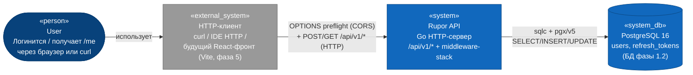
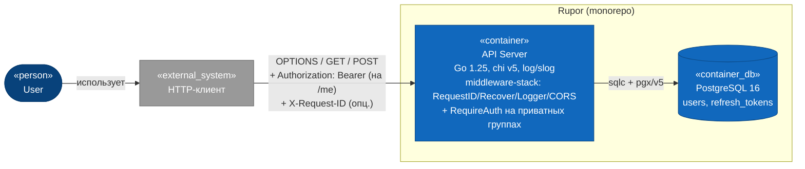
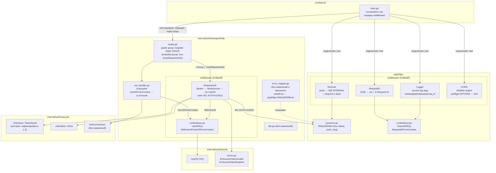
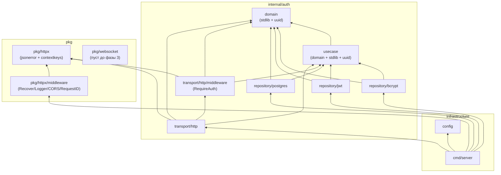
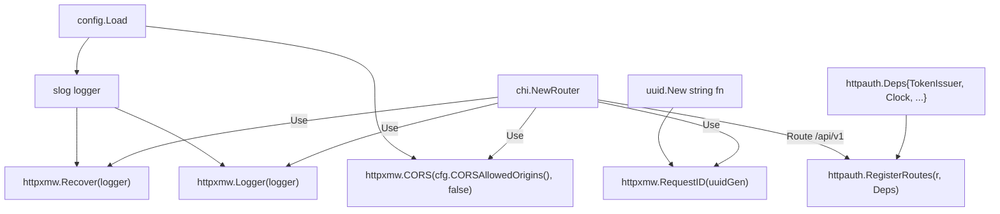

# 01 — Architecture (Logical View)

## C4 Level 1 — System Context

Фича 1.4 не вводит новых внешних систем. Контекст показан таким, каким он будет к концу фазы: пользователь по-прежнему обращается к Rupor API через HTTP-клиента; PostgreSQL подключается через тот же `pgxpool`. Существенное отличие от L1 фазы 1.3 — появляется **preflight-граница**: браузер (при будущем фронте на Vite) перед каждым cross-origin-запросом шлёт `OPTIONS …`, и API отвечает CORS-заголовками.



Акторы:
- **User** — обычный пользователь Rupor.
- **HTTP-клиент** — `curl` или JetBrains HTTP Client сейчас; в фазе 5 — браузер с React-приложением, который будет посылать preflight.

Внешние границы:
- **PostgreSQL 16** — не меняется.
- **Браузер ↔ API** — в фазе 1.4 формализуется. Whitelisted origins — env `CORS_ALLOWED_ORIGINS` (default `http://localhost:5173` для Vite-dev).

Что **не** входит в Level 1: STUN-сервер, фронтенд `web/`, продакшен-деплой, мониторинг.

## C4 Level 2 — Containers

Контейнеров — те же два, что и в фазе 1.1/1.3: API-сервер и БД. Auth Middleware **не вводит новых процессов**, только новые компоненты внутри API-сервера.



Затрагиваемые контейнеры:
- **API Server (`cmd/server`, `internal/auth/transport/http/`, `pkg/httpx/middleware/`, `config/`)** — основной объём изменений: новый общий пакет HTTP-обвязки `pkg/httpx/middleware/`, новый подпакет `internal/auth/transport/http/middleware/`, расширение `cmd/server/main.go` (порядок подключения), модификация `routes.go` (public/protected groups), упрощение `me_handler.go`.
- **PostgreSQL 16** — без изменений.

Новых контейнеров **нет** — Rupor планируется как монолит (`general_plan.md:69-79`).

## C4 Level 3 — Components

Раскладка по двум новым пакетам и точкам интеграции.



### Новый пакет `pkg/httpx/middleware/` (cross-cutting HTTP-обвязка)

Назначение — общие middleware, не зависящие от auth-домена. Импортируется из `cmd/server/main.go` напрямую и (в будущем) из других транспортных пакетов (`internal/room/transport/http/`, `internal/channel/transport/http/`, WebSocket-handshake).

Файлы:

#### `pkg/httpx/middleware/responsewriter.go` (общий wrapper)

Используется **обоими** Recover и Logger. Один источник истины:

```go
type responseWriter struct {
    http.ResponseWriter
    status        int
    headerWritten bool
}

func wrap(w http.ResponseWriter) *responseWriter {
    return &responseWriter{ResponseWriter: w, status: http.StatusOK}
}

func (r *responseWriter) WriteHeader(code int) {
    if r.headerWritten { return }
    r.status = code
    r.headerWritten = true
    r.ResponseWriter.WriteHeader(code)
}

func (r *responseWriter) Write(b []byte) (int, error) {
    if !r.headerWritten { r.WriteHeader(http.StatusOK) }
    return r.ResponseWriter.Write(b)
}
```

Зачем — `Logger` нужен `status` для access-log, `Recover` нужен `headerWritten` для решения «писать 500 или нет».

#### `pkg/httpx/middleware/recover.go`
- Функция `Recover(logger *slog.Logger) func(http.Handler) http.Handler`.
- Оборачивает `w` в `responseWriter`, передаёт обёрнутый `w` дальше.
- Через `defer func() { v := recover(); ... }()` ловит panic в нижестоящих middleware и хендлерах.
- Если `errors.Is(v, http.ErrAbortHandler)` — `panic(v)` (re-panic для совместимости с net/http).
- Логирует `slog.Error("panic recovered", "err", v, "stack", string(debug.Stack()), "request_id", reqID, "method", r.Method, "path", r.URL.Path)`.
- Если `!sw.headerWritten` — `pkg/httpx.WriteJSONError(sw, 500, "INTERNAL", "internal")` пишет стандартный envelope.
- Если `sw.headerWritten` — `slog.Warn("panic after WriteHeader, response truncated")` без второго WriteHeader.
- **Единственное место в проекте**, где `recover()` допустим (`prompts/Go style.txt:44`).

#### `pkg/httpx/middleware/logger.go`
- Функция `Logger(logger *slog.Logger, hook func(context.Context) []slog.Attr) func(http.Handler) http.Handler`.
- Если `hook == nil` — middleware использует пустую функцию, возвращающую `nil`. Это позволяет тестировать middleware без auth-зависимостей.
- Перед `next.ServeHTTP` запоминает `start := time.Now()`.
- Оборачивает `w` в тот же `responseWriter` из `responsewriter.go`. Если `Recover` стоит выше — он уже обернул, тогда `wrap` идемпотентен (см. реализационный note: проверка `if rw, ok := w.(*responseWriter); ok { return rw }`).
- После `next.ServeHTTP` собирает базовые attrs (`method`, `path`, `status`, `duration`, `request_id`, `remote_ip`, `user_agent`), добавляет `hook(r.Context())`, пишет `slog.LogAttrs(slog.LevelInfo, "http", attrs...)`.
- `request_id` берётся из ctx через `httpx.RequestIDFromContext`.
- Не логирует тело запроса/ответа (защита от PII, `prompts/Go style.txt:94`, ADR-012).
- Не логирует `Authorization` header.

#### `pkg/httpx/middleware/cors.go`
- Функция `CORS(allowedOrigins []string, allowCredentials bool) func(http.Handler) http.Handler`.
- На `r.Method == OPTIONS`:
  - проверяет `Origin` header против whitelist;
  - если match — выставляет `Access-Control-Allow-Origin: <origin>`, `Access-Control-Allow-Methods: GET, POST, PUT, DELETE, OPTIONS`, `Access-Control-Allow-Headers: Authorization, Content-Type, X-Request-ID`, `Access-Control-Max-Age: 600`, `Vary: Origin`;
  - `WriteHeader(204)`, без `next.ServeHTTP`.
- На остальных методах: если `Origin` совпадает с whitelist — выставляет те же `Access-Control-Allow-Origin` + `Vary: Origin`, `next.ServeHTTP` обычным образом.
- Wildcard `*` **не поддерживается** (см. ADR-004); только явный whitelist через CSV.
- `allowCredentials = false` в фазе 1.4 (auth идёт через `Authorization` header, не cookies).

#### `pkg/httpx/middleware/requestid.go`
- Функция `RequestID(uuidGen func() string) func(http.Handler) http.Handler`.
- Берёт `r.Header.Get("X-Request-ID")`. Если непуст и проходит проверку (`len <= 128`, ASCII-печатные) — использует как есть; иначе генерирует новый через `uuidGen()`.
- Кладёт в контекст: `ctx = httpx.WithRequestID(r.Context(), rid)`.
- Выставляет `w.Header().Set("X-Request-ID", rid)` ДО `next.ServeHTTP`.
- В `cmd/server/main.go` `uuidGen` — функция, замыкающая `uuid.New().String()`. В тестах — детерминированная.

#### `pkg/httpx/jsonerror.go`
- Функция `WriteJSONError(w http.ResponseWriter, status int, code string, message string)`.
- Тело: `{"error":{"code":"<code>","message":"<message>"}}` + `\n`.
- Заголовок `Content-Type: application/json; charset=utf-8`.
- Идемпотентна по отношению к двойному вызову через `http.Error`-стиль: если уже что-то писалось в response, просто WriteHeader (запись повторно невозможна).

#### `pkg/httpx/contextkeys.go`
- Типизированный приватный ключ `type requestIDKey struct{}`.
- Публичные `WithRequestID(ctx, rid string) context.Context`.
- Публичная `RequestIDFromContext(ctx) (string, bool)`.

### Новый подпакет `internal/auth/transport/http/middleware/` (auth-specific)

Назначение — middleware, зависящие от `usecase.TokenIssuer` и `domain.UserID`. Не выносится в `pkg/httpx/`, потому что валидация Bearer-токена — это бизнес-граница auth-домена.

Файлы:

#### `internal/auth/transport/http/middleware/auth.go`
- Конструктор-фабрика:
  ```go
  func RequireAuth(issuer usecase.TokenIssuer, clock usecase.Clock) func(http.Handler) http.Handler
  ```
- Логика:
  1. `auth := r.Header.Get("Authorization")`.
  2. Если `auth == ""` или не начинается на `"Bearer "` (case-sensitive) или хвост пустой → `pkg/httpx.WriteJSONError(w, 401, "AUTH-010", "access token invalid")`. Возврат.
  3. `token := auth[len("Bearer "):]`.
  4. `uid, err := issuer.VerifyAccess(token, clock.Now())`.
  5. На ошибке — мапим через локальный `mapAuthError(err)`:
     - `errors.Is(err, domain.ErrAccessTokenExpired)` → 401 AUTH-011.
     - Иначе → 401 AUTH-010.
  6. `ctx := WithUserID(r.Context(), uid)`.
  7. `next.ServeHTTP(w, r.WithContext(ctx))`.

#### `internal/auth/transport/http/middleware/contextkeys.go`
- Типизированный приватный ключ `type userIDKey struct{}` (`prompts/Go style.txt:51` — typed-key вместо string).
- Публичные:
  ```go
  func WithUserID(ctx context.Context, id domain.UserID) context.Context
  func UserIDFromContext(ctx context.Context) (domain.UserID, bool)
  ```
- `WithUserID` принимает уже валидную `domain.UserID` (без zero-uuid) — конструктор `domain.NewUserID` гарантирует.
- `UserIDFromContext` возвращает `(zero, false)` при отсутствии ключа.

### Точки интеграции с существующим кодом

#### `cmd/server/main.go` (модификация)
В функции `run` после `chi.NewRouter()`:
```go
mux := chi.NewRouter()

// глобальный stack: первый — RequestID, чтобы все остальные видели request_id
mux.Use(httpxmw.RequestID(func() string { return uuid.New().String() }))
mux.Use(httpxmw.Recover(logger))
mux.Use(httpxmw.Logger(logger))
mux.Use(httpxmw.CORS(cfg.CORSAllowedOrigins(), false))

mux.Route("/api/v1", func(r chi.Router) {
    r.Get("/health", healthHandler)
    httpauth.RegisterRoutes(r, httpauth.Deps{...})
})
```

`httpauth.Deps` дополняется:
```go
type Deps struct {
    Register    *usecase.RegisterUser
    Login       *usecase.LoginUser
    Refresh     *usecase.RefreshAccess
    Me          *usecase.GetCurrentUser
    TokenIssuer usecase.TokenIssuer
    Clock       usecase.Clock
    // новых полей нет — RequireAuth конструируется внутри RegisterRoutes
}
```

#### `internal/auth/transport/http/routes.go` (модификация)
Разделение на public и protected группы:
```go
func RegisterRoutes(r chi.Router, deps Deps) {
    r.Route("/auth", func(r chi.Router) {
        // public
        r.Group(func(r chi.Router) {
            r.Post("/register", NewRegisterHandler(deps.Register).ServeHTTP)
            r.Post("/login",    NewLoginHandler(deps.Login).ServeHTTP)
            r.Post("/refresh",  NewRefreshHandler(deps.Refresh).ServeHTTP)
        })
        // protected
        r.Group(func(r chi.Router) {
            r.Use(authmw.RequireAuth(deps.TokenIssuer, deps.Clock))
            r.Get("/me", NewMeHandler(deps.Me).ServeHTTP)
        })
    })
}
```

#### `internal/auth/transport/http/me_handler.go` (упрощение)
- Структура `MeHandler` хранит только `uc *usecase.GetCurrentUser`. `issuer` и `clock` удаляются.
- Конструктор: `NewMeHandler(uc *usecase.GetCurrentUser) *MeHandler`.
- `ServeHTTP`:
  ```go
  func (h *MeHandler) ServeHTTP(w http.ResponseWriter, r *http.Request) {
      uid, ok := authmw.UserIDFromContext(r.Context())
      if !ok {
          // защита от ошибки конфигурации роутера
          writeError(w, mapError(domain.ErrAccessTokenInvalid))
          return
      }
      out, err := h.uc.Execute(r.Context(), usecase.GetCurrentUserInput{UserID: uid.String()})
      if err != nil {
          writeError(w, mapError(err))
          return
      }
      // success: 200 + meResponse
  }
  ```

#### `internal/auth/transport/http/error_mapper.go` (минимальная модификация)
- `writeError` внутренне использует `pkg/httpx.WriteJSONError(w, he.status, he.code, he.message)`. Контракт `httpError` сохраняется. Это убирает дублирование сериализации envelope.

### Цепочка middleware и ResponseWriter

Порядок и обоснование (см. `03-decisions.md`, ADR-002):

```
[Request]
    ↓
RequestID  ← устанавливает rid в ctx и X-Request-ID в headers FIRST
    ↓
Recover    ← оборачивает всё ниже в defer recover(); логирует panic + 500
    ↓
Logger     ← фиксирует start, оборачивает w в statusWriter, пишет лог ПОСЛЕ
    ↓
CORS       ← на OPTIONS может вернуть 204 без next; на остальных методах добавляет Access-Control-Allow-Origin
    ↓
[chi.Route /api/v1]
    ↓
[chi.Group public]    [chi.Group protected]
    ↓                       ↓
                       RequireAuth   ← валидирует Bearer, кладёт UserID в ctx
                            ↓
[handler]             [handler с UserIDFromContext]
    ↓                       ↓
[use case → repo → DB]
    ↓
[response]
    ↑
Logger (POST-pass) пишет access-log
```

`RequestID` стоит первым, чтобы любой middleware/handler ниже мог обогатить логи `request_id`. `Recover` — выше `Logger`, чтобы panic в `Logger` тоже отлавливался (никогда не должен происходить, но это страховка). `CORS` — после `Logger`, чтобы preflight тоже логировался.

### Жизненный цикл `userID` в `context.Context`

```
[until RequireAuth]   userID отсутствует (UserIDFromContext → zero, false)
        |
        | RequireAuth.WithUserID(ctx, uid)
        ↓
[after RequireAuth]   userID = domain.UserID (не zero — гарантировано
                       конструктором domain.NewUserID в repository/jwt)
        |
[handler / use case]  читают через UserIDFromContext
        |
[response]            ctx сворачивается, нет утечки (стандарт net/http)
```

`UserIDFromContext` возвращает `(zero, false)` для public-маршрутов и `(valid, true)` для protected. Хендлер `/auth/me` после `RequireAuth` вправе считать `ok == true`; защитная ветка (`if !ok`) — на случай ошибки маршрутизации (помещение хендлера в неверную группу) и возвращает 401 AUTH-010.

## Граф зависимостей модулей

Правило из `prompts/Architecture Layers.txt:67-74`: импорт строго **внутрь**.



Запрещённые направления (`prompts/Architecture Layers.txt:73`):
- `pkg/httpx/...` импортирует что-либо из `internal/...` — **запрет**. `pkg/httpx/middleware/` живёт «выше» auth-домена, она cross-cutting.
- `internal/auth/transport/http/middleware/` импортирует `internal/auth/repository/...` — **запрет** (ловится `arch_test.go`).
- `usecase` или `domain` импортируют `pkg/httpx/...` — **запрет** (поднимает `prompts/Domain Model.txt:24-29`).

Архитектурный smoke-тест (`arch_test.go`) дополняется (см. `04-testing.md`):
- `TestArchitecture_PkgHttpxImports` — `pkg/httpx/...` импортирует только stdlib + `github.com/google/uuid`.
- `TestArchitecture_AuthTransportImports` — расширяется на новый подпакет `internal/auth/transport/http/middleware/`: импорты — только `internal/auth/usecase`, `internal/auth/domain`, `pkg/httpx`, stdlib.

### Composition root (фрагмент `cmd/server/main.go`)



Изменения в `cmd/server/main.go`:
- Добавляются 4 строки `mux.Use(...)` между `chi.NewRouter()` и `mux.Route(...)`.
- Добавляется импорт `pkg/httpx/middleware`.
- Удаляется создание/прокидывание `clock` отдельно для `MeHandler` (он теперь не нужен в `MeHandler`, но всё ещё нужен для `RequireAuth` через `Deps.Clock`).
- Никаких изменений в graceful shutdown, `pgxpool`, `usecase.New*`.
