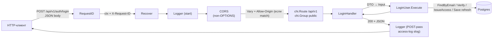
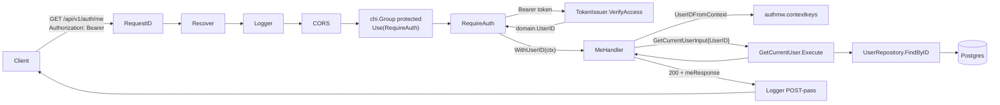
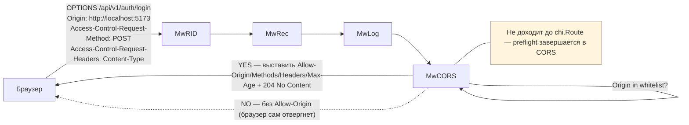
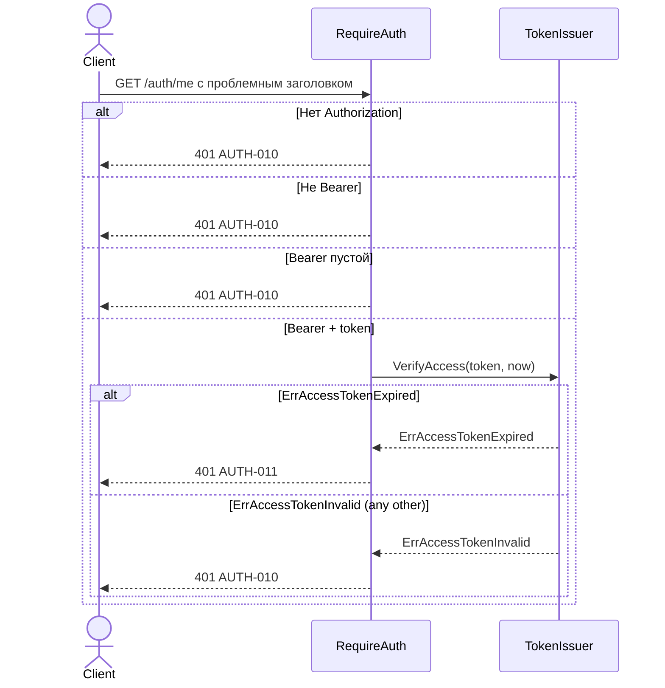
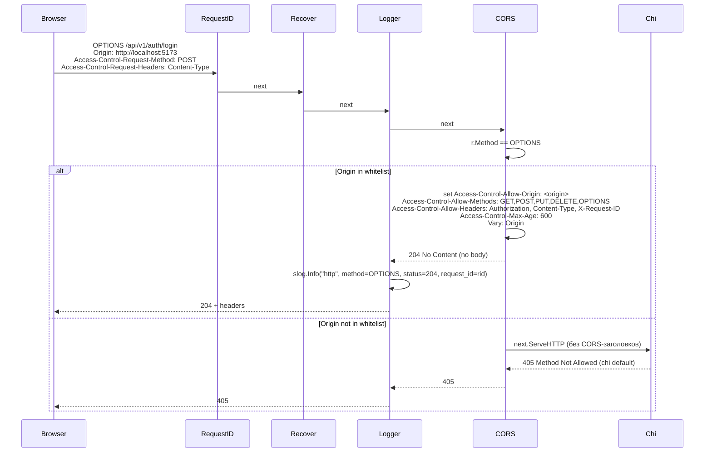
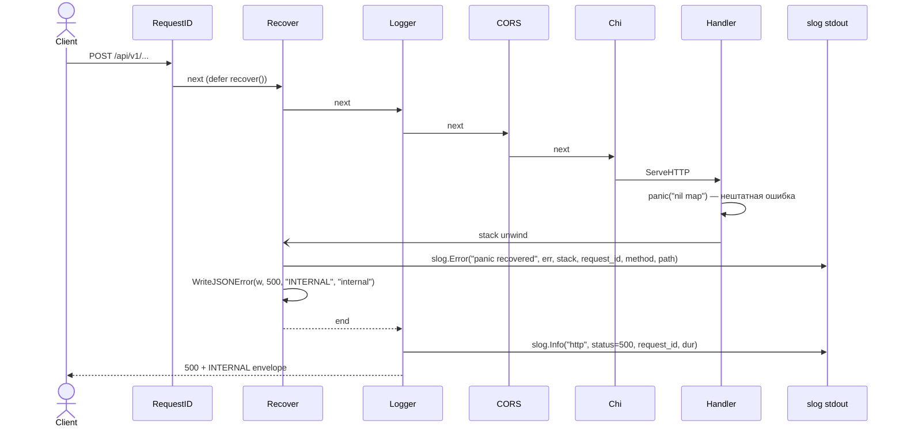

# 02 — Behavior (Process View)

## Data Flow Diagrams

### DFD-1: Public request (login / register / refresh)



### DFD-2: Authenticated request (`GET /auth/me`)



### DFD-3: Preflight (`OPTIONS`)



### DFD-4: Panic в хендлере

```mermaid
flowchart LR
    Client -->|"POST /api/v1/...<br/>(нештатная ситуация в хендлере)"| MwRID
    MwRID --> MwRec
    MwRec -->|"defer recover()"| MwLog
    MwLog --> MwCORS
    MwCORS --> ChiRoute
    ChiRoute --> Handler["Handler<br/>panic(\"…\")"]
    Handler -.->|"unwound stack"| MwRec
    MwRec -->|"slog.Error stack + request_id"| Logs[("slog stdout")]
    MwRec -->|"500 + INTERNAL envelope"| MwLog2["Logger POST-pass"]
    MwLog2 --> Client

    classDef logs fill:#eef
```

## Sequence Diagrams

Один use case на функциональное поведение middleware-стека. В отличие от 1.3, здесь use case — это не «бизнес-сценарий», а «маршрут запроса через стек».

### Use Case 1: Public request — успех

```mermaid
sequenceDiagram
    actor Client
    participant RID as RequestID
    participant Rec as Recover
    participant Log as Logger
    participant CORS
    participant Chi as chi router
    participant H as Handler
    participant UC as UseCase
    participant DB

    Client->>RID: POST /api/v1/auth/login {email, password}
    RID->>RID: rid = X-Request-ID OR uuid.New()
    RID->>RID: ctx = WithRequestID(ctx, rid); w.Header X-Request-ID
    RID->>Rec: next(ctx)
    Rec->>Rec: defer recover()
    Rec->>Log: next
    Log->>Log: start = time.Now(); wrap(w)
    Log->>CORS: next
    CORS->>CORS: r.Method != OPTIONS; if Origin in whitelist → set Allow-Origin + Vary
    CORS->>Chi: next
    Chi->>H: route /auth/login
    H->>UC: Execute(ctx, LoginUserInput)
    UC->>DB: FindByEmail / hash.Verify / IssueAccess / Save refresh
    DB-->>UC: rows
    UC-->>H: LoginUserOutput
    H-->>Chi: 200 + tokensResponse JSON
    Chi-->>CORS: response
    CORS-->>Log: response
    Log->>Log: slog.Info("http", method=POST, path=/auth/login, status=200, dur=N, request_id=rid)
    Log-->>Rec: done
    Rec-->>RID: done
    RID-->>Client: 200 OK + JSON + X-Request-ID + Access-Control-Allow-Origin
```

**Edge cases:**
- Клиент прислал `X-Request-ID` длиной >128 символов или с не-ASCII — middleware игнорирует, генерирует свой.
- Клиент прислал тот же `X-Request-ID`, что и предыдущий запрос — никаких проверок коллизий нет (request-id для коррелятора в логах, не для идемпотентности).
- `Origin` не выставлен (не cross-origin запрос, например, curl) — CORS-заголовки ответа не выставляются, но запрос обрабатывается.

### Use Case 2: Authenticated request — успех

```mermaid
sequenceDiagram
    actor Client
    participant RID as RequestID
    participant Rec as Recover
    participant Log as Logger
    participant CORS
    participant Chi as chi router
    participant Auth as RequireAuth
    participant Issuer as TokenIssuer
    participant Clock
    participant H as MeHandler
    participant UC as GetCurrentUser
    participant URepo as UserRepository
    participant DB

    Client->>RID: GET /api/v1/auth/me<br/>Authorization: Bearer <jwt>
    RID->>Rec: next
    Rec->>Log: next
    Log->>CORS: next
    CORS->>Chi: next
    Chi->>Auth: route /auth/me (protected group)
    Auth->>Auth: extract Authorization, validate prefix Bearer
    Auth->>Clock: Now()
    Clock-->>Auth: now
    Auth->>Issuer: VerifyAccess(token, now)
    Issuer-->>Auth: domain.UserID, nil
    Auth->>Auth: ctx = WithUserID(r.Context(), uid)
    Auth->>H: next.ServeHTTP(w, r.WithContext(ctx))
    H->>H: uid, ok := UserIDFromContext(ctx); ok = true
    H->>UC: Execute(ctx, GetCurrentUserInput{UserID: uid.String()})
    UC->>URepo: FindByID(ctx, UserID)
    URepo->>DB: SELECT * FROM users WHERE id = $1
    DB-->>URepo: row
    URepo-->>UC: *User
    UC-->>H: Output{...}
    H-->>Chi: 200 + meResponse JSON
    Chi-->>CORS: response
    CORS-->>Log: response
    Log->>Log: slog.Info("http", status=200, request_id=rid, user_id=uid)
    Log-->>Client: 200 + JSON
```

**Error cases:**

| Условие | Триггер | Code | HTTP | Поведение |
|---|---|---|---|---|
| Нет заголовка `Authorization` | RequireAuth | AUTH-010 | 401 | `{"error":{"code":"AUTH-010","message":"access token invalid"}}` |
| Заголовок не `Bearer <token>` (Basic, без префикса, lowercase `bearer`) | RequireAuth | AUTH-010 | 401 | то же |
| Токен пустой после `Bearer ` | RequireAuth | AUTH-010 | 401 | то же |
| Токен не парсится / неправильная подпись / `alg: none` | `domain.ErrAccessTokenInvalid` через `VerifyAccess` | AUTH-010 | 401 | то же |
| Токен истёк (`exp < now`) | `domain.ErrAccessTokenExpired` через `VerifyAccess` | AUTH-011 | 401 | `{"error":{"code":"AUTH-011","message":"access token expired"}}` |
| `sub` не парсится в UUID или zero-uuid | `domain.ErrAccessTokenInvalid` через `VerifyAccess` | AUTH-010 | 401 | то же |
| `MeHandler` без RequireAuth (ошибка маршрутизации) | UserIDFromContext → false | AUTH-010 | 401 | то же — защитная ветка `if !ok` |
| Ошибка БД в `GetCurrentUser` (после успешного RequireAuth) | wrapped error | INTERNAL | 500 | стандарт, попадает в Recover ветку только при panic; обычная error → mapError default → 500 |

**Edge cases RequireAuth:**
- `Authorization: Bearer xxx ` (с пробелом в конце) — токен будет содержать trailing space, `VerifyAccess` отвергнет → `AUTH-010`. Это согласуется с поведением 1.3 и не маскируется trim'ом.
- `Authorization: Bearer  xxx` (двойной пробел после `Bearer`) — после среза `auth[len("Bearer "):]` получим ` xxx` (с лидирующим пробелом). `VerifyAccess` отвергнет → `AUTH-010`. Намеренно строгая семантика.
- `Authorization: bearer xxx` (lowercase) — не проходит `strings.HasPrefix(auth, "Bearer ")` → `AUTH-010`. Совпадает с поведением 1.3 (`docs/1_3_auth_domen/03-decisions.md`, ADR-009).
- Запрос с двумя `Authorization` headers — `r.Header.Get` вернёт первый. Поведение определяется `net/http`; не специфицируется в RFC 7230 как ошибка, но мы не пытаемся объединять.
- userID, попавший в ctx через `WithUserID`, всегда валиден (zero-uuid отвергается ещё на уровне `VerifyAccess` через `domain.NewUserID`). Защитная ветка `if !ok` в `MeHandler` срабатывает только при ошибке маршрутизации (`/me` оказался в public-группе).

### Use Case 3: Failed authentication (matrix)

Все негативные сценарии RequireAuth обрабатываются единой логикой и ведут к одному из двух исходов: `401 AUTH-010` или `401 AUTH-011`. Это **намеренно** — `prompts/Tests Style.txt:152-156` (HTTP-тестирование auth).



В каждом 401-ответе:
- Тело `{"error":{"code":"<code>","message":"<message>"}}` через `pkg/httpx.WriteJSONError`.
- Заголовки `X-Request-ID` (от RequestID middleware), `Access-Control-Allow-Origin` (если Origin совпадает), `Vary: Origin`.
- Логгер пишет `slog.Info("http", status=401, request_id=rid, ...)`. Тело ошибки/токен в лог не попадают.

### Use Case 4: Preflight (`OPTIONS /api/v1/auth/login`)



**Edge cases preflight:**
- `Origin` отсутствует (HTTP/1.0 клиент или curl без `--origin`) — CORS не выставляет заголовков, OPTIONS-запрос идёт в chi и возвращает 405 (chi не регистрирует OPTIONS для большинства маршрутов). Это корректно: preflight без `Origin` — не CORS.
- `Access-Control-Request-Method: PATCH` (которого нет в Allow-Methods) — мы всё равно отвечаем 204 с тем же `Allow-Methods`. Браузер сам сравнит и отвергнет. Это допустимо по CORS-spec.
- preflight на путь, которого нет в роутере (например, `/api/v1/foo`) — мы всё равно отвечаем 204, потому что CORS-middleware висит выше chi.Route. Это допустимо: preflight отвечает только за CORS, не за маршрутизацию.
- Wildcard `*` в `Allow-Origin` не поддерживается (см. ADR-004) — для `*` нужен `AllowCredentials: false` и нельзя цитировать конкретный `Origin`. У нас `AllowCredentials: false`, но мы используем явный whitelist для будущей совместимости с cookie-режимом.

### Use Case 5: Panic в хендлере



**Edge cases panic:**
- Если хендлер уже вызвал `WriteHeader(200)` до panic — `Recover` не может изменить статус. В этом случае `WriteJSONError` пытается записать тело, что приведёт к усечённому ответу. Логируем `slog.Warn("panic after WriteHeader, response truncated", ...)`. Это deviation от happy path; ловится тестом `TestRecover_PanicAfterWriteHeader_LogsAndContinues`.
- panic внутри `Recover` — паника просочится через defer наверх (recover не ловит recursive panic). В этом случае chi/net.http прокидывает её на уровень goroutine и сервер логирует через `http.Server.ErrorLog`. Не покрываем в фазе 1.4 (правда, такой panic возможен только при ошибке самого `slog`).
- panic с `http.ErrAbortHandler` — стандартный механизм net/http, означает «прерви запрос без логирования». `Recover` должен пропустить такой panic дальше (не ловить). Реализуется через `if errors.Is(err, http.ErrAbortHandler) { panic(err) }` после recover. Покрывается тестом.

## Дополнительные сценарии

### Сценарий: Конфигурация при старте (CORS_ALLOWED_ORIGINS)

`config/config.go` дополняется одним полем:

| env | Default | Validation |
|-----|---------|-----------|
| `CORS_ALLOWED_ORIGINS` | `http://localhost:5173` | CSV-список; каждый элемент — корректный URL вида `<scheme>://<host>[:port]` без пути; `<scheme>` ∈ `{http, https}`; пустой список (после trim) — `CONFIG-006`/`CORS_ALLOWED_ORIGINS`/`required`. |

Парсинг:
1. `raw, _ := lookuper.Lookup("CORS_ALLOWED_ORIGINS")`.
2. Если `raw == ""` → используем default `"http://localhost:5173"`.
3. `parts := strings.Split(raw, ",")` → `strings.TrimSpace` для каждого.
4. Отбрасываем пустые элементы.
5. Если итоговый список пуст — `CONFIG-006`.
6. Для каждого: `url.Parse(item)` → проверка `Scheme ∈ {http,https}` и `Host != ""` и `Path == "" || Path == "/"`. Невалидный → `CONFIG-006` с указанием конкретного origin.

При невалидной конфигурации сервер падает на старте (`cmd/server/main.go:43-53`):
- `CONFIG-006` — `CORS_ALLOWED_ORIGINS` не парсится / содержит невалидный origin / пустой.

Геттер: `cfg.CORSAllowedOrigins() []string` — возвращает копию слайса (защита от мутации извне).

### Сценарий: Архитектурный smoke-тест активация для новых пакетов

`arch_test.go` уже проверяет четыре правила (`arch_test.go:61-147`). К ним добавляются:

| Тест | Проверка |
|------|----------|
| `TestArchitecture_PkgHttpxImports` | `pkg/httpx/...` (включая `pkg/httpx/middleware/`) импортирует только stdlib + `github.com/google/uuid`. Не импортирует `internal/...` ни в каком виде. |
| `TestArchitecture_AuthMiddlewareImports` | `internal/auth/transport/http/middleware/` импортирует только: stdlib + `github.com/google/uuid` + `github.com/dovgalb/project-rupor/internal/auth/{usecase,domain}` + `github.com/dovgalb/project-rupor/pkg/httpx`. Не импортирует `internal/auth/repository/...`. |
| `TestArchitecture_AuthTransportNoCycles` | `internal/auth/transport/http/` не импортирует `internal/auth/transport/http/middleware/` для логики (только для регистрации в `routes.go`). Это поверхностно проверяется парсером импортов. |

Реализация — расширение существующего `arch_test.go` без новых зависимостей, через `go/parser` (как сейчас).

### Сценарий: Перевод `MeHandler` на middleware

После 1.4 рантайм-инвариант:
- На `/api/v1/auth/me` запрос проходит RequireAuth ДО хендлера.
- `MeHandler.ServeHTTP` НЕ парсит `Authorization` сам.
- `MeHandler.ServeHTTP` НЕ вызывает `TokenIssuer.VerifyAccess` сам.

Контракт ответа `MeHandler` не меняется:
- На любую ошибку, ранее обрабатываемую инлайново (нет токена, истёк и т. д.) — теперь отвечает RequireAuth с тем же статусом и кодом.
- На ошибку usecase (`ErrUserNotFound` / `ErrInvalidUserID`) — `MeHandler` сам отвечает через `mapError` → 401 AUTH-010 (как и раньше).

Существующие 5 тестов `MeHandler_*` (`docs/1_3_auth_domen/04-testing.md` — `TestMeHandler_Success`, `_NoAuth`, `_BadScheme`, `_InvalidSignature`, `_TokenExpired`) **продолжают проходить без изменений**, потому что:
1. Они используют интеграционный паттерн: `httptest.NewServer(chi.Router)` с `httpauth.RegisterRoutes`. После 1.4 этот же роутер собран с RequireAuth-middleware на protected-группе.
2. `setup_test.go` обновляется минимально — добавляется тот же `httpauth.RegisterRoutes` (без новых параметров), потому что Deps не меняется.
3. Тестовые ожидания (статус, код, тело) совпадают: 401 + AUTH-010 при отсутствии токена; 401 + AUTH-011 при истечении.

См. полный список тестов в `04-testing.md`.

### Сценарий: Поведение при ошибке `chi.NotFound` / `chi.MethodNotAllowed`

`chi` по умолчанию пишет `404 page not found\n` или `405 method not allowed\n` без JSON-envelope. Это **не меняется** в фазе 1.4 — middleware не перехватывает 404/405. Тесты в 1.3 (`TestRegisterHandler_UnsupportedMethod`) проверяют только статус, не формат тела.

Если в фазе 2 потребуется JSON-envelope для 404/405 — будет реализовано через `r.NotFound(handler)` / `r.MethodNotAllowed(handler)` в `cmd/server/main.go`. В scope 1.4 это **вне рамок** — `general_plan.md:114-118` middleware-задачу формулирует как «JWT + logging + recover + CORS», без 404/405 customization.
