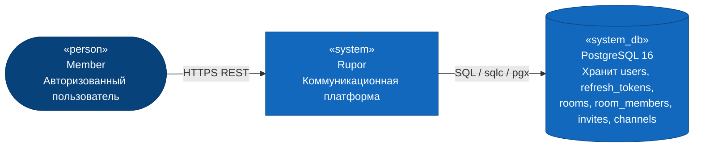
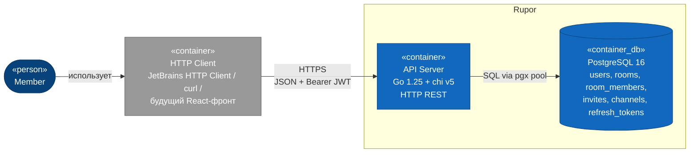
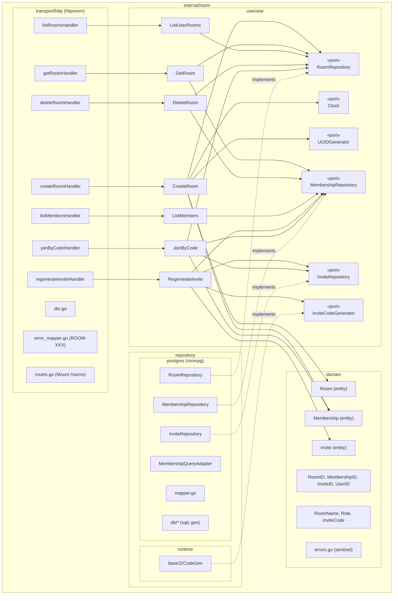
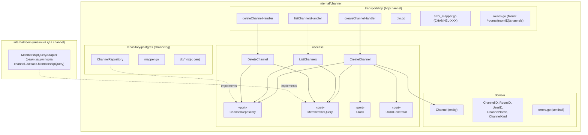
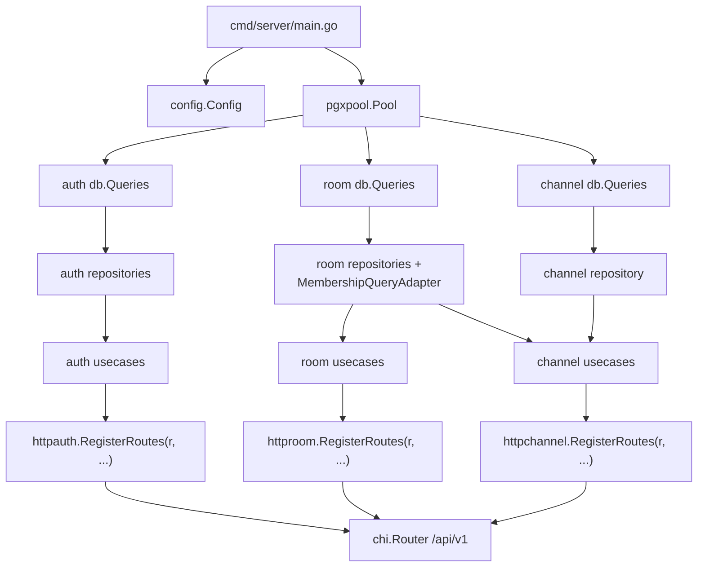
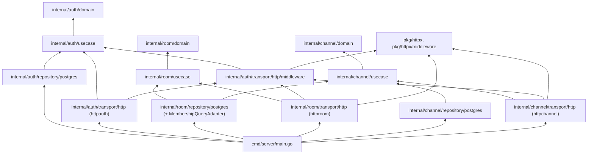

# 01 — Architecture (Logical View)

C4-нарратив: L1 → L2 → L3. На L3 показаны два затронутых модуля (`internal/room`, `internal/channel`) и их связь с уже существующим `internal/auth` через middleware-пакет.

## C4 Level 1 — System Context



Внешних систем PR-2 не привносит. WebSocket-сигнализация и WebRTC-инфраструктура появляются в фазах 3-4 и здесь не отображены.

## C4 Level 2 — Containers



Затрагиваемые контейнеры:
- **API Server** (`cmd/server/main.go`) — добавляются новые модули `internal/room/`, `internal/channel/`, регистрация роутов `/rooms*` и `/rooms/{roomID}/channels*` внутри уже существующей группы `/api/v1`.
- **PostgreSQL** — добавляются 4 таблицы (`rooms`, `room_members`, `invites`, `channels`), миграции `0004…0007`.

Новых контейнеров нет (Rupor — монолит).

## C4 Level 3 — Components

### 3.1 Модуль `internal/room/`



#### 3.1.1 Доменные сущности

**`Room` (entity)**
- Поля (приватные): `id RoomID`, `name RoomName`, `ownerID UserID`, `createdAt time.Time`.
- `NewRoom(id, ownerID, name, createdAt) (*Room, error)` — для usecase. Инварианты: `id != Zero`, `ownerID != Zero`, `createdAt != Zero`.
- `ReconstructRoom(id, ownerID, name, createdAt) (*Room, error)` — для репозитория.
- Метод `TransferOwnership(newOwner UserID) error` — меняет ownerID на роли entity (мутация инкапсулирована, см. фазу 3+; для PR-2 присутствует ради честного rich-domain — без HTTP-эндпоинта).
- Геттеры: `ID()`, `OwnerID()`, `Name()`, `CreatedAt()`.

**`Membership` (entity)**
- Identity = пара `(roomID, userID)`. Поля: `roomID`, `userID`, `role Role`, `joinedAt`.
- `NewMembership(roomID, userID, role, joinedAt)` — конструктор с инвариантами (zero-проверка на id, валидная роль).
- `ReconstructMembership(...)` — для репозитория.
- Бизнес-методы:
  - `Promote() error` — `member` → `admin`. Owner промоут не требует.
  - `Demote() error` — `admin` → `member`. Owner понизить нельзя (`ErrCannotDemoteOwner`).
- Методы-запросы (доменная матрица прав):
  - `CanCreateRoom() bool` — всегда true для авторизованного, не привязано к Membership; технически живёт не здесь.
  - `CanReadRoom() bool` — true для всех ролей.
  - `CanReadMembers() bool` — true для всех ролей.
  - `CanReadChannels() bool` — true для всех ролей.
  - `CanCreateChannel() bool` — `owner | admin`.
  - `CanDeleteChannel() bool` — `owner | admin`.
  - `CanGenerateInvite() bool` — `owner | admin`.
  - `CanDeleteRoom() bool` — `owner` only.
  - `CanKick(target Membership) bool` — owner может kick admin/member; admin — только member; member — никого. (kick-эндпоинта в PR-2 нет, но метод доменно нужен и тестируется — для будущих фаз.)

**`Invite` (entity)**
- Поля: `id InviteID`, `roomID RoomID`, `code InviteCode`, `createdBy UserID`, `createdAt time.Time`, `revokedAt time.Time` (zero = активен).
- `NewInvite(id, roomID, code, createdBy, createdAt) (*Invite, error)` — для usecase.
- `ReconstructInvite(...)` — для репозитория.
- `Revoke(now time.Time) error` — отказывает уже отозванному (`ErrInviteAlreadyRevoked`).
- Запросы: `IsActive() bool`, `IsRevoked() bool`.

#### 3.1.2 Value objects

| VO | Тип-носитель | Правила |
|----|--------------|---------|
| `RoomID` | `uuid.UUID` | non-zero |
| `MembershipID` | — | составной ключ; не VO, а пара (roomID, userID) |
| `InviteID` | `uuid.UUID` | non-zero |
| `UserID` | `uuid.UUID` | non-zero. **Свой** в `room/domain/`, параллельный одноимённому из `auth/domain` (см. `03-decisions.md` §D-08) |
| `RoomName` | `string` | trim; длина 1..64; без управляющих символов |
| `Role` | enum | `RoleOwner | RoleAdmin | RoleMember`; парсер `ParseRole(string) (Role, error)`; `String()` |
| `InviteCode` | `string` | строго 8 символов; алфавит Crockford base32 без `I/L/O/U` (32 символа: `0123456789ABCDEFGHJKMNPQRSTVWXYZ`); upper-case при создании; парсер нормализует регистр |

#### 3.1.3 State machine: Invite

```
created (active) ──Revoke()──▶ revoked
                ◀──(больше не оживает; новый Invite — отдельная сущность с новым id и новым code)──
```

Логика «один активный код на комнату» обеспечивается на уровне **репозитория** через `RegenerateActive` (атомарно: `UPDATE invites SET revoked_at=now() WHERE room_id=$1 AND revoked_at IS NULL` + `INSERT new`) и подкреплена частичным уникальным индексом БД (см. `06-repo-model.md`).

#### 3.1.4 State machine: Membership.role

```
member ──Promote()──▶ admin ──Promote()──X (no-op / NoChange)
member ◀──Demote()── admin ──Demote()──X (no-op / NoChange)
owner ──Promote()──X (NoChange)
owner ──Demote()──X ErrCannotDemoteOwner

owner ↔ admin: только через TransferOwnership (Room.entity), который меняет (старый owner)→admin, (новый owner)→owner.
TransferOwnership в PR-2 не выставлен через HTTP — только доменный метод.
```

#### 3.1.5 Доменные ошибки (`internal/room/domain/errors.go`)

Все sentinel, префикс сообщения `room: …`.

```
// валидация VO/Entity
ErrInvalidRoomID
ErrInvalidUserID
ErrInvalidInviteID
ErrInvalidCreatedAt
ErrInvalidRoomName
ErrInvalidRole
ErrInvalidInviteCode

// бизнес-инварианты
ErrRoomNotFound
ErrNotMember
ErrAlreadyMember
ErrInsufficientRole       // member/admin тянет на owner-операцию или member на admin-операцию
ErrInviteNotFound         // активный код не найден или revoked
ErrInviteAlreadyRevoked
ErrCannotDemoteOwner
```

### 3.2 Модуль `internal/channel/`



#### 3.2.1 Доменные сущности

**`Channel` (entity)**
- Поля: `id ChannelID`, `roomID RoomID`, `name ChannelName`, `kind ChannelKind`, `createdAt time.Time`.
- `NewChannel(id, roomID, name, kind, createdAt) (*Channel, error)` — инварианты: id и roomID не zero, valid name/kind, createdAt не zero.
- `ReconstructChannel(...)` — для репозитория.
- В PR-2 у Channel нет мутирующих бизнес-методов (rename отложен).
- Геттеры: `ID()`, `RoomID()`, `Name()`, `Kind()`, `CreatedAt()`.

#### 3.2.2 Value objects

| VO | Тип | Правила |
|----|-----|---------|
| `ChannelID` | `uuid.UUID` | non-zero |
| `RoomID` | `uuid.UUID` | non-zero. **Свой** в `channel/domain/`, параллельно `room/domain/`. См. §D-08 |
| `UserID` | `uuid.UUID` | non-zero. **Свой** в `channel/domain/` |
| `ChannelName` | `string` | trim; длина 1..64; без управляющих символов |
| `ChannelKind` | enum | `ChannelKindText | ChannelKindVoice`; `ParseChannelKind(string) (ChannelKind, error)`; `String()` |

#### 3.2.3 Доменные ошибки

```
ErrInvalidChannelID
ErrInvalidRoomID
ErrInvalidChannelName
ErrInvalidChannelKind
ErrInvalidCreatedAt

ErrChannelNotFound
ErrChannelNameAlreadyTaken      // unique violation в (room_id, name)
ErrChannelAccessDenied          // от MembershipQuery: не member
ErrChannelInsufficientRole      // от MembershipQuery: member на admin-операцию
```

`ErrChannelAccessDenied` и `ErrChannelInsufficientRole` объявлены **внутри `channel/domain/`** — это нейтральные доменные понятия, чтобы channel/usecase не зависел от room/domain. Адаптер `MembershipQueryAdapter` (живёт в `internal/room/repository/postgres/` или в отдельном `internal/room/adapter/membershipquery/`) на чтении из `room_members` маппит «нет строки» в `channel.domain.ErrChannelAccessDenied`, а «есть, но роль не подходит» — в `ErrChannelInsufficientRole`.

#### 3.2.4 Порт `MembershipQuery`

Объявлен в `internal/channel/usecase/ports.go`. Внутри только нейтральные понятия `RoleAtLeast`, без знания о room.

```go
type RoleRequirement int

const (
    RoleAnyMember RoleRequirement = iota // owner | admin | member
    RoleAdminOrOwner                     // admin | owner
    RoleOwnerOnly                        // owner only
)

type MembershipQuery interface {
    // Require возвращает nil, если у пользователя в комнате есть требуемая роль;
    // ErrChannelAccessDenied — если он не member;
    // ErrChannelInsufficientRole — если member, но недостаточно прав.
    Require(ctx context.Context, roomID RoomID, userID UserID, req RoleRequirement) error
}
```

`RoomID`, `UserID`, `RoleRequirement` — все из `channel/domain/` или `channel/usecase/`. Реализация (`MembershipQueryAdapter` в `internal/room/...`) принимает на входе UUID-обёртки channel-домена и внутри переводит в room-домен (через `uuid.UUID`-bridge).

### 3.3 Композиция (cmd/server)



Подробное описание шага DI и точек подключения — в `plan/README.md` после утверждения дизайна.

## Граф зависимостей модулей



### Правила, которые поддерживает граф (по `prompts/Architecture Layers.txt:67-73`)

1. `*/domain` — только stdlib + `github.com/google/uuid`.
2. `*/usecase` — stdlib + `uuid` + свой `*/domain` (никакого чужого `*/domain`).
3. `*/transport/http`, `*/repository/postgres` — могут импортировать свой `usecase` и `domain`, плюс `pkg/httpx`/`pkg/httpx/middleware` (для транспорта) и `pgx/v5`, `sqlc` (для репозитория).
4. `pkg/httpx*` — никаких импортов из `internal/...`.
5. **Кросс-доменное исключение №1 (санкционировано фазой 1.4)**: транспорт любого домена может импортировать `internal/auth/transport/http/middleware` ради `RequireAuth` и `UserIDFromContext`.
6. **Кросс-доменное исключение №2 (вводится PR-2)**: `internal/room/repository/...` может импортировать `internal/channel/usecase` (только интерфейс `MembershipQuery` и его доменные типы) — единственная допустимая «обратная» ссылка между доменами, потому что реализация порта живёт у источника данных. Никаких других пересечений room↔channel нет.

Все эти правила enforced в `arch_test.go` (см. список новых тестов в `04-testing.md`).
