# 02 — Behavior (Process View)

DFD + по одной sequence-диаграмме на use case. Для каждого use case — happy path, табличка ошибок и список edge cases.

## Data Flow Diagrams

### DFD-1. Запрос комнаты/канала по REST

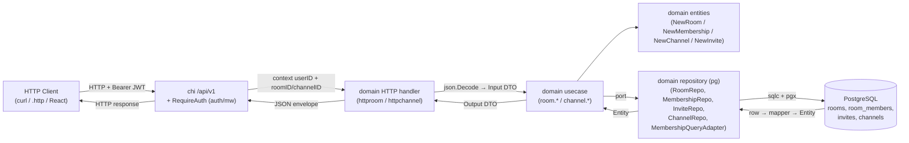

### DFD-2. Поток ошибок

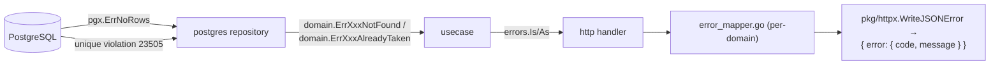

### DFD-3. Кросс-доменный поток (channel → room для проверки прав)

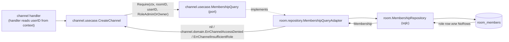

## Sequence Diagrams

Каждый sequence — один use case. Под каждым: error cases (таблица «Условие → Код → HTTP → Поведение») и edge cases (списком).

### UC-R1. CreateRoom

`POST /api/v1/rooms`

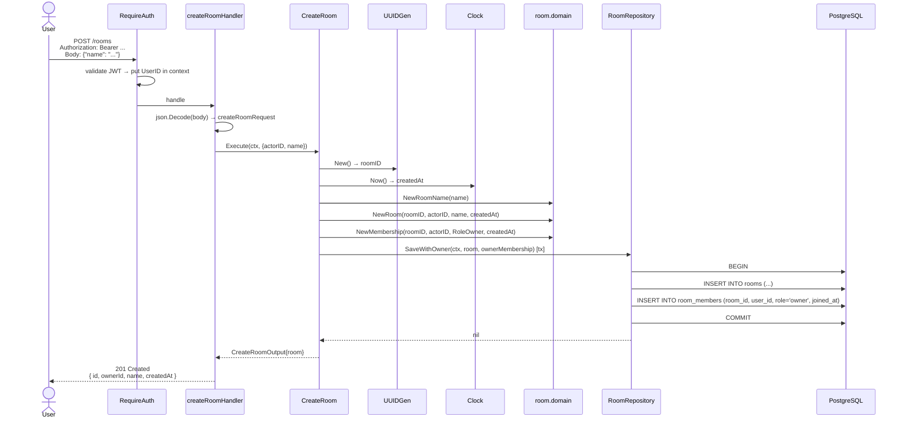

**Error cases**

| Условие | Код | HTTP | Поведение |
|---------|-----|------|-----------|
| Тело не парсится | `ROOM-009` | 400 | `writeBadBody` |
| `name` после trim пуст / >64 символов / содержит control-char | `ROOM-001` | 400 | Из `domain.NewRoomName` |
| `actorID` отсутствует в контексте (защитная ветка после `RequireAuth`) | `AUTH-010` | 401 | mapError (заимствуем) |
| Транзакция не удалась (БД) | `INTERNAL` | 500 | default |

**Edge cases**
- Партия одинаковых имён комнат не запрещена — глобальная уникальность не вводится в PR-2 (две комнаты «General» у разных владельцев — норма).
- В одной транзакции пишутся `rooms` и `room_members` — иначе возможен сирот. См. `06-repo-model.md` §SaveWithOwner.

---

### UC-R2. GetRoom

`GET /api/v1/rooms/{roomID}`

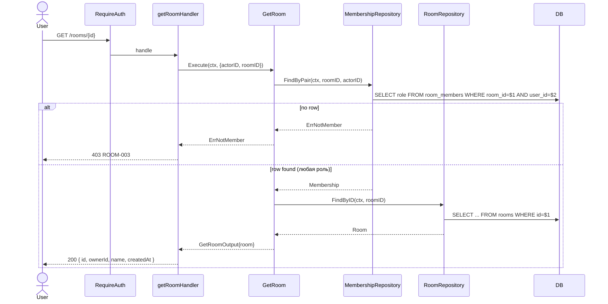

**Error cases**

| Условие | Код | HTTP |
|---------|-----|------|
| `roomID` не парсится в UUID | `ROOM-002` | 404 |
| Membership не найден (пользователь не в комнате) | `ROOM-003` | 403 |
| Комната не найдена (но membership есть — гонка между удалением и запросом) | `ROOM-002` | 404 |

**Edge cases**
- Гонка: `DeleteRoom` каскадно сносит `room_members`, поэтому одновременный GetRoom после удаления чаще даст `ErrNotMember` (membership уже снесён) → 403. Это допустимое поведение MVP.

---

### UC-R3. ListUserRooms

`GET /api/v1/rooms`

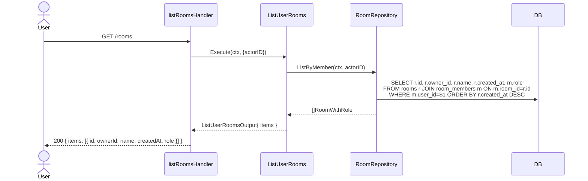

**Error cases**

| Условие | Код | HTTP |
|---------|-----|------|
| Технический сбой БД | `INTERNAL` | 500 |

**Edge cases**
- Empty list — `200 { items: [] }`.
- Пагинация в PR-2 не вводится (см. README §Out of scope).
- Поле `role` в ответе — это роль пользователя в этой конкретной комнате (нужна фронту для UI «my role»).

---

### UC-R4. DeleteRoom

`DELETE /api/v1/rooms/{roomID}`

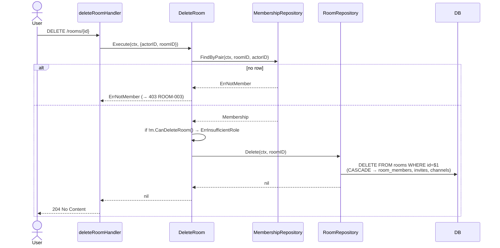

**Error cases**

| Условие | Код | HTTP |
|---------|-----|------|
| `roomID` не UUID | `ROOM-002` | 404 |
| Не member | `ROOM-003` | 403 |
| Member или admin (не owner) | `ROOM-005` | 403 |
| Room уже удалена (DELETE 0 rows) | `ROOM-002` | 404 |

**Edge cases**
- CASCADE на FK обеспечивает атомарное удаление зависимостей. Транзакция явно не нужна — один `DELETE`.

---

### UC-R5. ListMembers

`GET /api/v1/rooms/{roomID}/members`

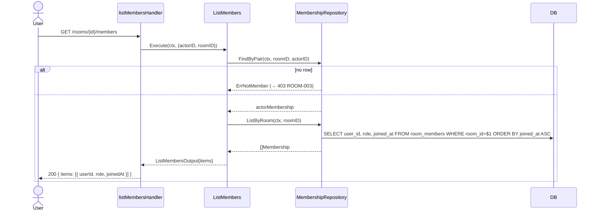

**Error cases**

| Условие | Код | HTTP |
|---------|-----|------|
| Не member | `ROOM-003` | 403 |
| `roomID` не UUID | `ROOM-002` | 404 |

**Edge cases**
- В PR-2 ответ содержит **только** `userId/role/joinedAt` — без username/email. Эти поля живут в `auth.users`; чтобы избежать кросс-доменного запроса, на этом этапе не делаем JOIN. Фронт будет добывать профили отдельно (под фазу `internal/user/`). Это сознательное упрощение, см. `03-decisions.md` §D-09.

---

### UC-R6. RegenerateInvite

`POST /api/v1/rooms/{roomID}/invite`

Эндпоинт идемпотентен по эффекту: каждый успешный вызов отзывает старый активный код (если был) и выдаёт новый. Эффективно покрывает и «выпустить инвайт» и «отозвать и перевыпустить».

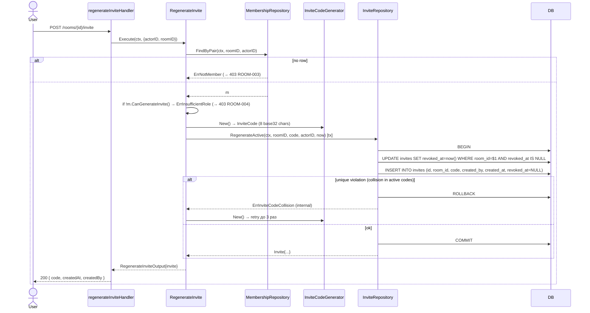

**Error cases**

| Условие | Код | HTTP |
|---------|-----|------|
| Не member | `ROOM-003` | 403 |
| Member (не admin/owner) | `ROOM-004` | 403 |
| `roomID` не UUID | `ROOM-002` | 404 |
| После 3 ретраев — все коды коллизировали | `INTERNAL` | 500 |

**Edge cases**
- Коллизия 8-символьного кода: 32^8 ≈ 1.1 × 10^12. На MVP-объёмах (<10^4 активных кодов) вероятность коллизии при первом броске — ~10^-8. Ретрай — защитная мера.
- Идемпотентность: повторный POST с тем же `actorID` — успешен, но возвращает новый код. Для UI «обновить инвайт» это и есть нужное поведение.
- Гонка двух одновременных POST: оба пытаются `RegenerateActive`. Один выиграет блокировку строк (UPDATE active row), второй увидит, что строк к UPDATE нет → INSERT нового, и `invites_active_room` partial unique помешает второму. Получит `ErrInviteCodeCollision`-подобный ответ → ретрай. На втором ретрае оба завершатся (один с уже актуальным новым кодом, второй с ещё более новым). Гарантия инварианта «один активный» соблюдается.

---

### UC-R7. JoinByCode

`POST /api/v1/rooms/join/{code}`

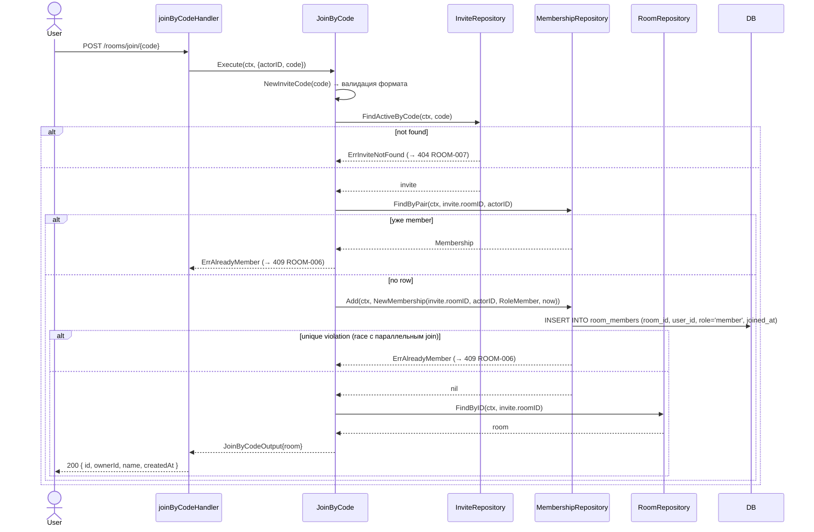

**Error cases**

| Условие | Код | HTTP |
|---------|-----|------|
| `code` не 8 base32-символов | `ROOM-008` | 400 |
| Активный код не найден / отозван | `ROOM-007` | 404 |
| Уже member этой комнаты | `ROOM-006` | 409 |
| Комната удалена между FindActiveByCode и FindByID (CASCADE на invites сработал бы — но возможна гонка) | `ROOM-002` | 404 |

**Edge cases**
- Owner, который вступает в свою же комнату по своему же коду, получает 409 `ROOM-006` (он уже owner, т.е. member для целей `room_members`).
- Регистронезависимость: `code` нормализуется в upper-case в `NewInviteCode` (плюс trim).
- Если код с момента FindActiveByCode был отозван (другой админ перевыпустил) — INSERT в room_members всё равно пройдёт по доменной логике (мы взяли актуальный roomID). Это допустимо: уже доказали, что на момент чтения код был валиден; если строгая проверка нужна — добавим явное `WHERE code=$1 AND revoked_at IS NULL` в одну SQL-операцию (см. ADR D-04 в `03-decisions.md`).

---

### UC-C1. CreateChannel

`POST /api/v1/rooms/{roomID}/channels`

```mermaid
sequenceDiagram
    actor User
    participant H as createChannelHandler
    participant UC as CreateChannel
    participant MQ as MembershipQuery
    participant ChDom as channel.domain
    participant Repo as ChannelRepository
    participant DB

    User->>H: POST /rooms/{id}/channels<br/>Body: { name, kind }
    H->>UC: Execute(ctx, {actorID, roomID, name, kind})
    UC->>MQ: Require(ctx, roomID, actorID, RoleAdminOrOwner)
    alt access denied
        MQ-->>UC: ErrChannelAccessDenied (→ 403 CHANNEL-006)
    else insufficient role
        MQ-->>UC: ErrChannelInsufficientRole (→ 403 CHANNEL-007)
    else ok
        MQ-->>UC: nil
        UC->>ChDom: NewChannelName(name); ParseChannelKind(kind)
        UC->>ChDom: NewChannel(uuid, roomID, name, kind, now)
        UC->>Repo: Save(ctx, channel)
        Repo->>DB: INSERT INTO channels (...)
        alt unique violation (room_id, name)
            Repo-->>UC: ErrChannelNameAlreadyTaken (→ 409 CHANNEL-004)
        else
            Repo-->>UC: nil
            UC-->>H: CreateChannelOutput{channel}
            H-->>User: 201 { id, roomId, name, kind, createdAt }
        end
    end
```

**Error cases**

| Условие | Код | HTTP |
|---------|-----|------|
| Тело не парсится | `CHANNEL-005` | 400 |
| Невалидное `name` | `CHANNEL-001` | 400 |
| Невалидное `kind` (не `text`/`voice`) | `CHANNEL-002` | 400 |
| Не member комнаты | `CHANNEL-006` | 403 |
| Member, но не admin/owner | `CHANNEL-007` | 403 |
| Имя занято в этой комнате | `CHANNEL-004` | 409 |
| `roomID` не UUID | `CHANNEL-003` | 404 (re-purposing — нет канала с таким родителем; см. примечание ниже) |

**Примечание о коде ROOM/CHANNEL для невалидного `roomID`:** в этом эндпоинте `roomID` относится к маршруту канала; парсер кладёт CHANNEL-003. Альтернативный вариант — переиспользовать ROOM-002, но тогда `channel.transport.error_mapper` импортирует `room.domain` ради `errors.Is(err, room.ErrRoomNotFound)`, что нарушает изоляцию. Решение зафиксировано в `03-decisions.md` §D-10.

**Edge cases**
- `name` в каждом запросе нормализуется через trim — `"#general "` и `"general"` будут разными после trim — но trim приводит к одинаковому `general`. Это уникальность по нормализованному значению.
- Удаление комнаты в момент создания канала: FK ON DELETE CASCADE на `channels.room_id` снесёт записи синхронно при DROP, а в живой комнате этого не случится.

---

### UC-C2. ListChannels

`GET /api/v1/rooms/{roomID}/channels`

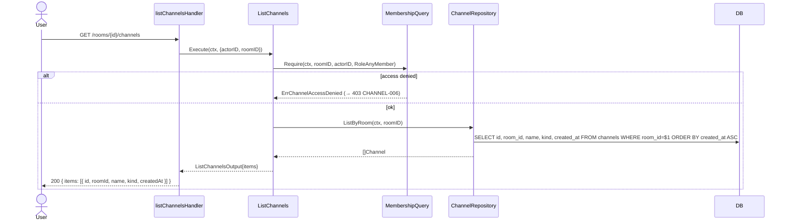

**Error cases**

| Условие | Код | HTTP |
|---------|-----|------|
| Не member | `CHANNEL-006` | 403 |
| `roomID` не UUID | `CHANNEL-003` | 404 |

**Edge cases**
- Empty list (комната без каналов) — `200 { items: [] }`.

---

### UC-C3. DeleteChannel

`DELETE /api/v1/rooms/{roomID}/channels/{channelID}`

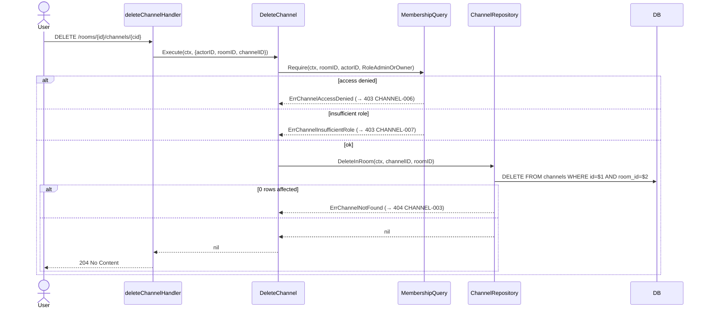

**Error cases**

| Условие | Код | HTTP |
|---------|-----|------|
| Не member | `CHANNEL-006` | 403 |
| Member, не admin/owner | `CHANNEL-007` | 403 |
| Канал не найден / не принадлежит указанной комнате | `CHANNEL-003` | 404 |
| `channelID`/`roomID` не UUID | `CHANNEL-003` | 404 |

**Edge cases**
- Защита от подмены `roomID` в URL: `DELETE ... WHERE id=$1 AND room_id=$2` гарантирует, что нельзя удалить канал чужой комнаты, передав его UUID.
- Удаление каскадом сообщений: в фазе 3 у `messages.channel_id` будет `ON DELETE CASCADE`. В PR-2 таблицы `messages` ещё нет — никаких зависимостей.

---

## Дополнительные сценарии (вне use case)

### Глобальный middleware-конвейер

Все эндпоинты PR-2 проходят через тот же стек, что и auth (см. `docs/1_4_auth_middleware/02-behavior.md`):

```
RequestID → Recover → Logger (с userIDHook) → CORS → chi router → group(RequireAuth) → handler
```

`RequireAuth` уже умеет писать в access-log поле `user_id` — для room/channel хук не модифицируется.

### Сценарий «гонка create/delete»

При параллельных запросах `CreateChannel` и `DeleteRoom` возможна последовательность:

1. `CreateChannel` прошёл `MembershipQuery.Require` (admin) — у пользователя ещё есть membership.
2. Параллельно `DeleteRoom` сносит room + room_members + channels (CASCADE).
3. `CreateChannel` пробует `INSERT INTO channels` — FK violation (`room_id` отсутствует).

В этом случае ChannelRepository отдаёт обёрнутую ошибку `fmt.Errorf("insert channel: %w", err)`; mapping её приведёт к `INTERNAL 500`. Это допустимое поведение — кейс редкий (двое одновременно с конфликтующими действиями). Альтернатива — мапить `foreign_key_violation` на `room_id` в `ErrChannelAccessDenied` (404/403) — отложено как улучшение.
