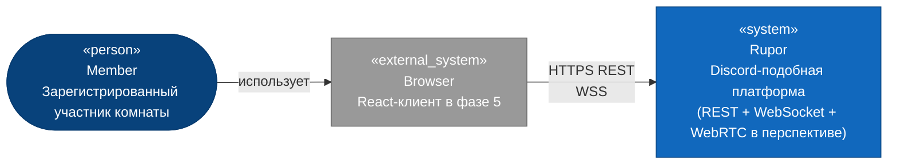
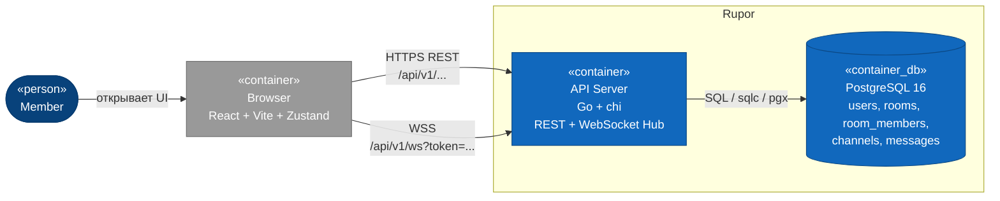
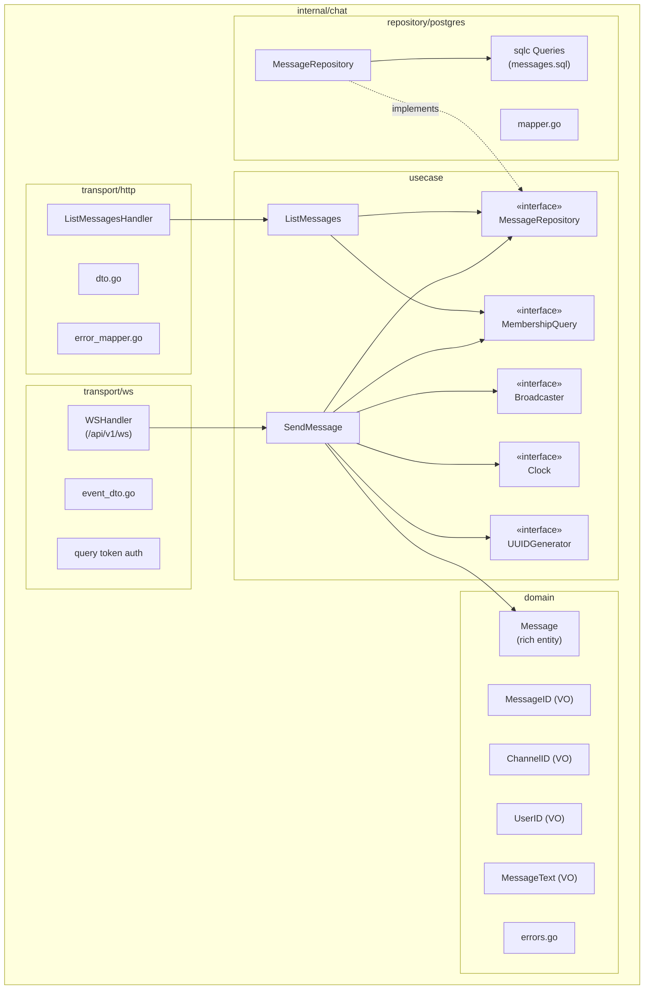
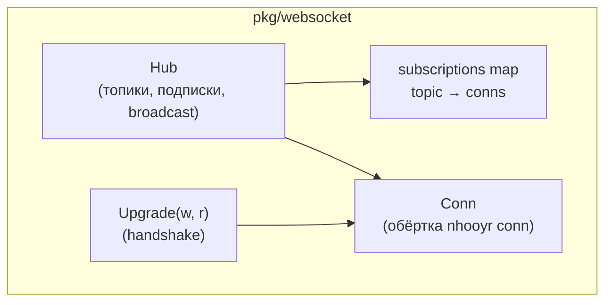
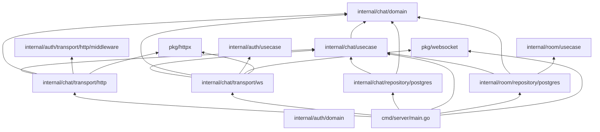

# 01 — Architecture (Logical View)

Этот документ — единый zoom-in нарратив: C4 L1 → L2 → L3 → граф зависимостей модулей.

## C4 Level 1 — System Context

Кто взаимодействует с системой и от каких внешних сервисов она зависит. Для PR-3_1 внешних сервисов нет: PostgreSQL — внутренний контейнер платформы; никаких сторонних API. Браузер пользователя — единственный внешний клиент.



**Акторы:**
- `Member` — пользователь, прошедший `auth.Register`/`auth.Login` и состоящий хотя бы в одной комнате.

**Границы системы:**
- Сервер `Rupor` принимает REST и WebSocket-трафик. БД — внутри границы.
- Клиент `Browser` — внешняя система (на момент фазы 3 не реализован, но протокол сразу проектируется под него).

**Внешние зависимости:** нет.

---

## C4 Level 2 — Containers

Внутри системы Rupor — один Go-процесс и одна Postgres. WebSocket-трафик и REST-трафик обслуживает тот же бинарь, разные роуты.



**Затрагиваемые контейнеры:**
- `API Server` (`cmd/server/main.go`) — добавляется WebSocket-handler и hub.
- `PostgreSQL` — добавляется таблица `messages` (миграция `0008_messages`).

**Новые контейнеры:** нет. Rupor — монолит, hub живёт внутри API-процесса.

**Используемые библиотеки:**
- `nhooyr.io/websocket` — единственная новая зависимость в `go.mod`.

---

## C4 Level 3 — Components

Зум-ин в затрагиваемые модули `internal/` и `pkg/`.

### 3.1 Domain: `internal/chat/`



**Сущности:**
- **`Message`** — rich-сущность с приватными полями `id MessageID, channelID ChannelID, authorID UserID, text MessageText, createdAt time.Time`. Конструкторы `NewMessage(...) (*Message, error)` и `ReconstructMessage(...)` проверяют `id`/`channelID`/`authorID` на `IsZero`, `text` валидирован VO `MessageText`, `createdAt` не нулевой.
- **Геттеры:** `ID()`, `ChannelID()`, `AuthorID()`, `Text()`, `CreatedAt()`. Сеттеров нет. Бизнес-операций MVP — нет (нет редактирования/удаления, см. `03-decisions.md` § D-04).

**Value objects:**
- **`MessageID`** — обёртка над `uuid.UUID` с `IsZero()`, `String()`, `UUID()`. Конструктор `NewMessageID(uuid.UUID) (MessageID, error)` отвергает нулевой uuid.
- **`ChannelID`**, **`UserID`** — собственные VO в `chat/domain`, не импортируются из `channel/domain` / `auth/domain` (зеркало паттерна `channel/domain`).
- **`MessageText`** — обёртка над string. Конструктор `NewMessageText(raw string) (MessageText, error)`:
  - `TrimSpace`
  - после трима: длина в рунах `1..4000`
  - запрет управляющих символов (`unicode.IsControl()`) и категории `Cf` (anti-spoofing), как в `internal/channel/domain/channel_name.go:24-28`
  - `\n`, `\r`, `\t` исключаются из «контролов» — это валидные символы текста (явный whitelist в реализации)

**Доменные ошибки** (`internal/chat/domain/errors.go`):
- Валидация: `ErrInvalidMessageID`, `ErrInvalidChannelID`, `ErrInvalidAuthorID`, `ErrInvalidMessageText`, `ErrInvalidCreatedAt`.
- Бизнес: `ErrMessageNotFound`, `ErrChatAccessDenied`, `ErrChannelNotText` (запись только в text-каналы — см. `03-decisions.md` § D-05).

**Use cases** (`internal/chat/usecase/`):
- **`SendMessage.Execute(ctx, input) (output, error)`** — оркеструет проверку прав, проверку типа канала, создание `Message`, сохранение, публикацию `message.new`.
- **`ListMessages.Execute(ctx, input) (output, error)`** — проверка прав, выборка с курсорной пагинацией.

**Порты** (объявляются в `chat/usecase/ports.go`, реализации — в адаптерах):

```go
type MessageRepository interface {
    Save(ctx context.Context, m *domain.Message) error
    ListByChannel(ctx context.Context, channelID domain.ChannelID, before domain.MessageID, limit int) ([]*domain.Message, error)
    ChannelOf(ctx context.Context, channelID domain.ChannelID) (channelInfo, error)  // см. § D-05
}

type RoleRequirement int
const (
    RoleAnyMember RoleRequirement = iota
    RoleAdminOrOwner
    RoleOwnerOnly
)

type MembershipQuery interface {
    Require(ctx context.Context, channelID domain.ChannelID, userID domain.UserID, req RoleRequirement) error
}

type Broadcaster interface {
    PublishToChannel(channelID domain.ChannelID, eventType string, payload any)
    PublishToRoom(roomID domain.RoomID, eventType string, payload any)
}

type Clock         interface{ Now() time.Time }
type UUIDGenerator interface{ New() uuid.UUID }
```

Точная форма `channelInfo`, `RoomID` в chat-домене — детали реализации (см. `03-decisions.md` § D-05 и § D-06).

**Транспорт HTTP** (`internal/chat/transport/http/`):
- `ListMessagesHandler` — `GET /api/v1/channels/{channelID}/messages?before=&limit=`, защищён `RequireAuth`.
- `routes.go::RegisterRoutes(r chi.Router, deps Deps)` — монтаж под существующее `/api/v1` (см. `internal/channel/transport/http/routes.go:19-27` как шаблон).
- `error_mapper.go::mapError(err)` — маппинг доменных ошибок в `CHAT-NNN` HTTP-коды (см. `08-api-contract.md`).

**Транспорт WS** (`internal/chat/transport/ws/`):
- `WSHandler.ServeHTTP(w, r)` — endpoint `/api/v1/ws`. Аутентификация: парсит `r.URL.Query().Get("token")`, вызывает `auth/usecase.TokenIssuer.VerifyAccess(token, clock.Now())`. При ошибке — `httpx.WriteJSONError(w, 401, "AUTH-010"|"AUTH-011", ...)` ДО апгрейда, чтобы клиент мог распарсить HTTP-ответ.
- После успеха: `pkg/websocket.Upgrade(ctx, w, r)` возвращает `*Conn`. Регистрация в hub, автоматическая подписка на `room:<id>` для всех комнат пользователя, цикл чтения JSON-фреймов.
- `event_dto.go` — типы `inboundEvent`, `outboundEvent`, формат `{ "type": "...", ... }`.

**Репозиторий** (`internal/chat/repository/postgres/`):
- `MessageRepository` реализует `chat/usecase.MessageRepository`. Конструктор `NewMessageRepository(pool *pgxpool.Pool) *MessageRepository`.
- `messages.sql` — `InsertMessage :exec`, `ListMessagesBeforeCursor :many`, `GetMessageByID :one`, `GetChannelKind :one` (для проверки типа канала — см. § D-05).
- `mapper.go` — `messageRowToDomain`, `domainToInsertMessageParams`.
- `pgerr.go` — `isUniqueViolation`, `isForeignKeyViolation` (по образцу `internal/channel/repository/postgres/pgerr.go`).

### 3.2 Расширение `internal/room/`

Только `JoinByCode` модифицируется для публикации `member.joined`. Добавляется новый порт в `internal/room/usecase/ports.go`:

```go
type RoomEventsPublisher interface {
    PublishMemberJoined(roomID domain.RoomID, userID domain.UserID, joinedAt time.Time)
}
```

Реализация — `pkg/websocket/Hub`. Биндинг — в `cmd/server/main.go`. Существующая логика `room/usecase.JoinByCode.Execute` дополняется вызовом publisher'а ПОСЛЕ успешного `Add(membership)`. На транзакционность не влияет: publish — best-effort, ошибка publish'а не откатывает membership.

Аналогично — `internal/room/repository/postgres/membership_query.go` расширяется реализацией нового порта `chat/usecase.MembershipQuery`. Это второй потребитель уже существующего адаптера; arch_test.go получает соответствующее разрешение (см. § D-01).

### 3.3 `pkg/websocket/`



**Компоненты:**
- `Hub` — единственная точка регистрации соединений и broadcast'а. Концентрирует state-управление.
  - `Register(conn *Conn) (closeFn func())` — добавить соединение в реестр; возвращает функцию для unregister на disconnect.
  - `Subscribe(conn *Conn, topic Topic)` — подписать соединение на topic.
  - `Unsubscribe(conn *Conn, topic Topic)` — снять подписку.
  - `Publish(topic Topic, frame []byte)` — рассылка JSON-фрейма всем подписчикам топика.
  - `Shutdown(ctx context.Context)` — закрывает все коннекты с close-code `1001` при остановке сервера.
- `Topic` — типизированный ключ. Реализация — структура с типом (`TopicKindChannel`, `TopicKindRoom`) и `uuid.UUID`. Метод `Key() string` возвращает `"channel:<uuid>"` / `"room:<uuid>"`.
- `Conn` — обёртка над `*websocket.Conn` из nhooyr. Поля: `id ConnID`, `userID uuid.UUID`, `ws *websocket.Conn`, `writeMu sync.Mutex`. Методы `WriteJSON`, `ReadJSON`, `Close(code, reason)`. Mutex защищает запись (см. § D-03).
- `Upgrade(ctx, w, r, opts)` — тонкая обёртка над `websocket.Accept`, инкапсулирует accept-опции (InsecureSkipVerify=false, OriginPatterns из CORS-config).

`pkg/websocket` не импортирует `internal/*`. Hub реализует chat'овый и room'овый порты-нотификаторы через type assertion на стороне `cmd/server/main.go`: hub предоставляет тонкие методы (`PublishChannel(channelID, event)`, `PublishRoom(roomID, event)`), и в main.go из них собираются адаптеры (либо сами эти методы — в составе hub'а — реализуют интерфейсы напрямую: пакет `pkg/websocket` не импортирует chat-types, но интерфейсы chat — duck typing, см. § D-02).

### 3.4 Состояние и lifecycle WS-соединения

```
States: AcceptingHTTP → Upgrading → Connected → Subscribed* → Closing → Closed

AcceptingHTTP → Upgrading      : verify token from query
Upgrading     → Connected       : nhooyr.Accept ok → register in hub → autosubscribe room:<id> for all memberships
Connected     → Subscribed      : inbound {type:subscribe, channel_id}, MembershipQuery.Require ok → hub.Subscribe(channel:<id>)
Subscribed    → Subscribed      : message.send | subscribe для других каналов
Connected/Sub → Closing         : context.Done() | client close | read error | write error
Closing       → Closed          : hub.Unregister → cleanup subscriptions → ws.Close(code, reason)
```

State machine описана словами и проиграна как sequence в `02-behavior.md` для каждого триггера.

---

## Граф зависимостей модулей



**Правила (соблюдаются и проверяются `arch_test.go`):**

1. **`internal/chat/domain/`** импортирует ТОЛЬКО stdlib + `github.com/google/uuid`.
2. **`internal/chat/usecase/`** импортирует stdlib + uuid + `internal/chat/domain/`. Запрещены `internal/channel/*`, `internal/room/*`, `internal/auth/*`, `pkg/websocket`.
3. **`internal/chat/repository/postgres/`** импортирует stdlib + uuid + pgx + `internal/chat/{domain,usecase}`. Запрещены `internal/{auth,room,channel}/*`, `internal/chat/transport/*`.
4. **`internal/chat/transport/http/`** импортирует stdlib + uuid + chi + `internal/chat/{domain,usecase}` + `internal/auth/{domain,usecase,transport/http/middleware}` + `pkg/httpx`. Запрещены `internal/{room,channel}/*`.
5. **`internal/chat/transport/ws/`** импортирует stdlib + uuid + `internal/chat/{domain,usecase}` + `internal/auth/{domain,usecase}` + `pkg/{httpx,websocket}`. Запрещены `internal/{room,channel}/*`, `nhooyr.io/websocket` (только через `pkg/websocket`).
6. **`pkg/websocket/`** импортирует stdlib + uuid + `nhooyr.io/websocket`. Запрещены `internal/*` и `pkg/httpx`.
7. **`internal/room/repository/postgres/`** дополнительно разрешено импортировать `internal/chat/{domain,usecase}` для реализации `chat/usecase.MembershipQuery` (по аналогии с уже разрешённой реализацией `channel/usecase.MembershipQuery`).
8. **`internal/room/usecase/`** остаётся изолированным от chat — публикация `member.joined` идёт через объявленный в `room/usecase` порт `RoomEventsPublisher`; реализация в `pkg/websocket` подключается в `cmd/server/main.go`.

Подробное обоснование — `03-decisions.md` (§ D-01, § D-02, § D-07).
