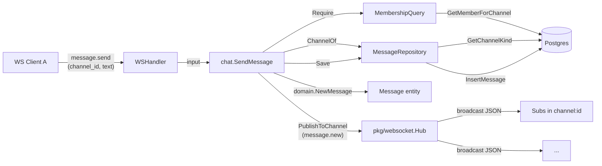
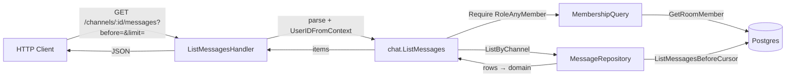
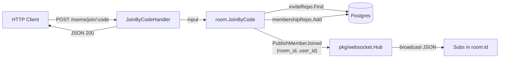
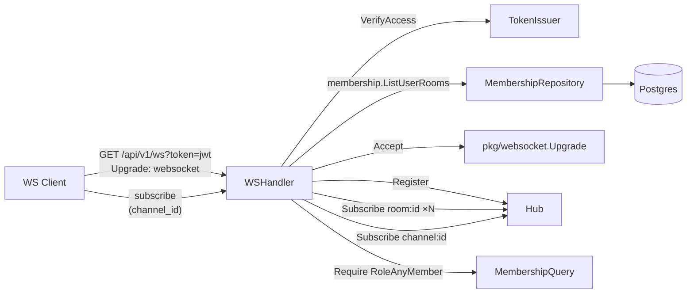
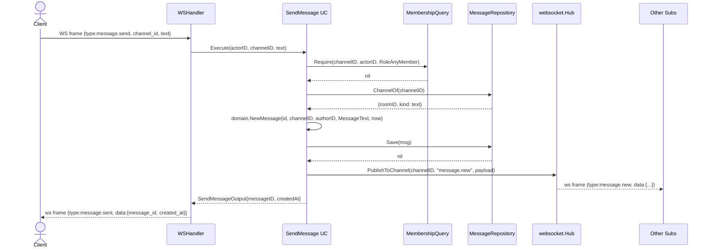
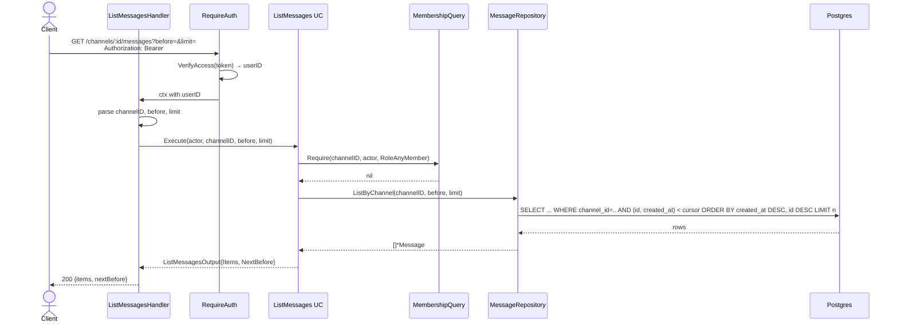
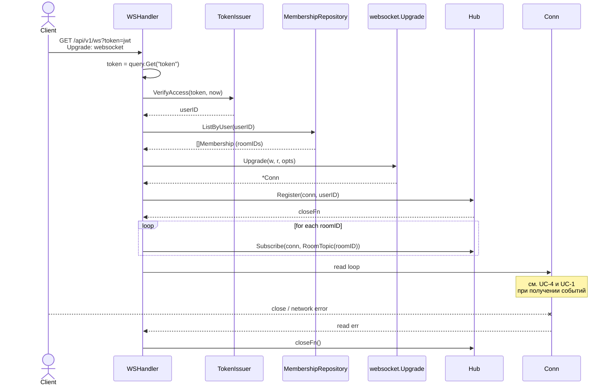
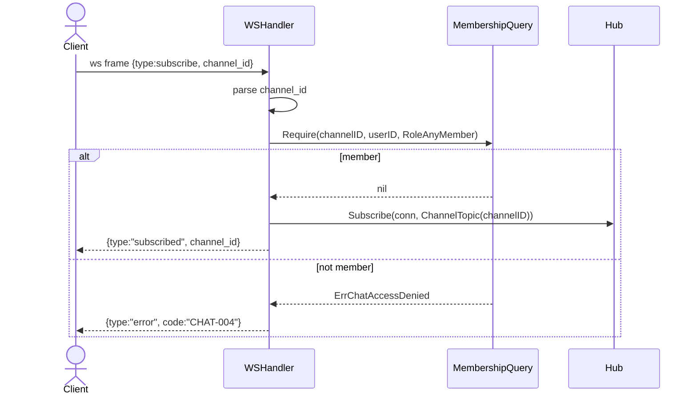
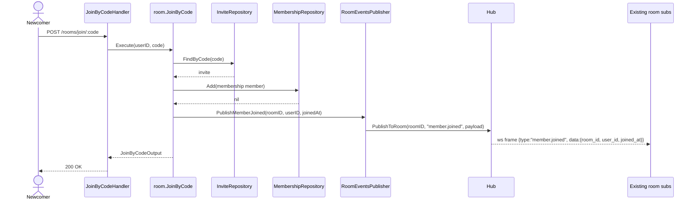

# 02 — Behavior (Process View)

DFD и sequence diagrams по основным сценариям. Один sequence — на use case (включая happy path и сводный блок error/edge cases).

## Data Flow Diagrams

### DFD-1: Отправка и доставка сообщения

### DFD-2: Чтение истории канала (REST курсор)

### DFD-3: Вступление в комнату + member.joined

### DFD-4: Подключение к WS и подписка

---

## Sequence Diagrams

### UC-1: Отправка сообщения (`chat.SendMessage`)

**Триггер:** WS-клиент шлёт `{"type":"message.send","channel_id":"<uuid>","text":"<string>"}`.

**Error cases:**

| Условие | Доменная ошибка | WS-ответ | REST-эквивалент (на будущее) |
|---|---|---|---|
| Пустой / только пробелы / > 4000 рун / control-char | `ErrInvalidMessageText` | `{type:"error", code:"CHAT-001"}` | 400 |
| Канал не найден | `ErrChannelNotFound` (из chat/domain) | `{type:"error", code:"CHAT-002"}` | 404 |
| Канал не текстовый | `ErrChannelNotText` | `{type:"error", code:"CHAT-003"}` | 400 |
| Не член комнаты | `ErrChatAccessDenied` | `{type:"error", code:"CHAT-004"}` | 403 |
| Невалидный channel_id (не uuid) | парсинг handler-level | `{type:"error", code:"CHAT-005"}` | 400 |
| Внутренний сбой Save | обёрнутая `fmt.Errorf` | `{type:"error", code:"INTERNAL"}` | 500 |

**Edge cases:**
- **Гонка между подпиской и публикацией.** Если клиент B успел подписаться на канал ровно в момент broadcast'а, и в этот момент клиент A слал message.send — порядок недетерминирован. Принимаемое поведение: B либо получает, либо нет; история возвращается через REST `ListMessages` (см. UC-2).
- **Отвалившийся клиент.** Если `conn.WriteJSON` упал внутри `Hub.Publish`, hub удаляет соединение и продолжает рассылку остальным. Сообщение в БД сохранено — клиент при reconnect+REST подтянет его.
- **Запись быстрее broadcast'а.** Save и Publish не атомарны. Возможен сценарий: сообщение в БД, но broadcast не отправлен (panic/crash сервера между Save и Publish). Митигация — клиент при reconnect получает историю через REST до резюмирования подписки.
- **Race на write в один conn.** Внутри `Conn.WriteJSON` — sync.Mutex (см. `03-decisions.md` § D-03). Многократный writer (`Hub.Publish` из разных горутин) безопасен.

### UC-2: Чтение истории канала (`chat.ListMessages`)

**Триггер:** HTTP `GET /api/v1/channels/{channelID}/messages?before=<uuid>&limit=<n>`.

**Error cases:**

| Условие | Код | HTTP Status |
|---|---|---|
| Невалидный токен / нет токена | AUTH-010 | 401 |
| Истёкший токен | AUTH-011 | 401 |
| `channelID` не UUID | CHAT-005 | 400 |
| `before` не UUID (если задан) | CHAT-005 | 400 |
| `limit` < 1 или > 100 | CHAT-006 | 400 |
| Канал не найден | CHAT-002 | 404 |
| Не член комнаты канала | CHAT-004 | 403 |
| Внутренняя ошибка БД | INTERNAL | 500 |

**Edge cases:**
- **Пустая история.** Возвращаем `{"items":[],"nextBefore":null}` со статусом 200.
- **`limit` опущен.** Дефолт 50.
- **`before` опущен.** Самые последние сообщения (LIMIT n DESC).
- **Меньше n записей до начала истории.** `nextBefore = null` в ответе.
- **`before`-id не существует.** Курсор интерпретируется как «всё, что строго ДО этого id». Если id неизвестен — возвращаем пустой набор (а не 404), чтобы клиент мог писать «прокручиваю с какого-то места».

### UC-3: Подключение WebSocket (`WSHandler.ServeHTTP`)

**Триггер:** клиент инициирует `GET /api/v1/ws?token=<jwt>` с заголовком `Upgrade: websocket`.

**Error cases (до апгрейда — HTTP-ответ):**

| Условие | Код | HTTP Status |
|---|---|---|
| Нет токена в query | AUTH-010 | 401 |
| Невалидный токен | AUTH-010 | 401 |
| Истёкший токен | AUTH-011 | 401 |
| `Upgrade` не запрошен | — | 400 (nhooyr Accept вернёт ошибку, отдаём stock-HTTP) |
| Origin не в whitelist | — | 403 (через `pkg/websocket.Upgrade` opts из CORS-config) |

**Error cases (после апгрейда — WS-close с кодом):**

| Условие | Close code | Reason |
|---|---|---|
| Server shutdown | 1001 | "going away" |
| Невалидный JSON-фрейм | 1003 | "invalid frame" |
| Превышение `max message size` | 1009 | "message too large" |
| Внутренний сбой | 1011 | "internal error" |

**Edge cases:**
- **Нет членств у пользователя.** Авто-подписки на room: не создаются. Клиент остаётся подключённым и может позже `subscribe` на channel (если получит доступ), хотя в фазе 3 подписка на channel требует членство.
- **Ребаланс при `JoinByCode` после connect.** Если пользователь вступил в новую комнату ПОСЛЕ открытия WS, авто-подписка на её room-topic не происходит до следующего reconnect. Это сознательный компромисс MVP (см. `03-decisions.md` § D-09).
- **Дубликат коннектов.** Один user может иметь несколько активных WS-коннектов (с разных вкладок). Hub не объединяет — каждый коннект независим.

### UC-4: Подписка на канал (`subscribe`)

**Триггер:** клиент шлёт `{"type":"subscribe","channel_id":"<uuid>"}`.

**Error cases:** см. таблицу UC-1, плюс невалидный `channel_id` (CHAT-005).

**Edge cases:**
- **Двойная подписка.** Повторный `subscribe` на тот же канал — no-op (set-семантика). Hub возвращает `{type:"subscribed"}` повторно.
- **Подписка на channel:<id> чужой комнаты.** `MembershipQuery.Require` вернёт `ErrChatAccessDenied`, клиент получит `{type:"error", code:"CHAT-004"}`.

### UC-5: Вступление в комнату с публикацией `member.joined` (`room.JoinByCode`)

**Триггер:** HTTP `POST /api/v1/rooms/join/{code}`.

Существующий handler / use case дополняется ОДНИМ вызовом publisher'а после `Add(membership)`. Логика остальных шагов (валидация кода, проверка `ErrAlreadyMember`) не меняется.

**Error cases / edge cases** для `JoinByCode` не меняются по сравнению с фазой 2 (см. `internal/room/usecase/join_by_code.go`). Дополнительные:

| Сценарий | Поведение |
|---|---|
| Publish не отвечает или паникует | Не откатывает membership. Логируется WARN. HTTP-ответ — 200. |
| Newcomer уже имеет открытый WS | Newcomer НЕ получает свой `member.joined`, потому что подписался на room-topic ещё до Join и подписан только на свои существующие комнаты. Для подписки на новую комнату — reconnect или ручной `subscribe` (см. § D-09). |

---

## Дополнительные сценарии

### S-1: Graceful shutdown

**Триггер:** `signal.NotifyContext` (SIGINT / SIGTERM) → `srv.Shutdown(ctx)`.

Поведение:
1. `srv.Shutdown` останавливает приём новых HTTP/WS-соединений.
2. `Hub.Shutdown(ctx)` итерируется по всем коннектам, на каждом вызывает `conn.Close(1001, "going away")`.
3. Сервер ждёт максимум `shutdownTimeout = 5s` (`cmd/server/main.go:39`); после — принудительно завершает.

### S-2: Disconnect клиента

**Триггер:** клиент закрывает соединение / network drop / `read` возвращает ошибку.

Поведение:
1. Read-loop в `WSHandler` ловит ошибку.
2. Вызывает `closeFn` от `Hub.Register`.
3. Hub удаляет соединение из `subscriptions` (все topic'и) и реестра.
4. `conn.Close(1000, "bye")` — best-effort.

### S-3: Read-deadline превышен (пинг-пинг)

В MVP не реализуется специальный keepalive: `nhooyr.io/websocket` поддерживает ping/pong нативно через `*Conn.Ping(ctx)`. Параметризация ping-интервала и read-deadline — в фазе 3.2 (вне scope текущего PR). В рамках текущей фазы используются дефолты библиотеки.
