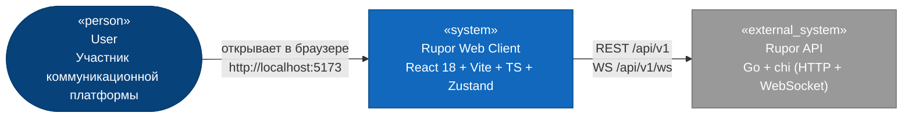
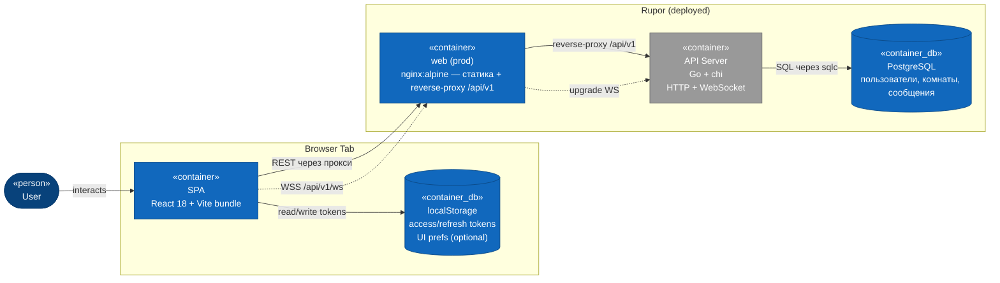
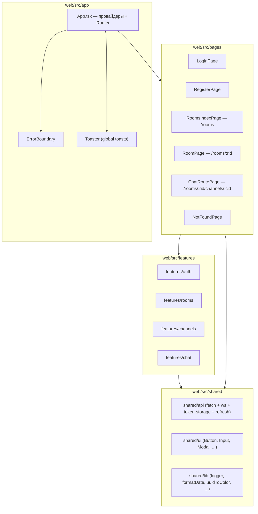
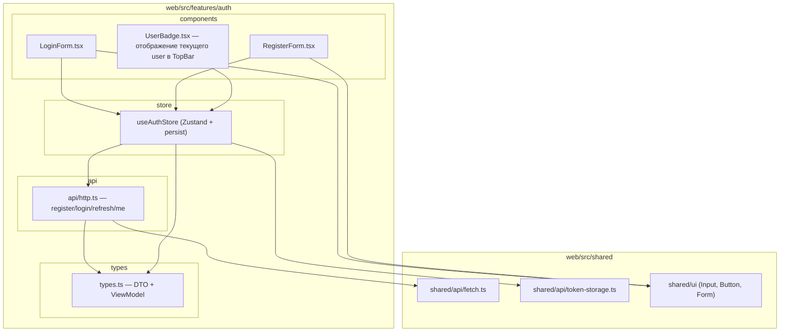
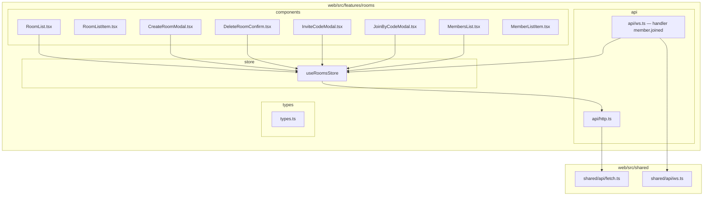
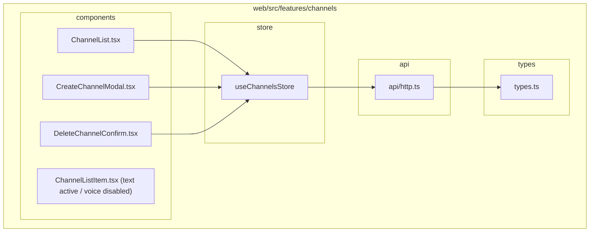
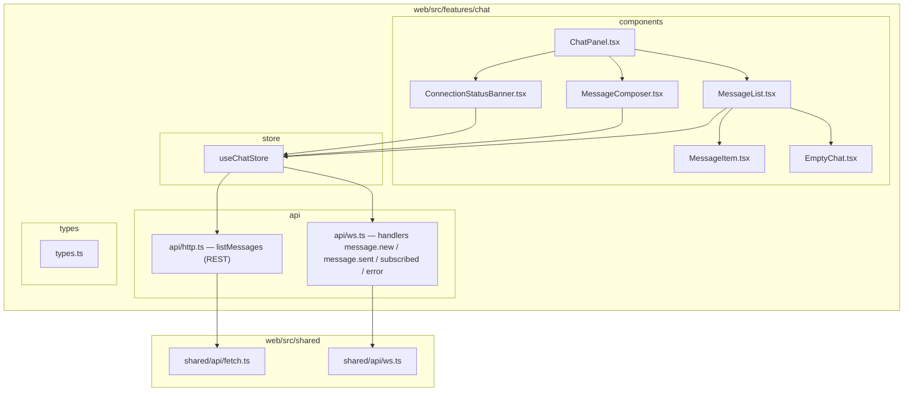
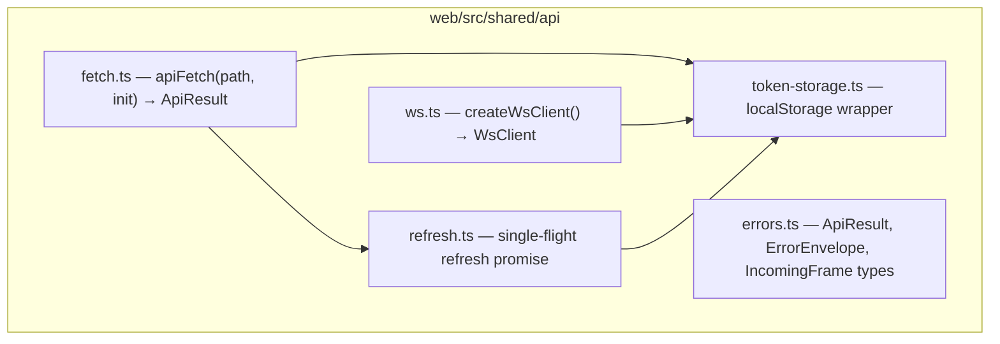
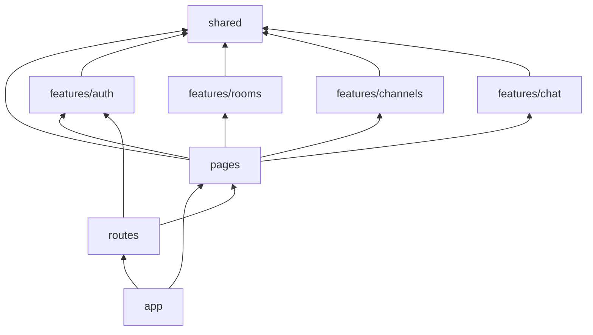

# 3.5 Frontend — Архитектура (Logical View)

## C4 Level 1 — System Context

КТО взаимодействует с системой и КАКИЕ внешние системы участвуют.

**Акторы:**
- **User** — авторизованный или анонимный пользователь, заходит через браузер. Может: регистрироваться, логиниться, создавать и управлять комнатами, отправлять сообщения в каналах в реалтайме.

**Границы системы:** Rupor Web Client — это SPA, который раздаётся nginx-ом в production и Vite dev-сервером в development. Сам по себе он не персистит ничего на бэке — все данные в Rupor API.

**Внешние системы:**
- **Rupor API** (Go-сервер, `cmd/server/main.go`) — единственная внешняя зависимость. Эндпоинты под `/api/v1/`, WebSocket на `/api/v1/ws`.

## C4 Level 2 — Containers

Внутреннее устройство веб-клиента на уровне технологических контейнеров.

**Dev-режим (упрощённый):**
- `npm run dev` поднимает Vite на `:5173`.
- Vite проксирует `/api/v1/*` на `http://localhost:8080` (`vite.config.ts`).
- Бэк запускается через `make run` (`:8080`), Postgres — через `make dc-up`.

**Production-режим:**
- `web` сервис в `docker-compose.yml` — `nginx:alpine` с собранной статикой.
- nginx раздаёт `index.html` для всех путей (SPA fallback) и проксирует `/api/v1` (включая WS-upgrade) на `api` сервис.
- Origins в `CORS_ALLOWED_ORIGINS` бэка должны включать prod-URL.

**Контейнеры внутри SPA-bundle (логические, не процессы):**

| Контейнер | Путь | Назначение |
|---|---|---|
| `app` | `web/src/app/` | Точка входа, Router, провайдеры (ErrorBoundary, Toaster), глобальные стили |
| `pages` | `web/src/pages/` | Page-компоненты, собирают features в экраны |
| `features/auth` | `web/src/features/auth/` | Регистрация, логин, refresh, профиль текущего пользователя |
| `features/rooms` | `web/src/features/rooms/` | Список комнат, создание, удаление, инвайты, join, члены |
| `features/channels` | `web/src/features/channels/` | Список каналов, создание/удаление text-каналов, voice-disabled |
| `features/chat` | `web/src/features/chat/` | История сообщений (REST), отправка/приём (WS), optimistic updates |
| `shared/api` | `web/src/shared/api/` | Единые HTTP- и WS-клиенты, auto-refresh, token storage |
| `shared/ui` | `web/src/shared/ui/` | Переиспользуемые UI-примитивы (Button, Input, Modal, Spinner, Toast) |
| `shared/lib` | `web/src/shared/lib/` | Утилиты (formatDate, uuidToColor, logger) |
| `routes` | `web/src/routes.tsx` | Карта роутов + гарды |

Новых процессов нет — это всё в одном SPA-bundle.

## C4 Level 3 — Components

### Общая карта (4 фичевых слайса + shared + app)

### features/auth — L3

**Компоненты:**
- `LoginForm` — контейнер, использует react-hook-form + zod. Поля: email, password. На submit — `useAuthStore.login(...)`. Состояния: idle/submitting/error.
- `RegisterForm` — аналогично, поля: email, username, password. На submit — `useAuthStore.register(...)`.
- `UserBadge` — презентационный, получает props `{ username, email, onLogout }`. Используется в TopBar.

**Store:** `useAuthStore` со state `{ status: "idle" | "authenticated" | "loading" | "error"; currentUser: CurrentUser | null; error: string | null }`. Persist'ит токены через `tokenStorage`. Actions: `register`, `login`, `refresh`, `loadMe`, `logout`, `clear`.

**API:** `register`, `login`, `refresh`, `me`. Каждая возвращает `ApiResult<T>`.

**Types:** `RegisterRequest`, `LoginRequest`, `RefreshRequest`, `TokensResponse`, `UserResponse`, `CurrentUser` (ViewModel — то же что `UserResponse`, без переименований).

**State machine (AuthState):** `idle → loading → authenticated`, при ошибке `loading → error`, на logout `* → idle`.

### features/rooms — L3

**Компоненты:**
- `RoomList` — sidebar-список комнат + кнопки «создать», «вступить по коду».
- `RoomListItem` — отдельная комната в списке, click → navigate.
- `CreateRoomModal` — форма с полем `name`. Validation: 1..64 руны.
- `DeleteRoomConfirm` — диалог подтверждения (видим только owner).
- `InviteCodeModal` — показывает текущий код, кнопка «сгенерировать новый» (admin/owner).
- `JoinByCodeModal` — ввод 8-символьного кода, submit.
- `MembersList` — список членов внутри активной комнаты.
- `MemberListItem` — один член: avatar по UUID, краткий UUID-placeholder, role badge.

**Store:** `useRoomsStore` со state `{ rooms: RoomWithRole[]; members: Record<RoomId, Member[]>; activeRoomId: RoomId | null; inviteByRoom: Record<RoomId, InviteCode>; status: ...; error: ... }`. Actions: `loadRooms`, `createRoom`, `deleteRoom`, `loadMembers`, `regenerateInvite`, `joinByCode` (+ reconnect WS), `selectRoom`, `clear`. Обработчик `onMemberJoined(frame)` — добавляет члена в `members[roomId]`.

**API:** все 6 эндпоинтов room + WS handler `member.joined` (binding в `useChatStore`/`useRoomsStore`).

**Types:** `Room`, `RoomWithRole`, `Member`, `Role = "owner" | "admin" | "member"`, `InviteCode = { code: string; createdBy: string; createdAt: string }`.

### features/channels — L3

**Компоненты:**
- `ChannelList` — список каналов активной комнаты. Группировка: text-каналы (interactive) + voice-каналы (disabled, с подписью «coming soon»).
- `ChannelListItem` — один канал. Активный канал подсвечен.
- `CreateChannelModal` — поля `name`, `kind: "text" | "voice"`. Видим только admin/owner.
- `DeleteChannelConfirm` — admin/owner.

**Store:** `useChannelsStore` со state `{ channelsByRoom: Record<RoomId, Channel[]>; activeChannelId: ChannelId | null; ... }`. Actions: `loadChannels`, `createChannel`, `deleteChannel`, `selectChannel`, `clear`.

**Types:** `Channel = { id; roomId; name; kind: "text" | "voice"; createdAt }`.

### features/chat — L3

**Компоненты:**
- `ChatPanel` — корневой компонент центральной панели; собирает MessageList + ConnectionBanner + MessageComposer.
- `MessageList` — список сообщений с infinite-scroll вверх (загрузка истории через `before=<id>`). Auto-scroll к низу при новых.
- `MessageItem` — одно сообщение: аватар, краткий UUID, текст, время, статус (pending / committed / failed).
- `MessageComposer` — textarea + кнопка send. Enter — отправка, Shift+Enter — перевод строки.
- `ConnectionStatusBanner` — баннер при `wsStatus !== "open"`.
- `EmptyChat` — empty state.

**Store:** `useChatStore` со state `{ messagesByChannel: Record<ChannelId, Message[]>; nextBeforeByChannel: Record<ChannelId, string | null>; loadingHistoryByChannel; wsStatus: "idle"|"connecting"|"open"|"reconnecting"; ... }`. Actions: `loadHistory`, `loadMoreHistory`, `sendMessage` (optimistic), `subscribeToChannel`, `appendMessage` (deduplication по id), `commitMessage` (temp-id → real id), `failMessage`, `setWsStatus`, `clear`.

**Types:** `Message = { id; channelId; authorId; text; createdAt; status: "pending" | "committed" | "failed"; tempId?: string }`, `IncomingFrame`, `OutgoingFrame`.

**State machine (WsState):** `idle → connecting → open ⇄ reconnecting → closed`. См. `05-state-model.md`.

### shared/api — L3

- `fetch.ts` — единственный fetch-обёрточный модуль. Подставляет `Authorization: Bearer`, парсит ErrorEnvelope, на 401 AUTH-011 запускает single-flight refresh.
- `refresh.ts` — модуль с глобальным `currentRefresh: Promise | null`. Запросы на refresh друг друга ждут.
- `ws.ts` — фабрика `createWsClient({ getToken, onFrame, onStatus })`. Управляет жизненным циклом WebSocket, делает reconnect.
- `token-storage.ts` — `getAccess`, `getRefresh`, `set(tokens)`, `clear`. Через localStorage с ключами `rupor.access`, `rupor.refresh`, `rupor.accessExpiresAt`, `rupor.refreshExpiresAt`.
- `errors.ts` — типы `ApiResult<T>`, `ErrorEnvelope`, `IncomingFrame`, `OutgoingFrame`, `ApiErrorCode`-литералы.

## Граф зависимостей модулей

**Правила направления (см. `prompts/Frontend Architecture Layers.txt`):**

1. `app` → `pages`, `routes`, `shared` (всё)
2. `pages` → `features/*`, `shared`. Не зависит от `app`
3. `routes` → `pages`, `features/auth` (для guard'а requireAuth)
4. `features/A` → `shared`. **НЕ зависит** от `features/B` напрямую
5. `shared/` ни от кого внутри `src/` не зависит

**Запрещено:**
- `features/chat` импортирует из `features/rooms`. Если нужно — выносим в `shared/lib` или через события на shared/api/ws.
- `shared/ui` импортирует Zustand-store фичи. Все ui-примитивы — pure-presentational.
- Циркулярные импорты внутри одной фичи между `components` ↔ `store` (контейнерный компонент → store ОК; store → component — REJECT).

## Точки расширения

- **Новая фича** — создать `web/src/features/<feature>/{components,api,store,types}/`, реэкспортнуть из `index.ts`, добавить роуты в `routes.tsx`, при необходимости — провайдеры в `app/`.
- **Новый WS-фрейм** — добавить в `IncomingFrame` discriminated union в `shared/api/errors.ts` (или вынести в `shared/api/ws-types.ts`), зарегистрировать handler в подходящем feature-сторе.
- **Новый shared-примитив** — добавить в `shared/ui/`, чистый presentational, без бизнес-логики.
