# 3.5 Frontend — Behavior (DFD + Sequences)

## Data Flow Diagrams

### DFD-1: REST-вызов (общий поток)

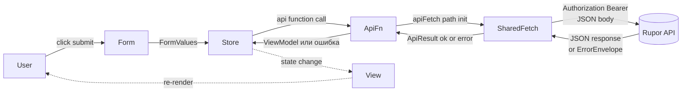

### DFD-2: WS-фрейм входящий

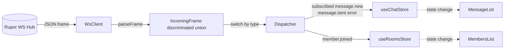

### DFD-3: Auto-refresh при 401 AUTH-011

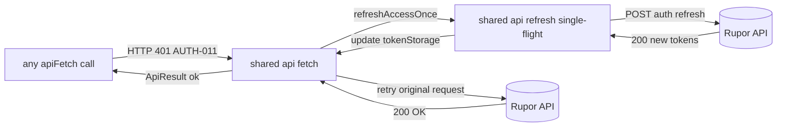

---

## Sequence Diagrams

### Use Case 1: Регистрация

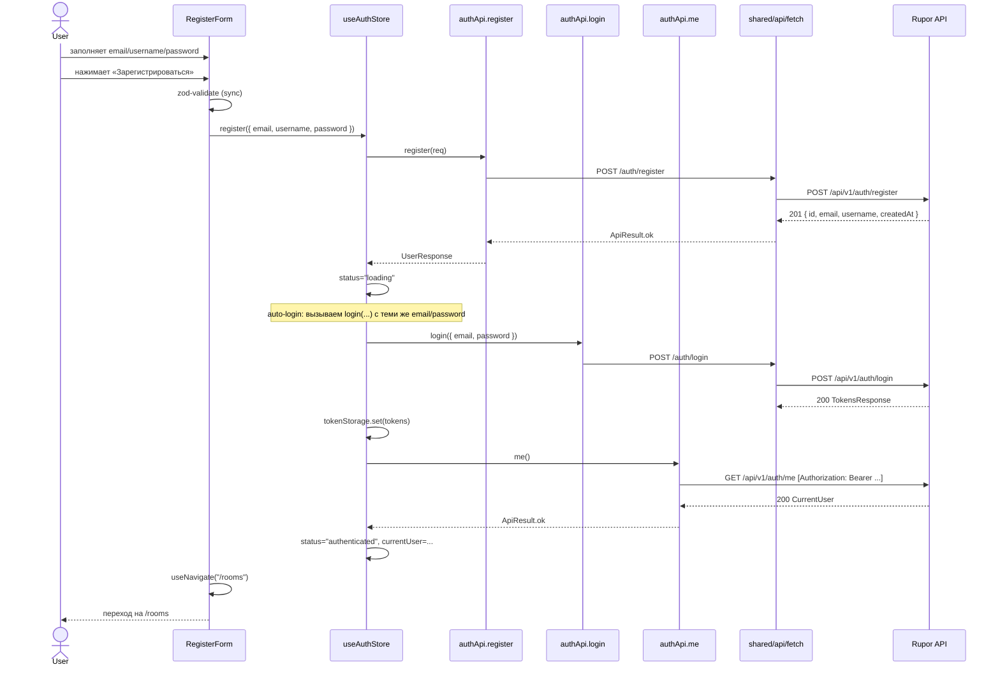

**Error cases:**

| Условие | Source | UI | Store |
|---|---|---|---|
| `AUTH-001` invalid email | register | inline error на `email` | `status=error` |
| `AUTH-002` invalid username | register | inline error на `username` | `status=error` |
| `AUTH-003` invalid password | register | inline error на `password` | `status=error` |
| `AUTH-004` email taken | register | inline error на `email` | `status=error` |
| `AUTH-005` username taken | register | inline error на `username` | `status=error` |
| Network error | fetch | toast «Нет соединения» | без изменений |
| Auto-login после register упал | login | form-level error «Зарегистрировано, но не вошли — попробуйте login вручную» + navigate /login | `status=error` |

### Use Case 2: Логин

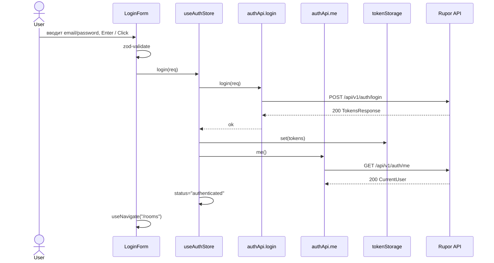

**Error cases:**

| Условие | UI | Store |
|---|---|---|
| `AUTH-006` invalid credentials | form-level «Неверный email или пароль» | `status=error` |
| `AUTH-012` malformed body | bug-баннер (UI-баг) | `status=error` |
| 500 INTERNAL | toast | `status=error` |

### Use Case 3: Auto-refresh access-токена (фоновый процесс)

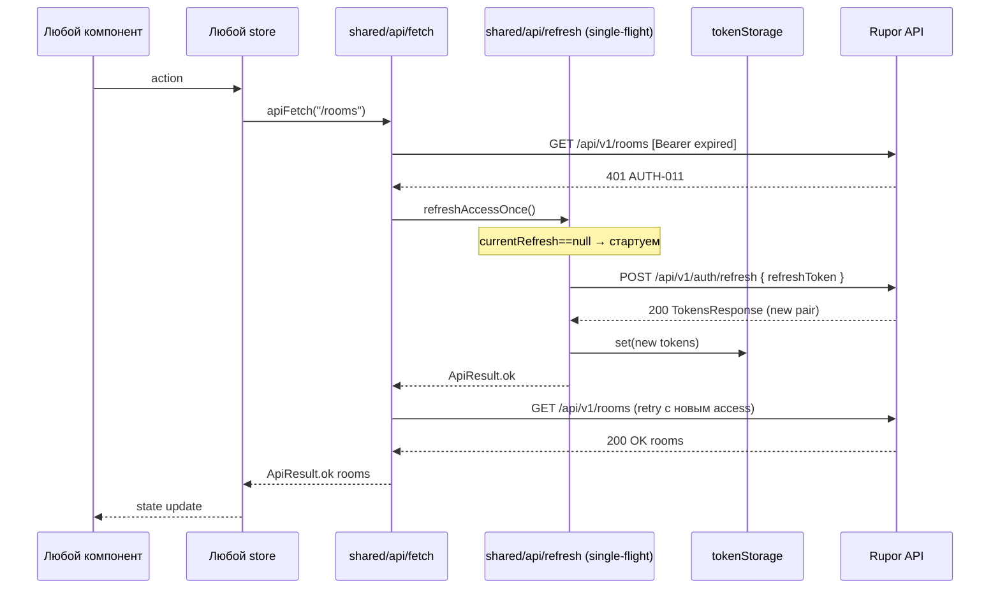

**Параллельные 401 (single-flight):**

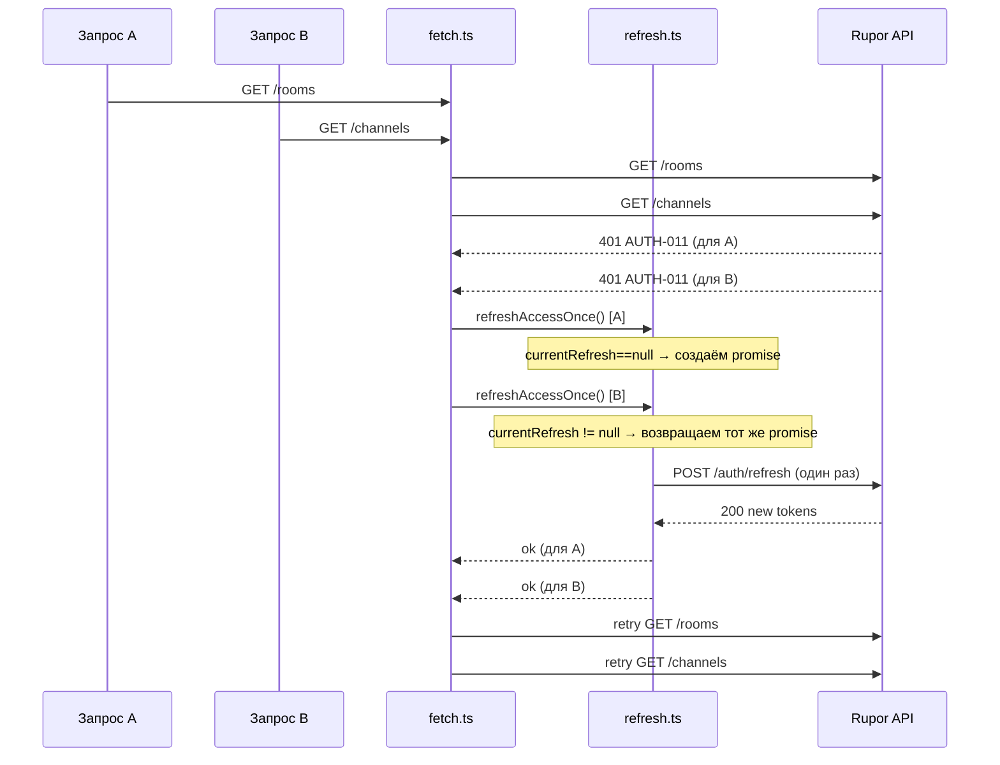

**Error cases auto-refresh:**

| Условие | Реакция |
|---|---|
| refresh вернул 401 `AUTH-007/008/009` | logout: clear stores, navigate /login |
| retry оригинального запроса снова дал 401 `AUTH-011` | logout (refresh-loop защита, см. `03-decisions.md` D-05) |
| Запрос был на сам `/auth/refresh` и упал с 401 AUTH-011 | logout (не пытаемся refresh refresh-а) |
| 500 на /auth/refresh | toast + logout |

### Use Case 4: Загрузка списка комнат и выбор активной

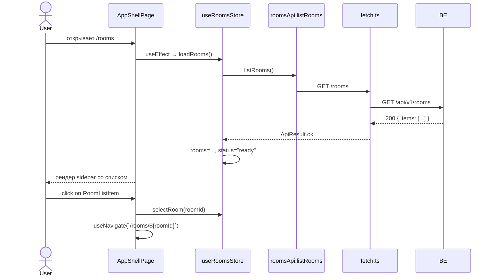

### Use Case 5: Создание комнаты

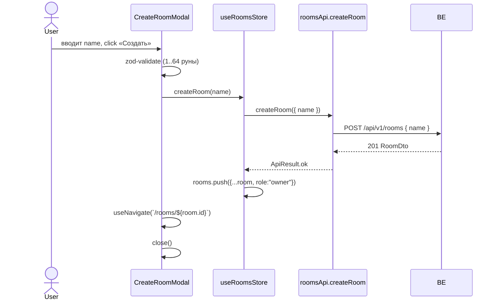

**Error cases:** `ROOM-001 invalid name` → inline; `ROOM-009 invalid body` → bug-баннер.

### Use Case 6: Удаление комнаты (только owner)

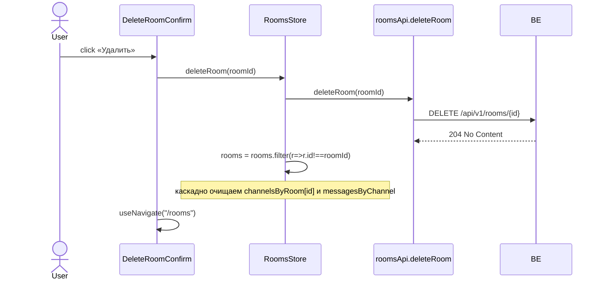

**Error cases:** `ROOM-005 only owner` → toast «Удалять может только владелец»; `ROOM-003 not a member` → удалить из стора (мы там не состоим больше).

### Use Case 7: Создание/показ инвайт-кода

```mermaid
sequenceDiagram
    actor User
    participant Modal as InviteCodeModal
    participant RoomsStore
    participant Api as roomsApi.regenerateInvite
    participant BE

    User->>Modal: открывает «Пригласить»
    Note over Modal: если activeInviteByRoom[roomId] есть — показать; иначе — пусто
    User->>Modal: click «Сгенерировать новый код»
    Modal->>RoomsStore: regenerateInvite(roomId)
    RoomsStore->>Api: regenerateInvite(roomId)
    Api->>BE: POST /api/v1/rooms/{id}/invite
    BE-->>Api: 200 InviteCodeDto
    Api-->>RoomsStore: ok
    RoomsStore->>RoomsStore: activeInviteByRoom[roomId] = code
    Modal-->>User: показывает code, кнопка «Копировать»
```

**Side-effect:** при каждом нажатии ВСЕ предыдущие активные инвайты комнаты отзываются на бэке (это поведение бэка, см. baseline). UI отображает только последний.

**Error cases:** `ROOM-004 admin/owner required` → toast «Только админ/владелец могут создавать инвайты».

### Use Case 8: Вступление в комнату по коду

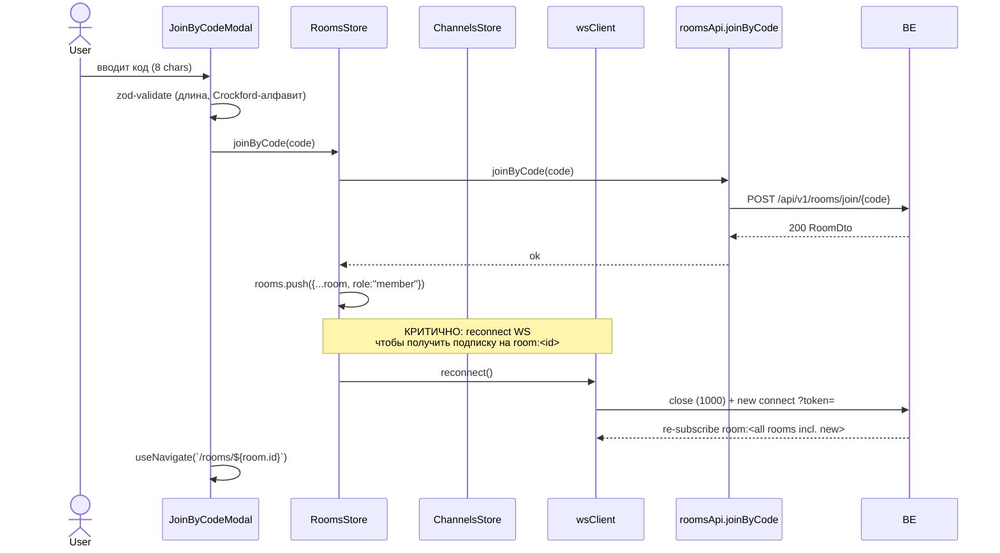

**Error cases:**
| Code | UI | Store |
|---|---|---|
| `ROOM-008 invalid code` | inline «Неверный формат кода» | — |
| `ROOM-007 invite not found` | inline «Код не найден или отозван» | — |
| `ROOM-006 already a member` | toast + navigate в существующую комнату | — |

### Use Case 9: Загрузка списка членов комнаты

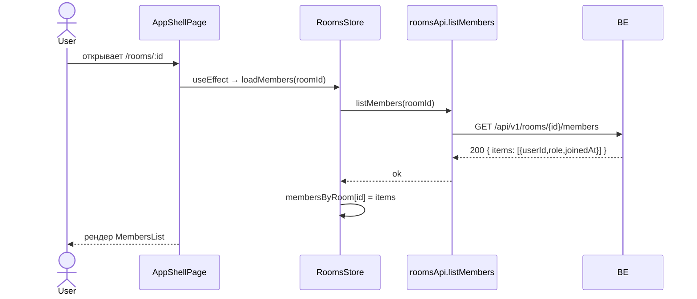

**WS дополнение:** при `member.joined` (см. UC-11) — `appendMember`. UUID-placeholder в UI для незнакомых членов.

### Use Case 10: CRUD каналов (создание / список / удаление)

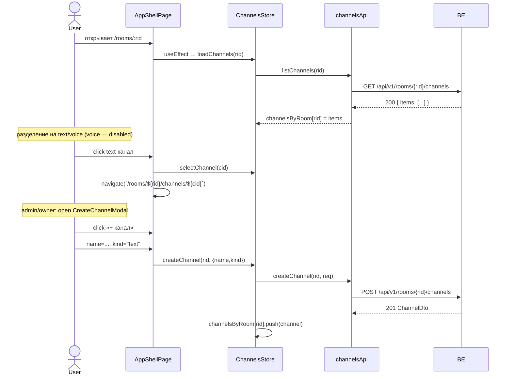

**Error cases (create):**
| Code | UI |
|---|---|
| `CHANNEL-001` invalid name | inline |
| `CHANNEL-002` invalid kind | bug-баннер (UI должен валидировать enum) |
| `CHANNEL-004` name taken | inline «Имя уже занято» |
| `CHANNEL-007` admin/owner required | toast |

### Use Case 11: Открытие канала и подписка через WS

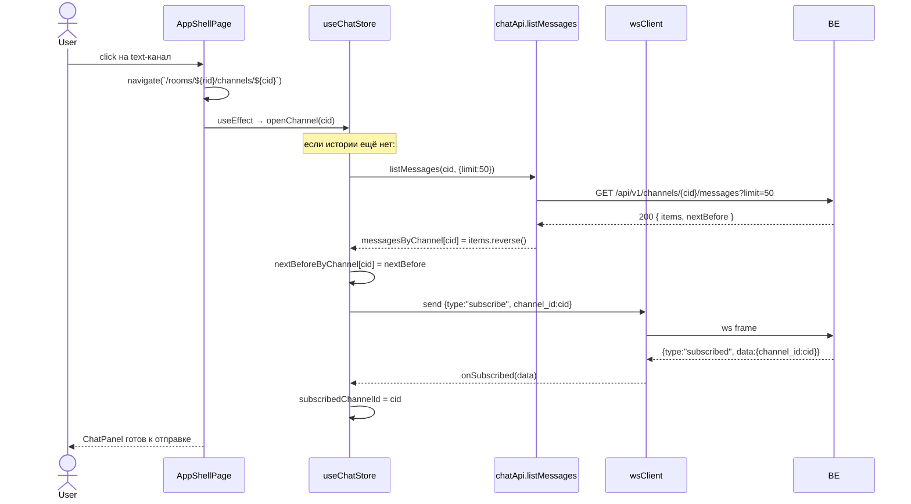

**Error cases:**
| Code | Источник | UI | Store |
|---|---|---|---|
| 403 CHAT-004 | listMessages REST | toast «Нет доступа» | удалить из rooms/channels (мы не member) |
| 404 CHAT-002 | listMessages REST | toast «Канал не найден» | удалить channel |
| WS error CHAT-002 | ws | toast «Канал не найден» | — |
| WS error CHAT-004 | ws | toast | — |
| WS error CHAT-005 | ws | bug-баннер | — |

### Use Case 12: Отправка сообщения (optimistic + ack)

```mermaid
sequenceDiagram
    actor User
    participant Comp as MessageComposer
    participant ChatStore
    participant Ws as wsClient
    participant BE

    User->>Comp: вводит текст, Enter
    Comp->>Comp: zod-validate (1..4000)
    Comp->>ChatStore: sendMessage(cid, text)
    ChatStore->>ChatStore: tempId=uuid(); push {id:tempId, status:"pending", ...}
    ChatStore->>Ws: send {type:"message.send", channel_id, text}
    Ws->>BE: ws frame
    BE-->>Ws: {type:"message.sent", data:{id, channel_id, created_at}}
    Ws-->>ChatStore: onMessageSent(data)
    ChatStore->>ChatStore: найти последний pending, обновить id+createdAt, status="committed"
    BE-->>Ws: {type:"message.new", data:{id,channel_id,author_id,text,created_at}}
    Ws-->>ChatStore: onMessageNew(data)
    ChatStore->>ChatStore: dedup по id — игнор (уже committed выше)
```

**Multi-tab:**

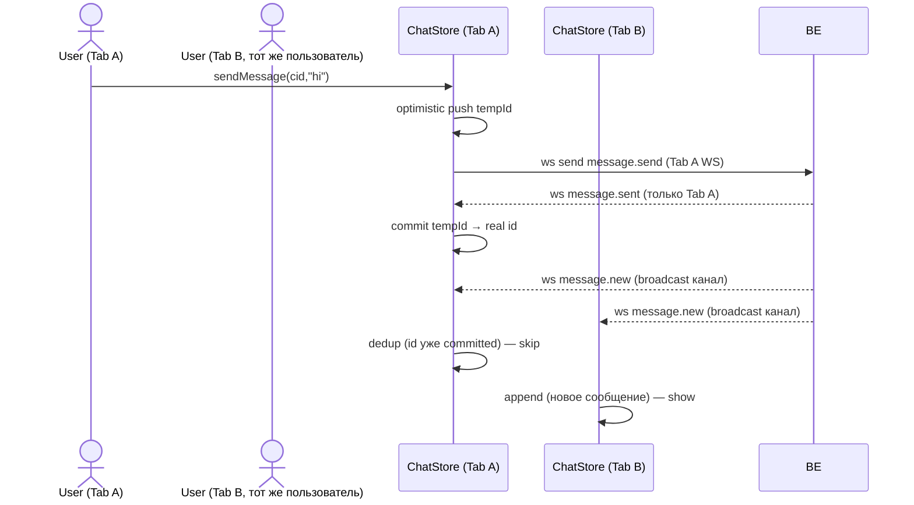

**Error cases:**
| WS error code | UI | Store |
|---|---|---|
| `CHAT-001 invalid text` | inline под composer; pending → failed | failMessage(tempId) |
| `CHAT-002/003/004` | toast; pending → failed | failMessage(tempId) |
| WS disconnect перед message.sent | UI: status="pending" → "failed" по таймауту 10s | timer + failMessage |

### Use Case 13: Infinite scroll вверх (история)

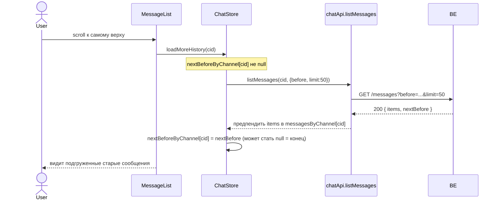

**Edge case:** если `nextBefore === null` — пользователь у самого начала истории. UI: подпись «Больше сообщений нет».

### Use Case 14: WS reconnect

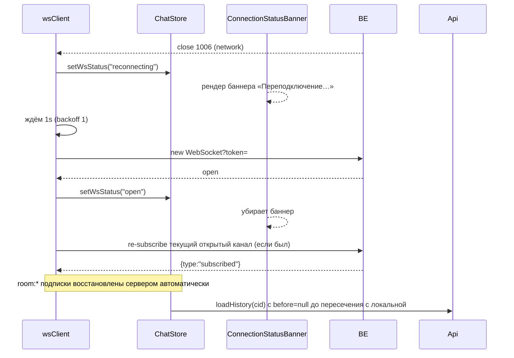

**Backoff:** 1s, 2s, 5s, 15s, 15s, 15s, ... (бесконечно). Каждая попытка обновляет `wsStatus="reconnecting"`.

**После logout:** `wsClient.disconnect()` → close с 1000 → reconnect НЕ запускается.

### Use Case 15: Logout

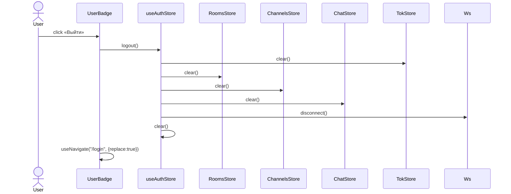

Серверного эндпоинта нет — операция чисто локальная.

### Use Case 16: Восстановление сессии после reload

```mermaid
sequenceDiagram
    actor User
    participant Boot as App.tsx
    participant AuthStore
    participant TokStore
    participant Me as authApi.me
    participant BE

    User->>Boot: F5 / открыл вкладку
    Boot->>TokStore: getAccess()
    alt access есть
        Boot->>AuthStore: loadMe()
        AuthStore->>Me: me()
        Me->>BE: GET /auth/me  [Bearer]
        alt 200 OK
            BE-->>Me: CurrentUser
            AuthStore->>AuthStore: status="authenticated"
            Boot->>Boot: рендерит /rooms или текущий route
        else 401 AUTH-011
            Me->>Fetch: внутренний flow auto-refresh
            Note over Fetch: refresh → retry me → ok
        else 401 AUTH-007/008/009/010
            Note over Boot: logout → navigate("/login")
        end
    else access нет
        Boot->>Boot: navigate("/login")
    end
```

---

## Error cases (сводная таблица по всем UC)

| Условие | Источник | Реакция UI | Реакция Store |
|---|---|---|---|
| 401 `AUTH-011` access expired | apiFetch (любой) | прозрачно (idle spinner) | auto-refresh single-flight → retry |
| 401 `AUTH-007/008/009/010` | apiFetch | redirect `/login` | logout: clear stores+tokens |
| 401 `AUTH-006` invalid creds | login form | form-level error | `status=error` |
| 400 `AUTH-001/002/003` | register form | inline field error | `status=error` |
| 409 `AUTH-004/005` | register | inline field error | `status=error` |
| 400 `ROOM-001` invalid name | createRoom | inline | — |
| 404 `ROOM-002` | getRoom / list | toast + redirect `/rooms` | удалить из стора |
| 403 `ROOM-003` not member | get/list members/channels | toast + redirect | удалить из стора |
| 403 `ROOM-004` admin/owner | regenerate invite, create channel | toast | — |
| 403 `ROOM-005` only owner | delete room | toast | — |
| 409 `ROOM-006` already member | join | toast + navigate туда | — |
| 404 `ROOM-007` invite not found | join | inline | — |
| 400 `ROOM-008` invalid code | join | inline | — |
| 400 `CHANNEL-001` invalid name | create channel | inline | — |
| 409 `CHANNEL-004` name taken | create channel | inline | — |
| 400 `CHAT-005` invalid uuid | list messages | bug-баннер | — |
| 400 `CHAT-006` invalid limit | list messages | bug-баннер | — |
| 403 `CHAT-004` not member | list messages | toast + удалить channel/room | — |
| WS `CHAT-001` invalid text | ws-error frame | inline под composer; pending→failed | failMessage |
| WS `CHAT-002/003` | ws-error frame | toast + close channel | — |
| WS `CHAT-004` | ws-error frame | toast | — |
| WS close 1006/1011 | wsClient | banner «Переподключение…» | wsStatus=reconnecting |
| WS close 1000 | wsClient | банер исчезает | wsStatus=closed; reconnect=no |
| network error / offline | apiFetch | toast «Нет соединения» | — |
| 500 INTERNAL (любой) | apiFetch | toast «Внутренняя ошибка» | — |

---

## Edge cases

**Multi-tab:**
- См. UC-12 (multi-tab диаграмма). Дедупликация по `id` в `onMessageNew`.
- `useAuthStore` персистится в localStorage → smena токенов в одной вкладке видна в другой через `storage` event (опционально слушаем).

**WS reconnect после join:**
- См. UC-8: после `joinByCode` обязателен `wsClient.reconnect()`. Иначе пользователь не увидит `member.joined` в новой комнате и не получит WS-обновлений для будущих каналов в ней (если откроет).

**Race condition: одновременный refresh:**
- Single-flight через `refresh.ts`, см. UC-3.

**Empty states:**
- Нет комнат: «У вас пока нет комнат. Создайте первую или присоединитесь по коду» + кнопки `Create` и `Join`.
- Нет каналов в комнате: «В этой комнате пока нет каналов» (+ кнопка `Create` для admin/owner).
- Нет сообщений в канале: «Будь первым».
- Нет членов (теоретически невозможно — actor сам там): defensive «—».

**Stale data:**
- При возврате на экран после долгого отсутствия — `useEffect` на mount компонента рефетчит данные. Сообщения дополняются через WS, но если был disconnect — после reconnect нужен `loadHistory` с `before=` до пересечения. См. `05-state-model.md`.

**Bug-баннер:**
- Реакция на `AUTH-012`, `ROOM-009`, `CHANNEL-005`, `CHAT-005/006/007`, `CHANNEL-002`. Это коды, которые не должны прилетать от валидного фронта. UI: красный баннер «Внутренняя ошибка клиента. Перезагрузите страницу или сообщите в поддержку».
- Логируем в `console.error` + (опционально) отправляем в Sentry без тела запроса.

**Невалидный JSON в WS-фрейме:**
- `parseFrame` возвращает `null`, dispatcher логирует warn, фрейм игнорируется. WS-соединение НЕ закрываем.

**Длинное сообщение:**
- 4000 рун — лимит бэка. Composer показывает счётчик при >3000 (для UX). На submit — zod-validate. Если каким-то образом ушло >4000 — WS `error` `CHAT-001`.

---

## Дополнительные сценарии

### Удаление текущего канала другим пользователем

Бэк не присылает WS-событие об удалении канала. Если другой админ удалил канал, в котором текущий пользователь — следующий запрос (`listMessages`/`message.send`) даст 404 `CHAT-002`. Реакция: удалить канал из локального `useChannelsStore`, navigate на `/rooms/:rid`, toast «Канал удалён».

### Удаление комнаты другим пользователем

Аналогично: при следующем запросе по этой комнате — 404 `ROOM-002`, redirect `/rooms` + удалить из локального стора + toast.

### Изменение роли (бэк не даёт это менять в PR-2)

Out of scope — UI просто отображает текущую роль из `RoomWithRole.role`.

### Истечение refresh-токена в фоне

При следующем запросе → 401 AUTH-007/008/009 → logout. Пользователь видит redirect на `/login` с toast «Сессия истекла, войдите снова».

### Vite dev: WS-прокси

Прокси Vite поддерживает `ws: true`. WS-апгрейд работает прозрачно. См. `06-api-integration.md`.

### Открытие deep-link на закрытой комнате

`/rooms/:rid/channels/:cid` — гард `requireMembership` проверяет наличие комнаты в `useRoomsStore.rooms`. Если её нет (ещё не загрузились) — wait spinner. Если после загрузки её всё ещё нет — redirect `/rooms` + toast «Комната не найдена».
