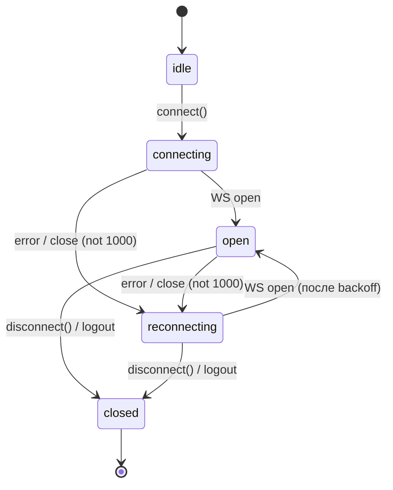
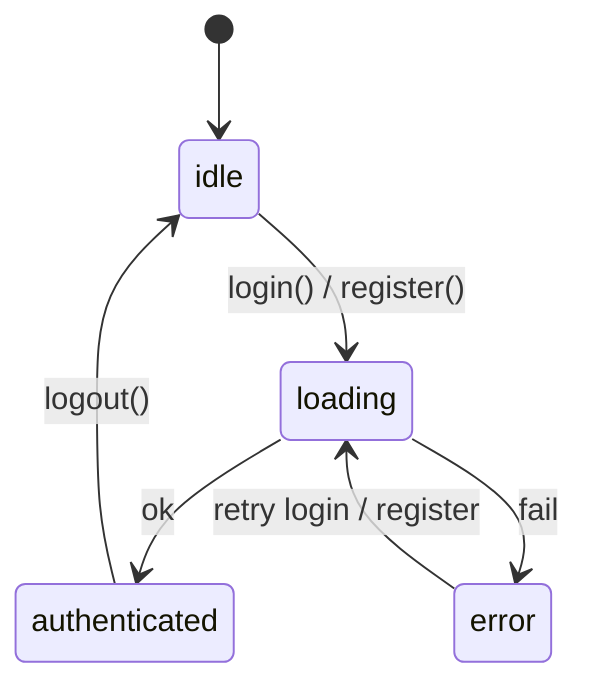

# 3.5 Frontend — State Model

## Глобальный store (Zustand)

Четыре изолированных store, по одному на каждую фичу. См. `prompts/Zustand Stores.txt`.

### useAuthStore — `web/src/features/auth/store/index.ts`

```ts
export type AuthStatus = "idle" | "loading" | "authenticated" | "error";

type AuthState = {
  status: AuthStatus;
  currentUser: CurrentUser | null;
  error: string | null;  // human-readable, для form-level
};

type AuthActions = {
  /** Регистрация → если ok, сразу login с теми же учётными */
  register: (req: RegisterRequest) => Promise<boolean>;
  /** Логин: при ok сохраняет токены и грузит /me */
  login: (req: LoginRequest) => Promise<boolean>;
  /** Подгрузить currentUser (при mount, если есть access) */
  loadMe: () => Promise<void>;
  /** Logout: очищает токены и все сторы, навигация делает компонент */
  logout: () => void;
  /** Сброс state до initial (вызывается на logout) */
  clear: () => void;
};

export const useAuthStore = create<AuthState & AuthActions>()(
  persist(
    (set, get) => ({
      status: "idle",
      currentUser: null,
      error: null,

      async register(req) {
        set({ status: "loading", error: null });
        const r = await authApi.register(req);
        if (!r.ok) {
          set({ status: "error", error: mapAuthErrorToMessage(r.error.code) });
          return false;
        }
        // auto-login
        return get().login({ email: req.email, password: req.password });
      },

      async login(req) {
        set({ status: "loading", error: null });
        const r = await authApi.login(req);
        if (!r.ok) {
          set({ status: "error", error: mapAuthErrorToMessage(r.error.code) });
          return false;
        }
        tokenStorage.set({
          access: r.data.accessToken,
          refresh: r.data.refreshToken,
          accessExpiresAt: r.data.accessExpiresAt,
          refreshExpiresAt: r.data.refreshExpiresAt,
        });
        await get().loadMe();
        return true;
      },

      async loadMe() {
        const r = await authApi.me();
        if (r.ok) set({ status: "authenticated", currentUser: r.data, error: null });
        else set({ status: "idle", currentUser: null });
      },

      logout() {
        tokenStorage.clear();
        useRoomsStore.getState().clear();
        useChannelsStore.getState().clear();
        useChatStore.getState().clear();
        // wsClient.disconnect() — снаружи в логике logout (см. shared/lib/logoutFlow)
        get().clear();
      },

      clear() {
        set({ status: "idle", currentUser: null, error: null });
      },
    }),
    {
      name: "rupor.auth",
      version: 1,
      partialize: (state) => ({ currentUser: state.currentUser }),
      // status/error не персистим — после reload пересчитываем через loadMe
    },
  ),
);
```

**Селекторы (используются в компонентах):**

```ts
const isAuthenticated = useAuthStore((s) => s.status === "authenticated");
const currentUser     = useAuthStore((s) => s.currentUser);
const authError       = useAuthStore((s) => s.error);
const login           = useAuthStore((s) => s.login);
```

### useRoomsStore — `web/src/features/rooms/store/index.ts`

```ts
type RoomsState = {
  rooms: RoomWithRole[];
  status: "idle" | "loading" | "error" | "ready";
  error: string | null;

  membersByRoom: Record<RoomId, Member[]>;
  membersLoadingByRoom: Record<RoomId, boolean>;

  activeInviteByRoom: Record<RoomId, InviteCode>;  // последний созданный код в этой сессии

  activeRoomId: RoomId | null;
};

type RoomsActions = {
  loadRooms: () => Promise<void>;
  createRoom: (name: string) => Promise<RoomWithRole | null>;
  deleteRoom: (roomId: RoomId) => Promise<boolean>;
  loadMembers: (roomId: RoomId) => Promise<void>;
  regenerateInvite: (roomId: RoomId) => Promise<InviteCode | null>;
  joinByCode: (code: string) => Promise<Room | null>;
  selectRoom: (roomId: RoomId | null) => void;
  /** Вызывается из WS-handler member.joined */
  appendMember: (frame: MemberJoinedFrame["data"]) => void;
  clear: () => void;
};
```

Особенности:
- `joinByCode` при `ok` ВСЕГДА вызывает `wsClient.reconnect()` после обновления state (D-10).
- `appendMember` дедуплицирует по `userId` в `membersByRoom[roomId]`.
- `selectRoom` НЕ грузит данные сам — компоненты собирают `useEffect`. Action только меняет `activeRoomId`.
- `clear` сбрасывает к `{rooms: [], status: "idle", ...}`.

### useChannelsStore — `web/src/features/channels/store/index.ts`

```ts
type ChannelsState = {
  channelsByRoom: Record<RoomId, Channel[]>;
  loadingByRoom: Record<RoomId, boolean>;
  errorByRoom: Record<RoomId, string | null>;
  activeChannelId: ChannelId | null;
};

type ChannelsActions = {
  loadChannels: (roomId: RoomId) => Promise<void>;
  createChannel: (roomId: RoomId, req: CreateChannelRequest) => Promise<Channel | null>;
  deleteChannel: (roomId: RoomId, channelId: ChannelId) => Promise<boolean>;
  selectChannel: (channelId: ChannelId | null) => void;
  clear: () => void;
};
```

- `selectChannel` НЕ делает subscribe сам — это делает `useChatStore.openChannel` после `selectChannel`.

### useChatStore — `web/src/features/chat/store/index.ts`

Самый сложный store — содержит логику подписки на WS, optimistic updates, реконсиляцию.

```ts
type MessageStatus = "pending" | "committed" | "failed";

type Message = {
  id: string;             // серверный id если committed, иначе tempId
  channelId: string;
  authorId: string;
  text: string;
  createdAt: string;
  status: MessageStatus;
  tempId?: string;        // присутствует пока pending; при commit — undefined
};

type WsStatus = "idle" | "connecting" | "open" | "reconnecting" | "closed";

type ChatState = {
  messagesByChannel: Record<ChannelId, Message[]>;  // отсортированы createdAt ASC
  nextBeforeByChannel: Record<ChannelId, string | null>;
  loadingHistoryByChannel: Record<ChannelId, boolean>;
  loadingMoreHistoryByChannel: Record<ChannelId, boolean>;
  subscribedChannelId: ChannelId | null;
  wsStatus: WsStatus;
};

type ChatActions = {
  /** Открыть канал: грузит историю (если ещё не было) и подписывается */
  openChannel: (channelId: ChannelId) => Promise<void>;
  /** Подгрузить старее (infinite scroll up) */
  loadMoreHistory: (channelId: ChannelId) => Promise<void>;
  /** Отправить с optimistic update */
  sendMessage: (channelId: ChannelId, text: string) => Promise<void>;
  /** Повторить failed-сообщение */
  retryMessage: (channelId: ChannelId, tempId: string) => Promise<void>;

  /** WS handlers (вызываются из shared/api/ws.ts) */
  onSubscribed: (frame: SubscribedFrame["data"]) => void;
  onMessageNew: (frame: MessageNewFrame["data"]) => void;
  onMessageSent: (frame: MessageSentFrame["data"]) => void;
  onWsError: (frame: ErrorFrame["data"]) => void;
  setWsStatus: (status: WsStatus) => void;

  clear: () => void;
};
```

**Ключевые actions:**

- `openChannel(channelId)`:
  1. Если канал не в `messagesByChannel` — `loadHistory` через REST (limit=50).
  2. Записать `subscribedChannelId = channelId`.
  3. `wsClient.send({type:"subscribe", channel_id: channelId})`.
  4. Дождаться `onSubscribed` — флага «готов» в state.

- `sendMessage(channelId, text)`:
  1. Генерируем `tempId = uuidv4()`.
  2. Добавляем в `messagesByChannel[channelId]` оптимистично: `{ id: tempId, channelId, authorId: currentUserId, text, createdAt: now, status: "pending", tempId }`.
  3. `wsClient.send({type:"message.send", channel_id, text})`.
  4. Ждём `onMessageSent` (см. ниже).

- `onMessageSent(data)` — commit оптимистичного сообщения:
  1. Найти в `messagesByChannel[data.channel_id]` сообщение с `status === "pending"` и максимальным `createdAt <= now()` (или последнее pending — берём последнее).
  2. Обновить: `id = data.id`, `createdAt = data.created_at`, `status = "committed"`, `tempId = undefined`.
  3. Если такого pending не нашли — игнор (странно, защитная ветка).

- `onMessageNew(data)`:
  1. Если уже есть сообщение с `id === data.id` (committed дубль) — игнор.
  2. Иначе — вставить как committed в `messagesByChannel[data.channel_id]`, отсортировать по `createdAt`.

- `setWsStatus("reconnecting")` — UI banner. На переход `reconnecting → open` — повторно подписаться на `subscribedChannelId`, если он был.

**State machine WS:**



**State machine Auth:**



---

## Form state

Все формы — `react-hook-form + zod`. См. `03-decisions.md` D-02.

### Схема валидации (пример: LoginForm)

```ts
import { z } from "zod";

export const loginSchema = z.object({
  email:    z.string().email("Введите корректный email"),
  password: z.string().min(8, "Минимум 8 символов").max(72, "Максимум 72 символа"),
});
export type LoginValues = z.infer<typeof loginSchema>;
```

### Подключение в компоненте

```tsx
const form = useForm<LoginValues>({
  resolver: zodResolver(loginSchema),
  defaultValues: { email: "", password: "" },
});

async function onSubmit(values: LoginValues) {
  const ok = await useAuthStore.getState().login(values);
  if (!ok) {
    const code = useAuthStore.getState().lastErrorCode;
    if (code === "AUTH-006") {
      form.setError("root.serverError", { message: "Неверный email или пароль" });
    }
    // другие коды — общая обработка через мэппер
  }
}
```

### Список форм PR-3.5

| Форма | Поля | Validation | Submit action |
|---|---|---|---|
| LoginForm | email, password | email + min 8 max 72 | `useAuthStore.login` |
| RegisterForm | email, username, password | email + alnum/_/- 3..32 + min 8 max 72 | `useAuthStore.register` |
| CreateRoomForm | name | 1..64 руны, trim | `useRoomsStore.createRoom` |
| JoinByCodeForm | code | exactly 8 chars from Crockford base32 | `useRoomsStore.joinByCode` |
| CreateChannelForm | name, kind | 1..64 руны + enum | `useChannelsStore.createChannel` |
| MessageComposer | text | 1..4000 рун после trim | `useChatStore.sendMessage` (через onSubmit Enter) |

---

## Кэш / производное состояние

- **Список комнат** — кэшируется в `useRoomsStore` на время сессии. Инвалидация: `clear` при logout. Обновляется через `loadRooms` при mount AppShell.
- **Список каналов комнаты** — кэшируется в `useChannelsStore.channelsByRoom`. Грузится при первом открытии комнаты, кэш на сессию. Инвалидация на reconnect WS — нет, бэк не присылает события об изменении каналов (нет `channel.created`/`channel.deleted` фреймов). Если другой пользователь создал канал — текущий пользователь увидит только при reload или повторном `loadChannels`.
- **История сообщений канала** — кэшируется в `useChatStore.messagesByChannel`. Дополняется через WS (`message.new`). При reconnect — НЕ перезагружаем заново (рассчитываем на `message.new` для новых).
- **Members комнаты** — `useRoomsStore.membersByRoom`. Грузится при выборе комнаты. Дополняется через `member.joined` (WS-frame). Удаление членов — нет события на бэке.

**Сценарии stale data**:
- Пользователь переоткрыл вкладку через час, токен access протух → `loadMe` при mount → 401 → refresh → ok → перезагрузка `loadRooms`/`loadChannels`/`loadHistory`. Это работает.
- Пользователь был оффлайн долго, в чате накопились пропущенные сообщения → reconnect WS не догружает их через WS, нужно явно вызвать `loadHistory` после reconnect. Решение: на `setWsStatus("open")` для подписанного канала — `loadHistory(channelId)` инкрементально (через `before=`-курсор) до пересечения с локальной историей.

---

## Optimistic updates

Только для `sendMessage`. Логика — см. action выше.

**Откат при ошибке:**
- Если ws `error` с `code === "CHAT-001/002/003/004/005"` — найти pending по `tempId` (берём последнее pending в канале, если `text` совпадает; либо проще — последнее pending) и пометить `status = "failed"`. UI MessageItem рисует кнопку «повторить» / «удалить».
- Если WS отвалился (`wsStatus !== "open"`) во время отправки — `pending` сообщение остаётся видимым, но без `message.sent` после таймаута 10s — становится `failed`.

**retryMessage(channelId, tempId):**
1. Найти сообщение по `tempId`, проверить `status === "failed"`.
2. Заменить `status` на `pending`.
3. `wsClient.send({type:"message.send", channel_id, text})`.

---

## Что НЕ персистится

- Списки комнат / каналов / сообщений / членов — рефетчатся при mount.
- WS-статус.
- Form state.
- Открытая комната / канал — после reload пользователь попадает на дефолтный экран `/rooms` (выберет вручную; в будущем — last-active room из URL).

URL-роутинг (см. `08-routes.md`) — единственный «persist» текущего экрана. При обновлении страницы он восстанавливается из URL, а данные подтягиваются по `useEffect`-ам.

---

## Селекторы и перформанс

```ts
// Подписка на одно поле — без shallow
const wsStatus = useChatStore((s) => s.wsStatus);

// Подписка на массив — стабильный selector через индекс
const messages = useChatStore((s) => s.messagesByChannel[channelId] ?? EMPTY_ARRAY);

// Подписка на несколько полей — shallow
import { shallow } from "zustand/shallow";
const { rooms, status } = useRoomsStore(
  (s) => ({ rooms: s.rooms, status: s.status }),
  shallow,
);
```

`EMPTY_ARRAY` — модульная константа, чтобы новая ссылка не вызывала ре-рендер.

---

## DevTools

В dev — `zustand/middleware`'s `devtools` для всех 4 сторов:

```ts
const isDev = import.meta.env.DEV;
const wrap = <T>(init: StateCreator<T>) =>
  isDev ? devtools(init, { name: "auth" }) : init;
```

В production — без devtools (bundle, безопасность).

---

## Тесты сторов

См. `04-testing.md` + `prompts/Tests Style (Web).txt`. Базовый паттерн:

```ts
beforeEach(() => {
  useAuthStore.setState(useAuthStore.getInitialState(), true);
  vi.restoreAllMocks();
});

it("login: сохраняет токены и грузит /me", async () => {
  vi.spyOn(authApi, "login").mockResolvedValue({ ok: true, data: tokensFixture });
  vi.spyOn(authApi, "me").mockResolvedValue({ ok: true, data: userFixture });

  const ok = await useAuthStore.getState().login({ email: "u@e.com", password: "secret123" });

  expect(ok).toBe(true);
  expect(useAuthStore.getState().status).toBe("authenticated");
  expect(useAuthStore.getState().currentUser).toEqual(userFixture);
  expect(tokenStorage.getAccess()).toBe(tokensFixture.accessToken);
});
```

---

## Cascade logout

Один сценарий касается всех сторов — logout. Реализация в `useAuthStore.logout()`:

```
useAuthStore.logout()
  ├─ tokenStorage.clear()
  ├─ useRoomsStore.getState().clear()
  ├─ useChannelsStore.getState().clear()
  ├─ useChatStore.getState().clear()
  └─ useAuthStore.getState().clear()
  
[snapshot]
component вызывает useAuthStore.logout() и затем navigate("/login")
```

Альтернативно — отдельная shared-функция `logoutFlow()` в `web/src/shared/lib/auth/logoutFlow.ts`, вызываемая из:
- `useAuthStore.logout()`
- `apiFetch` при `AUTH-007/008/009/010` (без явного вызова из store, чтобы избежать циклической зависимости)

Это обсуждаемо — реальный выбор зафиксируем в `plan/`.
