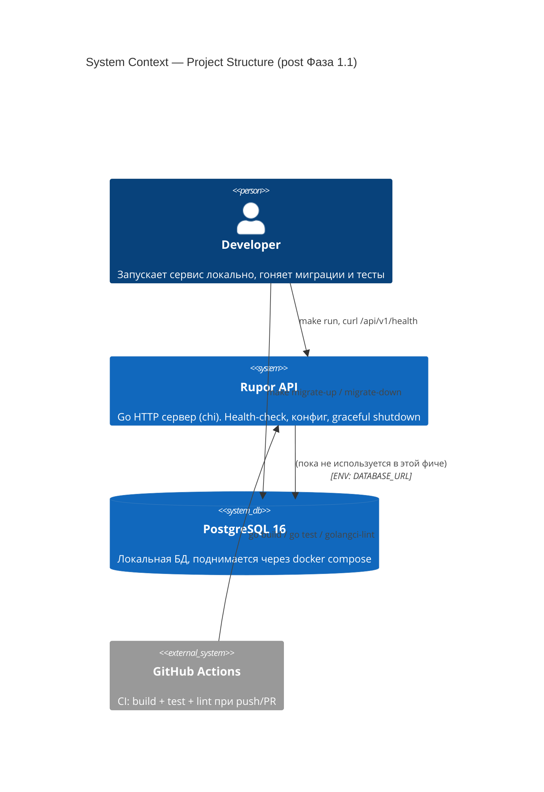
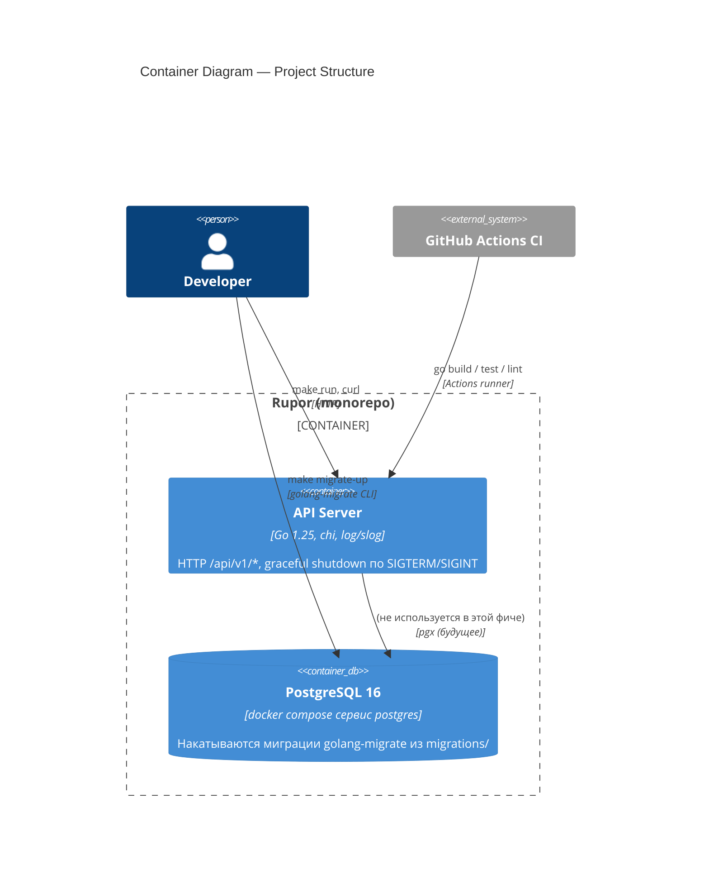
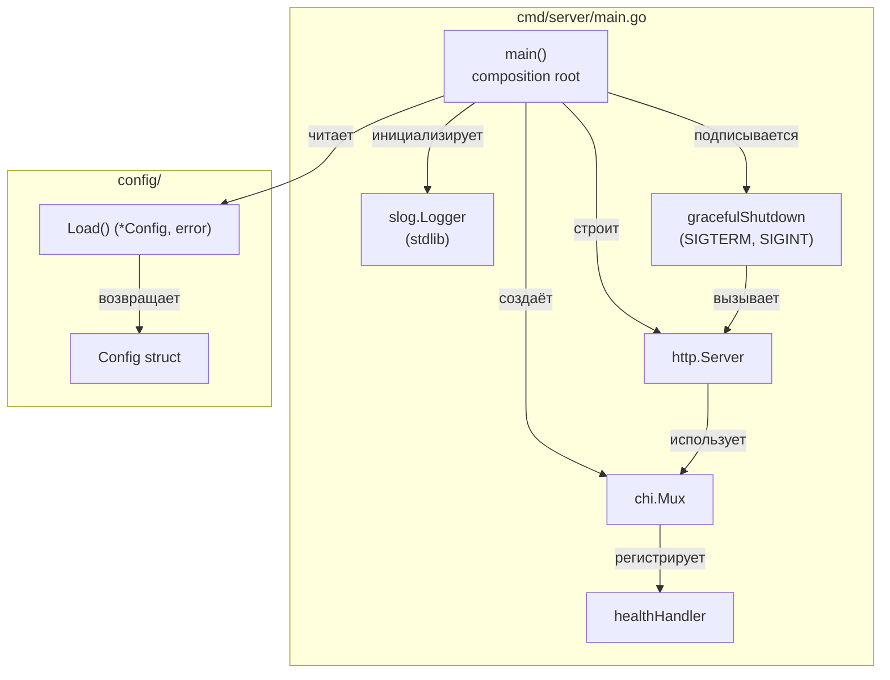
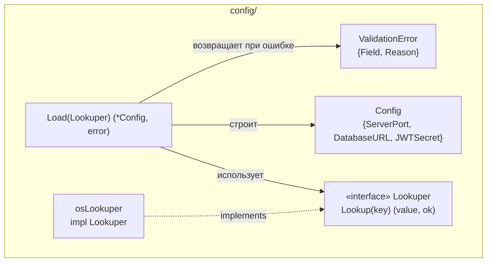
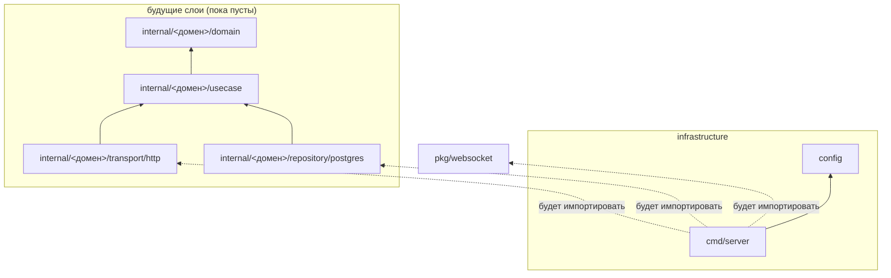

# 01 — Architecture (Logical View)

## C4 Level 1 — System Context

На уровне system context фича `project-structure` не вводит новых внешних систем — она описывает скелет системы Rupor. Контекст показан таким, каким он будет к концу Фазы 1.1: сервер запускается локально, ходит в локальный PostgreSQL, разработчик использует `make`/`git`/`docker compose` через CLI.



Акторы:
- **Developer** — единственный пользователь скелета. На MVP не выходит из локалхоста.
- **GitHub Actions** — внешний агент, который гонит CI на push/PR в `main` и любую `feature/*`-ветку.

Внешние системы:
- **PostgreSQL 16** — поднимается через `docker compose`, на этой фазе используется только для проверки `make migrate-up`/`migrate-down`. HTTP-сервер с ней пока не разговаривает.

Что **не** входит в Level 1 этой фичи: STUN-сервер для WebRTC, фронтенд `web/`, продакшен-деплой, мониторинг.

## C4 Level 2 — Containers

Контейнеры в смысле C4 — это процессы и хранилища. На этой фазе их два: API-сервер и БД.



Затрагиваемые контейнеры:
- `cmd/server` — единственный исполняемый процесс монорепо в текущем scope.
- `docker-compose.yml` — определение сервиса `postgres`. Описание сервиса `api` сейчас не добавляем (локально запускаем через `make run`, см. ADR-003 в `03-decisions.md`).
- `.github/workflows/ci.yml` — CI-пайплайн.

Новых контейнеров нет — Rupor планируется как монолит (`general_plan.md:69-79`).

## C4 Level 3 — Components (структура монорепо)

C4 L3 для этой фичи — это **дерево директорий** монорепо и компоненты в `cmd/server/` и `config/` (единственные места, где появляется код).

### Дерево директорий

```
project-rupor/
├── .github/
│   └── workflows/
│       └── ci.yml                            # Build + test + lint
├── .claude/                                  # (существует)
├── .thoughts/                                # (существует)
├── prompts/                                  # (существует)
├── tasks/                                    # (существует)
├── docs/
│   └── project-structure/                    # (создано этой командой)
├── cmd/
│   └── server/
│       └── main.go                           # Composition root
├── config/
│   ├── config.go                             # Тип Config + Load() из env
│   └── config_test.go                        # Юнит-тесты загрузчика
├── internal/
│   ├── auth/
│   │   ├── domain/.gitkeep
│   │   ├── usecase/.gitkeep
│   │   ├── transport/http/.gitkeep
│   │   └── repository/postgres/.gitkeep
│   ├── user/    {domain, usecase, transport/http, repository/postgres}
│   ├── room/    {domain, usecase, transport/http, repository/postgres}
│   ├── channel/ {domain, usecase, transport/http, repository/postgres}
│   ├── chat/    {domain, usecase, transport/http, repository/postgres}
│   └── voice/   {domain, usecase, transport/http, repository/postgres}
├── pkg/
│   └── websocket/.gitkeep                    # Заполнится в Фазе 3
├── migrations/
│   ├── 0001_init.up.sql                      # Метаданные / extensions, без бизнес-таблиц
│   └── 0001_init.down.sql                    # Парный откат
├── .env.example                              # Шаблон env для разработчика
├── .gitignore                                # bin/, .env, vendor/, .idea/ и т.д.
├── .golangci.yml                             # Конфигурация линтера
├── CLAUDE.md                                 # (существует)
├── Makefile                                  # run/build/test/lint/migrate/sqlc/dc-*
├── README.MD                                 # (существует)
├── docker-compose.yml                        # postgres:16-alpine
├── go.mod                                    # + chi/v5
├── go.sum                                    # появится после go mod tidy
├── init_project                              # (существует)
└── sqlc.yaml                                 # version: 2, engine: postgresql, заготовка
```

Все домены `internal/<домен>/` содержат одинаковый набор подпапок (`domain/`, `usecase/`, `transport/http/`, `repository/postgres/`) с `.gitkeep`. Это фиксирует терминологию из `prompts/Architecture Layers.txt:46-58` физически и не оставляет места для альтернативных раскладок при добавлении нового домена.

### Компоненты `cmd/server/`



Компоненты:
- **`config.Config`** — структура с полями `ServerPort int`, `DatabaseURL string`, `JWTSecret string`. Никаких тегов (json/db/yaml) — конфиг не сериализуется.
- **`config.Load() (*Config, error)`** — чистая функция (источник энва инжектируется через интерфейс `Lookuper`, см. `04-testing.md`). Валидация: `JWTSecret` не пустой, `DatabaseURL` не пустой, `ServerPort` либо отсутствует (default 8080), либо парсится как `int` в диапазоне `1..65535`.
- **`main()`** — composition root по `prompts/Architecture Layers.txt:60-66`. Никакой бизнес-логики, только инициализация: загрузить конфиг → построить логгер → собрать роутер → зарегистрировать `/api/v1/health` → запустить `http.Server` → ждать сигнала → вызвать `Shutdown(ctx)` с таймаутом 5с.
- **`healthHandler`** — приватная функция/handler в `main.go` или в локальном `health.go` рядом с `main.go`. Возвращает `200 {"status":"ok"}`. Не зависит от БД (см. ADR-006 в `03-decisions.md`).
- **`gracefulShutdown`** — `signal.NotifyContext(ctx, SIGTERM, SIGINT)` + `srv.Shutdown(ctxWithTimeout)` с таймаутом 5с.

### Компоненты `config/`



Интерфейс `Lookuper` сделан только ради тестируемости (`prompts/Tests Style.txt:75-100` — фейки руками). В тестах подменяется на `mapLookuper`, в проде — на `osLookuper{}` поверх `os.LookupEnv`.

## Граф зависимостей модулей

Правило из `prompts/Architecture Layers.txt:67-74`: импорт строго **внутрь**. На этой фиче пакетов почти нет, но граф фиксирует целевую направленность.



Запрещённые направления (`prompts/Architecture Layers.txt:73`):
- `domain` импортирует что-либо из `usecase/transport/repository/cmd` — **запрет**.
- `usecase` импортирует `transport`/`repository` — **запрет**.
- Один доменный `internal/<X>/...` импортирует `internal/<Y>/transport` или `internal/<Y>/repository` — **запрет**.

В этой фиче импорт-тест проверяет только наличие правил (тестовых случаев нечем нарушить — кода ещё нет). Полноценный gate появится с первым доменом. См. `04-testing.md` — раздел «Архитектурный smoke».

## State machine — жизненный цикл сервера

Минимальный, но фиксирует поведение для теста graceful shutdown:

```
[Init] ──load config──> [Building] ──http.Server.ListenAndServe──> [Running]
   │                                                                    │
   │ (config invalid)                                                   │ SIGTERM/SIGINT
   ↓                                                                    ↓
[Failed: exit 1]                                              [ShuttingDown]
                                                                        │
                                                                        │ выждать активные запросы (≤5с)
                                                                        ↓
                                                                  [Stopped: exit 0]
```

Переход `Running → ShuttingDown → Stopped` валидируется тестом в `02-behavior.md` (sequence «Graceful shutdown»).
